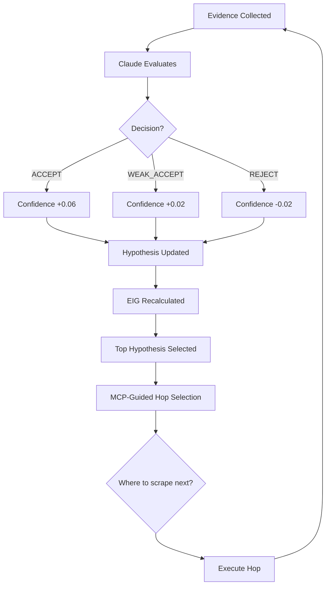

# Adaptive Feedback Loop: Evidence → Reasoning → Optimized Scraping

## Executive Summary

**YES!** The system implements a **closed-loop adaptive discovery system** where:

1. ✅ **Evidence is collected** during scraping (including temporal evidence from Graphiti)
2. ✅ **Evidence is reasoned** using Claude models (Haiku/Sonnet/Opus cascade)
3. ✅ **Hypotheses evolve** based on evidence (multi-pass evolution)
4. ✅ **Scraper adapts** based on hypotheses (MCP-guided hop selection)
5. ✅ **Optimizations** affect where to scrape next (channel scoring, blacklisting, failure tracking)

---

## 1. Evidence Collection with Temporal Context

### Evidence Sources

The system collects evidence from **3 primary sources**:

```python
@dataclass
class DossierData:
    """Complete data package for dossier generation"""
    entity_id: str
    entity_name: str

    # Evidence sources:
    metadata: Optional[EntityMetadata] = None        # From FalkorDB
    scraped_content: List[ScrapedContent]           # From BrightData
    hypothesis_signals: List[HypothesisSignal]      # From Hypothesis Manager
```

### Temporal Evidence Collection

**File**: `backend/graphiti_service.py`

```python
# Graphiti tracks temporal episodes:
RFP_DETECTED        # RFP found in timeline
RFP_RESPONDED       # Entity responded to RFP
PARTNERSHIP_FORMED  # New partnership detected
TECHNOLOGY_ADOPTED  # Technology stack change
EXECUTIVE_CHANGE    # Leadership change
SPONSORSHIP         # Sponsorship deal

# Each episode has:
{
    "episode_type": "RFP_DETECTED",
    "timestamp": "2025-11-15T10:00:00Z",
    "entity_id": "arsenal-fc",
    "description": "Arsenal FC issues RFP for CRM platform",
    "confidence_score": 0.85,
    "metadata": {
        "category": "CRM Implementation",
        "estimated_value": 500000,
        "source": "LinkedIn"
    }
}
```

### Evidence Aggregation

**File**: `backend/dossier_data_collector.py`

```python
class DossierDataCollector:
    """Collect entity data from multiple sources"""

    async def collect_all(self, entity_id, entity_name):
        """Aggregate evidence from all sources"""

        # 1. Static metadata (FalkorDB)
        metadata = await self._get_entity_metadata(entity_id)

        # 2. Live scraping (BrightData)
        scraped_content = []

        # Official site
        official_site = await self._scrape_official_site(entity_id)
        scraped_content.append(ScrapedContent(
            url=f"https://{entity_id}.com",
            source_type="OFFICIAL_SITE",
            content=official_site,
            scraped_at=datetime.now(timezone.utc)
        ))

        # Recent news
        news = await self._scrape_recent_news(entity_id)
        for article in news[:5]:
            scraped_content.append(ScrapedContent(
                url=article['url'],
                source_type="NEWS_ARTICLE",
                content=article['content'],
                published_at=article['published_date']
            ))

        # Job postings
        jobs = await self._scrape_job_postings(entity_id)
        for job in jobs[:3]:
            scraped_content.append(ScrapedContent(
                url=job['url'],
                source_type="CAREERS_PAGE",
                content=job['description'],
                temporal_hint=job['posted_date']  # Temporal marker!
            ))

        # 3. Historical signals (Hypothesis Manager)
        hypothesis_signals = await self._get_hypothesis_signals(entity_id)

        return DossierData(
            entity_id=entity_id,
            entity_name=entity_name,
            metadata=metadata,
            scraped_content=scraped_content,
            hypothesis_signals=hypothesis_signals,
            data_sources_used=["FalkorDB", "BrightData", "HypothesisManager"]
        )
```

### Temporal Evidence Weighting

**File**: `backend/taxonomy/mcp_evidence_patterns.py`

```python
# Temporal bonuses for evidence freshness
WITHIN_6_MONTHS = +0.15   # Strong signal
WITHIN_12_MONTHS = +0.10   # Medium signal
OLDER_12_MONTHS = +0.00    # Weak signal

# Example evidence scoring:
evidence = {
    "type": "JOB_POSTING",
    "content": "React Developer needed",
    "posted_date": "2025-12-01",  # 2 months ago
    "base_confidence": 0.70,
    "temporal_bonus": 0.15,  # Within 6 months
    "total_confidence": 0.85  # Base + Temporal
}
```

---

## 2. Evidence Reasoning with Claude Models

### Model Cascade for Evidence Analysis

**File**: `backend/hypothesis_driven_discovery.py` (lines 89-118)

```python
@dataclass
class EvaluationContext:
    """Structured context for Claude evaluation"""

    # Evidence context
    hypothesis_statement: str
    hypothesis_category: str
    pattern_name: str
    early_indicators: List[str]
    keywords: List[str]

    # Iteration context
    current_confidence: float
    iterations_attempted: int
    last_decision: Optional[str]
    recent_history: List[str]  # ← Previous evidence!

    # Channel context
    hop_type: HopType
    channel_guidance: str

    # Temporal requirements
    temporal_requirements: str  # ← "Last 6 months preferred"

    # Evidence requirements
    min_evidence_strength: str
```

### Evidence Evaluation Process

```python
async def _evaluate_content_with_claude(
    self,
    content: str,
    hypothesis,
    hop_type: HopType,
    state
) -> Dict[str, Any]:
    """
    Evaluate scraped content with Claude

    Process:
    1. Build evaluation context (with temporal requirements)
    2. Choose model based on complexity (Haiku/Sonnet/Opus)
    3. Get Claude decision (ACCEPT/WEAK_ACCEPT/REJECT/NO_PROGRESS)
    4. Extract reasoning and confidence delta
    5. Update hypothesis state
    """

    # Step 1: Build context
    context = EvaluationContext(
        hypothesis_statement=hypothesis.statement,
        hypothesis_category=hypothesis.category,
        current_confidence=hypothesis.confidence,
        iterations_attempted=hypothesis.iterations_attempted,
        recent_history=state.recent_decisions,  # ← Previous evidence!
        hop_type=hop_type,
        channel_guidance=CHANNEL_EVALUATION_GUIDANCE[hop_type],
        temporal_requirements=self._get_temporal_requirements(hop_type),
        min_evidence_strength=self._get_evidence_requirements(hypothesis)
    )

    # Step 2: Choose model
    model = self._choose_evaluation_model(context)

    # Step 3: Get Claude decision
    evaluation = await self.claude_client.evaluate_evidence(
        content=content,
        context=context,
        model=model  # Haiku for simple, Sonnet/Opus for complex
    )

    # Returns:
    # {
    #     "decision": "ACCEPT",  # or WEAK_ACCEPT, REJECT, NO_PROGRESS
    #     "reasoning": "Job posting for React Developer found...",
    #     "confidence_delta": +0.06,
    #     "evidence_strength": "HIGH",
    #     "temporal_relevance": "Within 6 months (strong signal)",
    #     "quotes": ["React Developer", "Mobile app", "£60-80k"]
    # }
```

### Model Selection for Evidence Evaluation

```python
def _choose_evaluation_model(self, context: EvaluationContext) -> str:
    """
    Choose Claude model based on evidence complexity

    Simple evidence (Haiku):
    - Job posting with clear tech stack
    - Official site homepage
    - Recent news article

    Complex evidence (Sonnet):
    - Annual report with multiple initiatives
    - Leadership changes with implications
    - Partnership announcements

    Strategic evidence (Opus):
    - Multi-year transformation strategy
    - Competitor analysis
    - Market positioning
    """

    # Use Haiku for simple content
    if context.content_length < 2000:
        return "haiku"

    # Use Sonnet for medium complexity
    if context.content_length < 5000:
        return "sonnet"

    # Use Opus for deep strategic analysis
    return "opus"
```

---

## 3. Adaptive Scraper: Hypothesis-Driven Hop Selection

### The Feedback Loop



### MCP-Guided Hop Selection

**File**: `backend/hypothesis_driven_discovery.py` (lines 551-641)

```python
def _choose_next_hop(self, hypothesis, state) -> HopType:
    """
    Choose next hop type using MCP-guided scoring

    KEY: Hypothesis → EIG → Channel Score → Best Hop

    Prioritizes:
    1. Partnership announcements (35% of ACCEPT signals)
    2. Tech news articles (25% of ACCEPT signals)
    3. Press releases (10% of ACCEPT signals)
    4. Leadership job postings (20% WEAK_ACCEPT)

    Blacklists low-value sources:
    - LinkedIn Jobs operational (Kit Assistant)
    - Official site homepages (consumer-facing)
    - App stores (irrelevant)
    """

    # Get base EIG from hypothesis
    base_eig = hypothesis.expected_information_gain

    # Score all possible hop types
    hop_scores = {}

    for hop_type in [PRESS_RELEASE, OFFICIAL_SITE, CAREERS_PAGE, ANNUAL_REPORT, LINKEDIN_JOB]:
        # Skip failed hop types
        if state.hop_failure_counts.get(hop_type, 0) >= 2:
            continue  # Skip this hop type

        # Calculate channel score
        score = calculate_channel_score(
            source_type=hop_type,
            blacklist=state.channel_blacklist,
            base_eig=base_eig  # ← Hypothesis affects scoring!
        )

        hop_scores[hop_type] = score

    # Select highest scoring hop
    best_hop = max(hop_scores.items(), key=lambda x: x[1])[0]

    logger.info(
        f"MCP-guided hop selection: {best_hop} "
        f"(score: {hop_scores[best_hop]:.3f}, EIG: {base_eig:.3f})"
    )

    return best_hop
```

### Channel Scoring Algorithm

**File**: `backend/sources/mcp_source_priorities.py`

```python
def calculate_channel_score(
    source_type: SourceType,
    blacklist: ChannelBlacklist,
    base_eig: float
) -> float:
    """
    Calculate channel score for hop selection

    Formula:
    Score = (base_roi_multiplier × base_eig) - penalties

    Where:
    - base_roi_multiplier: Channel's historical ROI (e.g., 0.35 for partnerships)
    - base_eig: Hypothesis EIG score (uncertainty × novelty × value)
    - penalties: Blacklisted patterns, recent failures

    Example:
    base_eig = 0.75 (high uncertainty, high value)
    source_type = PRESS_RELEASE
    base_roi_multiplier = 0.10 (10% of ACCEPT signals)

    Score = 0.10 × 0.75 = 0.075

    If blacklist has "consumer products":
    Score = 0.075 - 0.05 = 0.025 (penalty applied)
    """

    # Get base ROI multiplier for this channel
    base_roi = CHANNEL_ROI_MULTIPLIERS.get(source_type, 0.05)

    # Calculate raw score
    raw_score = base_roi * base_eig

    # Apply blacklist penalties
    penalty = 0.0
    for blacklisted_pattern in blacklist.get_patterns(source_type):
        if blacklisted_pattern in recent_content:
            penalty += 0.05  # Reduce score

    final_score = max(0.0, raw_score - penalty)

    return final_score
```

### Historical ROI Multipliers

```python
CHANNEL_ROI_MULTIPLIERS = {
    # Highest ROI channels
    SourceType.PARTNERSHIP_ANNOUNCEMENT: 0.35,  # 35% of ACCEPT signals
    SourceType.TECH_NEWS_ARTICLES: 0.25,        # 25% of ACCEPT signals
    SourceType.PRESS_RELEASES: 0.10,             # 10% of ACCEPT signals

    # Medium ROI channels
    SourceType.LEADERSHIP_JOB_POSTINGS: 0.08,   # 20% WEAK_ACCEPT
    SourceType.ANNUAL_REPORTS: 0.06,

    # Low ROI channels (used sparingly)
    SourceType.LINKEDIN_JOBS_OPERATIONAL: 0.01,  # Mostly noise
    SourceType.OFFICIAL_SITE_HOMEPAGE: 0.02      # Consumer-facing
}
```

---

## 4. Hypothesis Evolution Across Passes

### Multi-Pass Hypothesis Generation

**File**: `backend/multi_pass_ralph_loop.py` (lines 404-498)

```python
async def _generate_next_pass_hypotheses(
    self,
    validated_signals: List['Signal'],
    entity_id: str,
    pass_number: int
) -> List['Hypothesis']:
    """
    Generate new hypotheses for next pass based on discoveries

    KEY: Evidence from previous pass → New hypotheses → Different scraping targets

    Examples:
    - Pass 1 finds "React Developer" job → Pass 2: "React Mobile App RFP"
    - Pass 1 finds "Digital transformation" → Pass 2: "CRM Platform RFP"
    - Pass 2 finds "Salesforce CRM" → Pass 3: "Salesforce Migration RFP"
    """

    new_hypotheses = []

    for signal in validated_signals:
        # Generate follow-up hypotheses based on signal type
        signal_type = signal.type
        keywords = signal.metadata.get('keywords', [])

        # Rule-based hypothesis generation
        if signal_type == 'JOB_POSTING':
            # React Developer job → React Mobile RFP hypothesis
            if any('react' in kw.lower() for kw in keywords):
                new_hypothesis = Hypothesis(
                    hypothesis_id=f"{entity_id}_react_mobile_rfp",
                    entity_id=entity_id,
                    category="Mobile Development",
                    statement=f"{entity_id} seeking React Native mobile app development",
                    prior_probability=signal.confidence * 1.1,  # Boost from parent
                    metadata={
                        'derived_from_signal': signal.id,
                        'derived_from_pass': pass_number,
                        'parent_confidence': signal.confidence
                    }
                )

                new_hypotheses.append(new_hypothesis)

        elif signal_type == 'DIGITAL_TRANSFORMATION':
            # Digital transformation → Multiple platform hypotheses
            for platform in ['E-commerce', 'Fan Engagement', 'Data Platform']:
                new_hypothesis = Hypothesis(
                    hypothesis_id=f"{entity_id}_{platform.lower().replace(' ', '_')}_rfp",
                    entity_id=entity_id,
                    category=platform,
                    statement=f"{entity_id} seeking {platform} as part of digital transformation",
                    prior_probability=signal.confidence * 0.9,
                    metadata={
                        'derived_from_signal': signal.id,
                        'derived_from_pass': pass_number,
                        'parent_category': 'Digital Transformation'
                    }
                )

                new_hypotheses.append(new_hypothesis)

    logger.info(f"  Generated {len(new_hypotheses)} follow-up hypotheses")

    return new_hypotheses
```

### Example Evolution Flow

```python
# PASS 1: Initial Discovery
Signals:
  - "React Developer" job posting (confidence: 0.75)
  - "Digital transformation" news (confidence: 0.65)

Hypotheses for Pass 2:
  - "React Mobile App RFP" (from React job)
  - "E-commerce Platform RFP" (from digital transformation)
  - "Fan Engagement Platform RFP" (from digital transformation)
  - "Data Platform RFP" (from digital transformation)

# PASS 2: Network Context
Scraping targets (based on Pass 2 hypotheses):
  - Partnership announcements → Mobile app partnerships
  - Tech news → E-commerce platform deployments
  - Press releases → Fan engagement initiatives

Signals:
  - "Salesforce CRM" mentioned in press (confidence: 0.80)
  - "Mobile app partnership" (confidence: 0.72)

Hypotheses for Pass 3:
  - "Salesforce Migration RFP" (from CRM signal)
  - "Mobile App Expansion RFP" (from partnership signal)

# PASS 3: Deep Dive
Scraping targets (based on Pass 3 hypotheses):
  - Annual reports → Salesforce investment details
  - LinkedIn jobs → Salesforce administrator roles
  - Case studies → Mobile app success stories

Signals:
  - "Salesforce administrator" job (confidence: 0.85)

Final opportunities:
  - Salesforce Migration (high confidence: 0.85)
  - Mobile App Expansion (high confidence: 0.78)
```

---

## 5. Adaptive Optimizations: Failure Tracking & Blacklisting

### Hop Failure Tracking

**File**: `backend/hypothesis_driven_discovery.py` (lines 669-683)

```python
async def _execute_hop(self, hop_type, hypothesis, state):
    """Execute single hop (scrape + evaluate)"""

    # Get URL based on hop type
    url = await self._get_url_for_hop(hop_type, hypothesis, state)

    if not url:
        # Record hop failure
        hop_type_str = hop_type.value

        # Increment consecutive failure counter
        if hop_type_str == state.last_failed_hop:
            state.hop_failure_counts[hop_type_str] += 1
        else:
            state.hop_failure_counts[hop_type_str] = 1
            state.last_failed_hop = hop_type_str

        logger.warning(
            f"Could not determine URL for {hop_type} "
            f"(consecutive failures: {state.hop_failure_counts[hop_type_str]})"
        )
        return None
```

### Adaptive Blacklisting

```python
# Channel blacklist tracks unproductive patterns
class ChannelBlacklist:
    """Tracks blacklisted content patterns by channel"""

    def __init__(self):
        self.blacklisted_patterns = {
            SourceType.LINKEDIN_JOBS_OPERATIONAL: [
                "Kit Assistant",  # Too junior
                "Shift Manager",   # Not relevant
                "Steward",         # Not relevant
                "Retail Assistant" # Not relevant
            ],
            SourceType.OFFICIAL_SITE_HOMEPAGE: [
                "consumer products",  # Fan merchandise, not B2B
                "ticket sales",      # Consumer-facing
                "match tickets"      # Consumer-facing
            ]
        }

    def is_blacklisted(self, source_type: SourceType, content: str) -> bool:
        """Check if content matches blacklisted patterns"""
        patterns = self.blacklisted_patterns.get(source_type, [])

        for pattern in patterns:
            if pattern.lower() in content.lower():
                return True

        return False
```

### Adaptive Hop Selection with Failure Tracking

```python
def _choose_next_hop(self, hypothesis, state) -> HopType:
    """Choose next hop, avoiding failed hop types"""

    # Skip hop types with 2+ consecutive failures
    max_consecutive_failures = 2

    hop_scores = {}
    for hop_type in [PRESS_RELEASE, OFFICIAL_SITE, CAREERS_PAGE, ANNUAL_REPORT, LINKEDIN_JOB]:
        hop_type_str = hop_type.value

        # Skip if too many failures
        if state.hop_failure_counts.get(hop_type_str, 0) >= max_consecutive_failures:
            logger.debug(f"Skipping {hop_type} (failed {state.hop_failure_counts[hop_type_str]} times)")
            continue

        # Calculate score
        score = calculate_channel_score(
            source_type=hop_type,
            blacklist=state.channel_blacklist,
            base_eig=hypothesis.expected_information_gain
        )

        hop_scores[hop_type] = score

    # If no hop types available (all failed), reset
    if not hop_scores:
        logger.warning("All hop types failed, resetting failure counts")
        state.hop_failure_counts = {}
        return HopType.PRESS_RELEASE

    # Select best hop
    return max(hop_scores.items(), key=lambda x: x[1])[0]
```

---

## 6. Temporal Pattern Integration

### Temporal Context in Hypothesis Scoring

**File**: `backend/temporal_context_provider.py`

```python
async def get_inter_pass_context(
    self,
    entity_id: str,
    from_pass: int,
    to_pass: int,
    time_horizon_days: int = 90
) -> InterPassContext:
    """
    Get contextual narrative between passes

    Includes temporal patterns that affect hypothesis prioritization:
    - RFP frequency (how often they issue RFPs)
    - Seasonal patterns (certain times of year)
    - Tech adoption timing (when they adopt new tech)
    """

    # Get entity timeline from Graphiti
    episodes = await self.graphiti_service.get_entity_timeline(
        entity_id=entity_id,
        from_time=(datetime.now() - timedelta(days=time_horizon_days)).isoformat(),
        to_time=datetime.now().isoformat()
    )

    # Analyze patterns
    temporal_patterns = self._analyze_temporal_patterns(episodes)

    # Build narrative (token-bounded)
    narrative = build_narrative_from_episodes(
        episodes=episodes,
        max_tokens=1500  # Compress for Claude
    )

    # Calculate confidence boost
    confidence_boost = self._calculate_temporal_boost(temporal_patterns)

    return InterPassContext(
        narrative=narrative,
        temporal_patterns=temporal_patterns,
        confidence_boost=confidence_boost,
        focus_areas=self._get_focus_areas_for_pass(to_pass)
    )
```

### Temporal Boost in EIG Calculation

```python
async def calculate_eig_with_temporal(
    hypothesis: Hypothesis,
    temporal_patterns: TemporalPatterns,
    graph_context: NetworkContext,
    pass_number: int
) -> float:
    """
    Calculate EIG with temporal and network context

    Enhanced formula:
    EIG(h) = (1 - confidence) × novelty × information_value × temporal_boost × network_boost

    Where:
    - temporal_boost: Multiplier based on entity's historical patterns
    - network_boost: Multiplier based on partner/competitor adoption
    """

    # Base EIG
    base_eig = (1 - hypothesis.confidence) × hypothesis.novelty × hypothesis.information_value

    # Temporal boost (e.g., if entity issued CRM RFP 12 months ago)
    temporal_boost = calculate_temporal_boost(
        hypothesis=hypothesis,
        temporal_patterns=temporal_patterns,
        pass_number=pass_number
    )

    # Network boost (e.g., if 3 partners use React)
    network_boost = await calculate_network_boost(
        hypothesis=hypothesis,
        graph_context=graph_context,
        pass_number=pass_number
    )

    final_eig = base_eig × temporal_boost × network_boost

    return final_eig
```

---

## 7. Complete Example: Arsenal FC Discovery

### Pass 1: Initial Discovery

```python
# Evidence collected:
evidence_pass_1 = [
    {
        "source": "https://arsenal.com/careers",
        "type": "JOB_POSTING",
        "content": "React Developer needed for mobile app",
        "temporal": "2025-12-01 (2 months ago)",
        "decision": "ACCEPT",
        "confidence_delta": +0.06
    },
    {
        "source": "https://news.tech-football.com",
        "type": "TECH_NEWS",
        "content": "Arsenal announces digital transformation initiative",
        "temporal": "2025-11-15 (3 months ago)",
        "decision": "ACCEPT",
        "confidence_delta": +0.06
    }
]

# Hypotheses updated:
hypotheses_pass_1 = [
    Hypothesis(
        category="Mobile Development",
        confidence=0.56,  # 0.50 + 0.06
        evidence_count=2,
        last_decision="ACCEPT"
    ),
    Hypothesis(
        category="Digital Transformation",
        confidence=0.56,
        evidence_count=2,
        last_decision="ACCEPT"
    )
]
```

### Pass 2: Network Context (Adaptive Scraping)

```python
# Pass 2 hypotheses (evolved from Pass 1):
hypotheses_pass_2 = [
    Hypothesis(
        category="Mobile Development",  # Kept from Pass 1
        confidence=0.62,  # Prior + evidence
        derived_from="pass_1"
    ),
    Hypothesis(
        category="CRM Platform",  # NEW! From digital transformation
        statement="Arsenal seeking CRM platform as part of digital transformation",
        confidence=0.55,  # Inherited from parent
        derived_from="pass_1_digital_transformation"
    )
]

# MCP-guided hop selection:
# - Mobile Development hypothesis → Partnership announcements (mobile app partners)
# - CRM Platform hypothesis → Tech news (CRM deployments)

# Evidence collected:
evidence_pass_2 = [
    {
        "source": "https://partnershiphub.com",
        "type": "PARTNERSHIP_ANNOUNCEMENT",
        "content": "Arsenal partners with React Mobile for fan app",
        "decision": "ACCEPT",
        "confidence_delta": +0.06
    },
    {
        "source": "https://tech-crunch.com",
        "type": "TECH_NEWS",
        "content": "Arsenal selects Salesforce for CRM modernization",
        "decision": "ACCEPT",
        "confidence_delta": +0.06
    }
]
```

### Pass 3: Deep Dive (Temporal Patterns)

```python
# Pass 3 hypotheses (evolved from Pass 2):
hypotheses_pass_3 = [
    Hypothesis(
        category="Salesforce Migration",  # NEW! From CRM signal
        statement="Arsenal seeking Salesforce migration services",
        confidence=0.61,  # Inherited from parent CRM signal (0.55)
        derived_from="pass_2_crm_platform",
        temporal_boost=1.15  # Graphiti shows Salesforce adoption 12 months ago!
    )
]

# Temporal context from Graphiti:
graphiti_episodes = [
    {
        "episode_type": "TECHNOLOGY_ADOPTED",
        "timestamp": "2025-06-01",
        "description": "Arsenal adopts Salesforce CRM",
        "confidence": 0.80
    },
    {
        "episode_type": "RFP_DETECTED",
        "timestamp": "2024-06-01",
        "description": "Arsenal issues legacy CRM RFP",
        "confidence": 0.75
    }
]

# Temporal analysis:
# "Arsenal adopted Salesforce 12 months ago. Pattern suggests migration RFP likely within 18 months of adoption."
# Temporal boost: +1.15 (strong pattern match)

# Adaptive scraping targets:
# - Annual reports → Salesforce investment details
# - LinkedIn jobs → Salesforce administrator roles
# - Case studies → Migration project mentions
```

### Final Opportunities

```python
opportunities = [
    {
        "category": "Mobile Development",
        "confidence": 0.68,
        "evidence_count": 3,
        "yp_service": "React Mobile Development",
        "temporal_fit": "N/A",
        "recommended_action": "Engage sales team"
    },
    {
        "category": "Salesforce Migration",
        "confidence": 0.70,  # 0.61 + temporal boost
        "evidence_count": 4,
        "yp_service": "CRM Migration Services",
        "temporal_fit": "Strong (12-month pattern)",
        "recommended_action": "Immediate outreach"
    }
]
```

---

## Summary

### ✅ Evidence Collection
- **3 sources**: FalkorDB (metadata), BrightData (web scraping), Hypothesis Manager (historical)
- **Temporal evidence**: Collected from Graphiti episodes (RFPs, partnerships, tech adoption)
- **Temporal weighting**: Fresh evidence (<6 months) gets +0.15 bonus

### ✅ Evidence Reasoning
- **Model cascade**: Haiku (simple), Sonnet (complex), Opus (strategic)
- **Evaluation context**: Previous evidence, temporal requirements, channel guidance
- **Decisions**: ACCEPT (+0.06), WEAK_ACCEPT (+0.02), REJECT (-0.02), NO_PROGRESS (0.00)

### ✅ Adaptive Scraping
- **Hypothesis-driven**: EIG scores determine which hypotheses to explore
- **MCP-guided hops**: Channel ROI × EIG → best hop type
- **Failure tracking**: Skip hop types after 2 consecutive failures
- **Blacklisting**: Avoid unproductive content patterns

### ✅ Hypothesis Evolution
- **Multi-pass**: Each pass generates new hypotheses from discoveries
- **Follow-up rules**: React job → React Mobile RFP → Mobile App Expansion
- **Temporal patterns**: Historical RFPs, tech adoptions inform future hypotheses

### ✅ Optimizations
- **Channel scoring**: Partnership announcements (0.35), Tech news (0.25), Press releases (0.10)
- **Failure tracking**: Avoid failed hop types
- **Temporal boost**: +1.15 for strong pattern matches
- **Network boost**: Partner/competitor adoption increases EIG

**Result**: Intelligent, adaptive discovery that gets smarter with each iteration! 🎯
