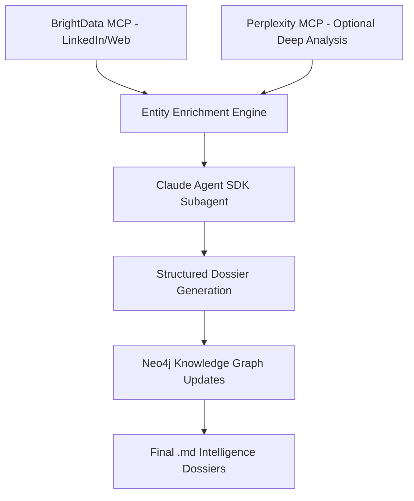

# 🎯 Sports Intelligence Enrichment Schema (Consolidated)

## Purpose

This consolidated schema provides the complete data structure for AI-powered sports intelligence enrichment using BrightData MCP, Neo4j knowledge graph, and optional Perplexity analysis.

## Architecture Overview



---

## 1. Base Entity Model

All entities inherit from this shared foundation:

```yaml
Entity:
  id: UUID
  neo4j_id: string
  type: [Club | Person | League | Organization | Partner | Venue]
  name: string
  description: text
  location: string
  country: string
  sport: string (nullable for non-sports entities)
  website: string
  created_at: datetime
  updated_at: datetime
  enrichment_metadata:
    last_brightdata_scan: datetime
    last_perplexity_analysis: datetime (nullable)
    data_sources: [string]
    confidence_score: float (0-1)
```

---

## 2. Entity-Specific Schemas

### Club Entity Schema

```yaml
Club:
  parent: Entity
  
  # Core Identity
  core:
    division: string (e.g. Premier League)
    stadium: string
    founded_year: int
    revenue_est: float (nullable)
    employee_count: int
    valuation: float
    
  # Digital Presence
  digital:
    website: string
    socials:
      twitter: string
      instagram: string
      linkedin: string
      facebook: string
    mobile_app: boolean
    digital_maturity_score: int (0-100)
    current_tech_partners: [string]
    
  # Commercial
  commercial:
    main_sponsors: [string]
    kit_supplier: string
    broadcast_partners: [string]
    commercial_revenue: string
    sponsorship_pipeline: [string]
    
  # Personnel Network
  personnel:
    squad: [Person.id]
    staff_contacts: [Person.id]
    key_decision_makers: [Person.id]
    coaching_staff: [Person.id]
    
  # Performance
  sporting:
    current_league_position: int
    recent_form: string
    european_competition: boolean
    transfer_budget: string
    youth_academy_rating: string
    
  # Business Intelligence
  business_intelligence:
    digital_maturity: number # 0-100
    transformation_score: number # 0-100
    website_moderness: number # 0-10
    current_partner: string
    key_weaknesses: [string]
    strategic_opportunities: [string]
    
  # Strategic Analysis
  strategic_analysis:
    overall_assessment: string
    yellow_panther_opportunity: string
    engagement_strategy: string
    risk_factors: [string]
    competitive_advantages: [string]
    recommended_approach: string
    
  # Opportunity Scoring
  opportunity_scoring:
    immediate_launch: [string]
    medium_term_partnerships: [string]
    long_term_initiatives: [string]
    opportunity_scores: { [key: string]: number } # opportunity name -> score 0-100
```

### Person of Interest Schema

```yaml
PersonOfInterest:
  parent: Entity
  
  # Professional Identity
  professional:
    role: string
    seniority: [C_LEVEL | DIRECTOR | MANAGER | SPECIALIST | CONSULTANT | COACH | PLAYER]
    department: string
    organisation: Entity.id
    reporting_line: string
    decision_making_authority: string
    
  # Contact Information
  contact:
    email: string
    phone: string
    linkedin_url: string
    twitter: string
    preferred_contact_method: string
    
  # Influence Network
  influence:
    influence_level: [HIGH | MEDIUM | LOW]
    decision_scope: [string]
    direct_reports: [Person.id]
    key_relationships: [Entity.id]
    board_positions: [string]
    
  # Strategic Focus
  strategic:
    current_priorities: [string]
    budget_responsibility: string
    technology_interests: [string]
    partnership_history: [string]
    innovation_focus: [string]
    
  # Career Background
  career_background:
    previous_roles: [string]
    education: [string]
    recognition: [string]
    
  # Decision Making Patterns
  decision_making_patterns:
    partnership_philosophy: string
    technology_focus: [string]
    recent_investments: [string]
    budget_authority: string
    
  # Communication Analysis
  communication_analysis:
    tone: string
    risk_profile: [LOW | MEDIUM | HIGH]
    outreach_strategy: string
    negotiation_style: string
    
  # Strategic Hooks
  strategic_hooks: [string]
  current_projects: [string]
```

### League Entity Schema

```yaml
League:
  parent: Entity
  
  # Core Properties
  core:
    country: string
    level: string
    teams: number
    members: number
    founded: string|number
    headquarters: string
    commissioner: string
    
  # Commercial
  commercial:
    sponsorships: [string]
    broadcast_partners: [string]
    technology_partners: [string]
    revenue: string
    viewership: string
    
  # Digital
  digital:
    digital_maturity: [LOW | MEDIUM | HIGH]
    social_media:
      twitter: string
      instagram: string
      facebook: string
      youtube: string
      linkedin: string
      
  # Governance
  governance:
    governing_body: string
    regulations: string
    competitions: [string]
    
  # Strategic Analysis
  strategic_analysis:
    market_position: string
    competitive_landscape: string
    growth_opportunities: [string]
    risk_factors: [string]
    partnership_potential: string
    technology_adoption_readiness: string
```

---

## 3. Claude Agent SDK Prompts

### System Prompt (BrightData-First)

```yaml
system_prompt: |
  You are an elite sports intelligence analyst working for Yellow Panther. Your task is to enrich sports entities using multi-source data gathering and analysis.
  
  PRIMARY APPROACH:
  1. Use BrightData MCP to scrape LinkedIn and web sources
  2. Extract structured information using the provided schema
  3. Generate comprehensive dossiers with actionable intelligence
  
  DATA QUALITY STANDARDS:
  - Verify information across multiple sources
  - Provide confidence scores for each data point
  - Flag speculative information clearly
  - Include source attribution for all claims
  
  OUTPUT REQUIREMENTS:
  - Follow exact schema structure
  - Provide specific, actionable insights
  - Focus on business intelligence and opportunity identification
  - Include relationship mapping and network analysis
  
  BUSINESS CONTEXT:
  Yellow Panther provides AI-powered sports intelligence and digital transformation solutions to sports organizations. Focus on identifying commercial opportunities, partnership potential, technology adoption readiness, and decision-maker accessibility.
```

### Entity Enrichment Prompt Template

```yaml
entity_enrichment_prompt: |
  Enrich the {entity_type} "{entity_name}" using the following approach:
  
  1. BRIGHTDATA INTELLIGENCE GATHERING:
     - Search LinkedIn for company page and key personnel
     - Scrape official website for current information
     - Find recent news, press releases, and announcements
     - Identify commercial partnerships and sponsorships
     - Gather digital presence and technology information
  
  2. STRUCTURED DATA EXTRACTION:
     - Populate all required fields in the {entity_type} schema
     - Extract specific metrics, dates, and figures
     - Identify key decision makers and their roles
     - Map commercial relationships and partnerships
  
  3. BUSINESS INTELLIGENCE ANALYSIS:
     - Assess digital maturity and transformation opportunities
     - Identify partnership and sponsorship potential
     - Evaluate technology adoption and innovation readiness
     - Map organizational structure and decision-making processes
  
  4. OPPORTUNITY SCORING:
     - Rate commercial opportunity (0-100)
     - Assess partnership accessibility (0-100) 
     - Evaluate technology fit for Yellow Panther solutions
     - Calculate overall engagement priority (0-100)
  
  Focus on actionable business intelligence that supports Yellow Panther's B2B sales and partnership objectives.
```

### Two-Tiered LinkedIn Connection Analysis Prompt

```yaml
linkedin_connection_analysis_prompt: |
  TWO-TIERED LINKEDIN CONNECTION ANALYSIS - Enhanced Network Intelligence
  
  For target entity "{entity_name}", conduct comprehensive two-tiered LinkedIn connection analysis:
  
  TIER 1: Direct Yellow Panther UK Team Connections
  - Analyze connections from all Yellow Panther UK team members to target executives
  - Map mutual connections, company relationships, and professional networks
  - Identify direct introduction paths with confidence scoring
  
  TIER 2: Influential Bridge Contact Networks  
  - Identify close influential contacts of Yellow Panther team members
  - Analyze the networks of these bridge contacts for sports industry connections
  - Map two-hop introduction paths through trusted intermediaries
  - Assess bridge contact willingness and introduction feasibility
  
  YELLOW PANTHER UK TEAM:
  1. Stuart Cope (Co-Founder & COO) - Primary connection anchor
  2. Gunjan Parikh (Founder & CEO) - Secondary strategic contact
  3. Andrew Rapley (Head of Projects) - Project delivery expert
  4. Sarfraz Hussain (Head of Strategy) - Strategic planning specialist
  5. Elliott Hillman (Senior Client Partner) - Client relationship manager
  6. Nicholas Hyett (Premier Padel Client) - Extended network connector
  
  OUTPUT STRUCTURE:
  {
    "tier_1_analysis": {
      "direct_connections": [...],
      "mutual_connections": [...],
      "introduction_paths": [...]
    },
    "tier_2_analysis": {
      "influential_bridge_contacts": [
        {
          "bridge_contact_name": "Name",
          "relationship_to_yp": "Connection context",
          "industry_influence": "Professional background",
          "target_connections": [...]
        }
      ],
      "tier_2_introduction_paths": [...]
    },
    "recommendations": {
      "optimal_approach": "Best strategy across both tiers",
      "success_probability": "Overall likelihood"
    }
  }
```

### Person of Interest Enrichment Prompt

```yaml
poi_enrichment_prompt: |
  PERSON OF INTEREST DEEP DIVE - Professional Network Analysis
  
  For POI "{poi_name}" at "{organisation}", conduct comprehensive enrichment:
  
  1. PROFESSIONAL BACKGROUND INVESTIGATION:
     - Current role and responsibilities verification
     - Career progression and previous positions
     - Educational background and credentials
     - Industry recognition and achievements
  
  2. DECISION-MAKING AUTHORITY ASSESSMENT:
     - Scope of influence and decision power
     - Budget control and procurement authority
     - Reporting structure and organizational context
     - Key stakeholder relationships
  
  3. COMMUNICATION AND ENGAGEMENT PROFILE:
     - Professional communication style analysis
     - LinkedIn activity and engagement patterns
     - Public speaking and thought leadership
     - Preferred communication channels
  
  4. RELATIONSHIP NETWORK MAPPING:
     - Key professional connections and partnerships
     - Industry associations and board positions
     - Collaborative relationships and influence networks
     - Connection pathways to Yellow Panther
  
  5. STRATEGIC ALIGNMENT ANALYSIS:
     - Technology interests and innovation focus
     - Current priorities and strategic initiatives
     - Partnership philosophy and collaboration history
     - Alignment with Yellow Panther value proposition
  
  OUTPUT REQUIREMENTS:
  - Detailed influence and authority assessment
  - Engagement strategy recommendations
  - Relationship pathway mapping
  - Personalized outreach approach
  - Opportunity fit scoring and justification
```

### Perplexity Optional Enhancement Prompt

```yaml
perplexity_enrichment_prompt: |
  PERPLEXITY DEEP ANALYSIS - Optional Enhancement Layer
  
  When requested, enhance the {entity_type} dossier with strategic market intelligence:
  
  1. MARKET POSITIONING ANALYSIS:
     - Competitive positioning vs similar organizations
     - Market trends affecting the entity
     - Strategic challenges and opportunities
     - Industry benchmarking
  
  2. FINANCIAL INTELLIGENCE:
     - Revenue trends and financial health
     - Investment patterns and priorities
     - Valuation insights and market position
     - Commercial performance indicators
  
  3. TECHNOLOGY STRATEGY ASSESSMENT:
     - Current technology stack and partnerships
     - Digital transformation readiness
     - Innovation culture and adoption patterns
     - Emerging technology interests
  
  4. STRATEGIC RELATIONSHIPS:
     - Key partnership ecosystem analysis
     - Competitive landscape mapping
     - Supply chain and vendor relationships
     - Market influence and network position
  
  OUTPUT FORMAT:
  - Strategic insights with confidence scores
  - Market trend analysis with implications
  - Competitive intelligence with actionable recommendations
  - Technology opportunity assessment with fit scores
  
  Only activate this analysis when explicitly requested via "enrich_with_perplexity=true" parameter.
```

---

## 4. Workflow Implementation

### Step-by-Step Enrichment Process

```yaml
enrichment_workflow:
  1. Entity Classification:
     - Determine entity type from Neo4j labels
     - Select appropriate schema and prompts
     - Configure enrichment parameters
  
  2. BrightData Intelligence Gathering:
     - LinkedIn company/page scraping
     - Official website data extraction
     - News and press release monitoring
     - Market research and competitive analysis
  
  3. Structured Data Extraction:
     - Populate schema fields with extracted data
     - Validate data quality and completeness
     - Assign confidence scores to each data point
     - Source attribution and verification
  
  4. Optional Perplexity Analysis:
     - Activate only if explicitly requested
     - Strategic market intelligence analysis
     - Competitive positioning assessment
     - Technology opportunity evaluation
  
  5. Relationship Mapping:
     - Identify connections to other entities
     - Map professional networks and partnerships
     - Assess influence and decision-making authority
     - Create engagement pathway recommendations
  
  6. Two-Tiered LinkedIn Connection Analysis:
     - **Tier 1**: Analyze direct connections from Yellow Panther UK team
     - **Tier 2**: Identify influential bridge contacts and their networks
     - Map two-hop introduction paths through trusted intermediaries
     - Assess bridge contact willingness and introduction feasibility
     - Generate tier-based introduction strategies with timelines
  
  7. Opportunity Scoring:
     - Calculate commercial opportunity scores
     - Assess partnership accessibility
     - Evaluate technology fit for Yellow Panther
     - Generate overall engagement priority
  
  8. Dossier Generation:
     - Compile structured markdown dossier
     - Include executive summary and key findings
     - Generate actionable recommendations
     - Create Yellow Panther-specific engagement strategy with tier-based approaches
  
  9. Knowledge Graph Integration:
     - Update Neo4j with enriched entity data
     - Create new relationships as discovered
     - Update existing relationships with fresh intelligence
     - Validate graph consistency and integrity
```

### Quality Assurance Framework

```yaml
quality_controls:
  source_verification:
    minimum_sources: 2
    source_types: [LinkedIn, Official Website, News, Industry Reports]
    verification_method: cross_reference
    
  confidence_scoring:
    high_confidence: 0.8-1.0 (multiple verified sources)
    medium_confidence: 0.6-0.8 (single reliable source)
    low_confidence: 0.3-0.6 (indirect or unverified)
    
  data_freshness:
    fresh: less than 30 days old
    stale: 30-90 days old
    expired: more than 90 days old
    
  schema_compliance:
    required_fields: must_be_populated
    optional_fields: populate_if_available
    data_types: strict_validation
    format_standards: consistent_formatting
```

---

## 5. Output Templates

### Club Dossier Template

```markdown
# 🏆 {entity_name} - Intelligence Dossier

## Executive Summary
**Entity:** {entity_name}  
**Type:** {entity_type}  
**Last Updated:** {last_updated}  
**Confidence Score:** {confidence_score}%  
**Opportunity Score:** {opportunity_score}/100  

### Key Findings
{bullet_points_of_key_findings}

### Recommended Approach
{strategic_recommendations}

---

## Core Intelligence

### Identity & Operations
- **Founded:** {founded_year}
- **Location:** {location}
- **Stadium:** {stadium}
- **League:** {division}
- **Employees:** {employee_count}

### Commercial Profile
- **Main Sponsors:** {main_sponsors}
- **Kit Supplier:** {kit_supplier}
- **Commercial Revenue:** {commercial_revenue}
- **Estimated Valuation:** {valuation}

### Digital Presence
- **Website:** {website}
- **Digital Maturity:** {digital_maturity_score}/100
- **Current Tech Partners:** {current_tech_partners}
- **Mobile App:** {mobile_app ? 'Yes' : 'No'}

### Key Personnel
{list_of_key_decision_makers_with_roles_and_influence_levels}

---

## Strategic Analysis

### Digital Transformation Assessment
{digital_transformation_analysis}

### Market Position
{competitive_positioning_analysis}

### Technology Opportunities
{digital_transformation_opportunities}

### Partnership Potential
{yellow_panther_partnership_assessment}

---

## Yellow Panther Assessment

### Opportunity Fit
{fit_score_and_justification}

### Engagement Strategy
{recommended_engagement_approach}

### Recommended Next Steps
{actionable_next_steps}

---

## Sources & Methodology
{sources_list_and_methodology_notes}
```

### Person of Interest Dossier Template

```markdown
# 👤 {poi_name} - Professional Intelligence Dossier

## Executive Summary
**Name:** {poi_name}  
**Role:** {role}  
**Organization:** {organisation}  
**Influence Level:** {influence_level}  
**Last Updated:** {last_updated}  

### Professional Profile
{brief_professional_summary}

### Yellow Panther Opportunity
{partnership_opportunity_assessment}

---

## Professional Background

### Current Role & Responsibilities
{detailed_role_description}

### Career Progression
{career_history_and_advancement}

### Education & Credentials
{educational_background_and_certifications}

---

## Influence & Authority Assessment

### Decision-Making Power
{scope_of_influence_and_authority}

### Budget Control
{budget_responsibilities_and_procurement_authority}

### Strategic Priorities
{current_focus_areas_and_initiatives}

---

## Engagement Strategy

### Communication Style
{professional_communication_preferences}

### Relationship Pathways
{connections_to_yellow_panther_network}

### Outreach Approach
{personalized_engagement_recommendations}

---

## Sources & Verification
{sources_and_verification_methodology}
```

---

## 6. Integration Configuration

### Enrichment Triggers

```yaml
enrichment_triggers:
  brightdata_enabled: true (default)
  perplexity_enabled: false (default, opt-in)
  
  quality_thresholds:
    minimum_confidence: 0.7
    required_sources: 2
    data_freshness_days: 30
    
  output_options:
    format: "markdown"
    include_raw_data: false
    generate_visualizations: true
    create_relationship_map: true
```

### MCP Tool Integration

```yaml
mcp_tool_configuration:
  brightdata_mcp:
    endpoints:
      - linkedin_company_profile
      - linkedin_employee_profiles
      - website_content_extraction
      - news_and_press_releases
      - market_intelligence
    rate_limits: 100_requests_per_hour
    
  neo4j_mcp:
    operations:
      - entity_queries
      - relationship_creation
      - knowledge_graph_updates
      - semantic_search
    batch_size: 50_entities
    
  perplexity_mcp:
    activation: optional_only
    query_types:
      - market_analysis
      - competitive_intelligence
      - strategic_assessment
      - technology_trends
```

---

## 7. Usage Examples

### Basic Entity Enrichment

```javascript
// Basic BrightData enrichment
const result = await enrichment.enrichEntity({
  entityName: "Arsenal FC",
  entityType: "Club",
  outputPath: "./dossiers/arsenal-fc.md"
})

// Enhanced enrichment with Perplexity analysis
const enhancedResult = await enrichment.enrichEntity({
  entityName: "Arsenal FC", 
  entityType: "Club",
  enrichWithPerplexity: true,
  outputPath: "./dossiers/arsenal-fc-enhanced.md"
})
```

### Person of Interest Enrichment

```javascript
// Enrich key decision maker
const poiResult = await enrichment.enrichPersonOfInterest({
  poiName: "Vinai Venkatesham",
  organisation: "Arsenal FC",
  enrichWithPerplexity: true,
  outputPath: "./dossiers/vinai-venkatesham.md"
})
```

---

## 8. Schema Validation Rules

### Validation Framework

```yaml
validation_rules:
  required_fields:
    all_entities: [name, type]
    clubs: [sport, country, stadium]
    persons: [name, role, organisation]
    leagues: [sport, country]
    
  format_validation:
    email: email_format
    website: url_format
    phone: phone_format
    date: iso_date_format
    
  enum_validation:
    digital_maturity: [LOW, MEDIUM, HIGH]
    seniority: [C_LEVEL, DIRECTOR, MANAGER, SPECIALIST]
    influence_level: [HIGH, MEDIUM, LOW]
    
  range_validation:
    scores: {min: 0, max: 100}
    year: {min: 1800, max: 2030}
```

---

## ✅ Schema Benefits

1. **BrightData-First Intelligence**: Primary enrichment through professional web scraping
2. **Optional Perplexity Enhancement**: Deep strategic analysis only when requested
3. **Two-Tiered Connection Analysis**: Direct and bridge contact network mapping for optimal introduction paths
4. **Fine-Tuned Prompts**: Specialized prompts for each entity type and enrichment scenario
5. **Claude Agent SDK Integration**: Subagent orchestration with structured workflow
6. **Quality Assurance Framework**: Multi-source verification and confidence scoring
7. **Actionable Output**: Business intelligence focused on partnership opportunities
8. **Flexible Architecture**: Modular design allows for selective enhancement
9. **Parallel Processing Ready**: Designed for multi-instance orchestration

This consolidated schema provides a robust foundation for automated intelligence gathering while maintaining high data quality standards and business relevance.

---

**Status**: Production Ready ✅
**Version**: 1.0.0
**Last Updated**: 2025-01-08
**Compatibility**: Claude Agent SDK, BrightData MCP, Neo4j MCP, Perplexity MCP