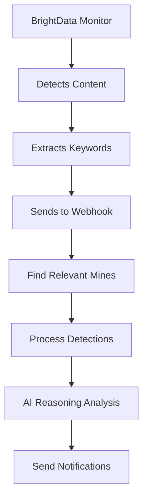
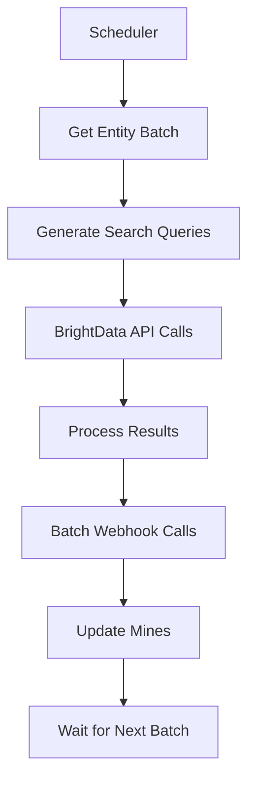

# 🔍 **Keyword Mines System - Webhook & Batch Processing Guide**

## **System Architecture Overview**

The keyword mines system works on a **3-layer architecture**:

1. **Keyword Mines Layer** - Smart keyword entities with contextual monitoring
2. **Webhook Integration Layer** - Real-time data ingestion from external sources  
3. **Batch Processing Layer** - Bulk data processing for historical/periodic analysis

---

## **1. Keyword Mines - Smart Entity Monitoring**

### **How Keywords Work**
```typescript
interface KeywordMine {
  id: string;
  entity_name: string;           // "Premier League", "Arsenal FC"
  keywords: string[];            // ["digital transformation", "fan engagement", "ticketing"]
  monitoring_sources: [
    {
      type: "linkedin",
      keywords: ["procurement", "rfp", "tender"],
      frequency: "realtime",
      weight: 8  // High importance
    }
  ],
  alert_threshold: 75;           // Confidence score to trigger alert
  reasoning_context: string;     // AI-generated context for entity
}
```

### **Keyword Generation Logic**
For each entity, the system generates **3 types of keywords**:

```typescript
// 1. Direct Entity Keywords
["premier league", "manchester united", "football club"]

// 2. Business Context Keywords  
["digital transformation", "sponsorship deals", "fan engagement"]

// 3. Procurement Keywords
["request for proposal", "tender", "procurement", "rfp", "vendor selection"]
```

---

## **2. Webhook Integration - Real-Time Processing**

### **Webhook Endpoint**
```
POST /api/mines/webhook
```

### **Webhook Flow**


### **Real Webhook Example**
```bash
curl -X POST "http://localhost:3005/api/mines/webhook" \
  -H "Content-Type: application/json" \
  -d '{
    "source": "linkedin",
    "content": "Premier League seeking digital transformation partner for fan engagement platform modernization and data analytics integration",
    "url": "https://linkedin.com/news/premier-league-digital",
    "keywords": ["premier league", "digital transformation", "fan engagement", "data analytics"],
    "timestamp": "2025-10-05T15:45:00.000Z"
  }'
```

### **Webhook Processing Logic**
```typescript
// 1. Find relevant mines (2+ matching keywords)
const relevantMines = await findRelevantMines(
  ["premier league", "digital transformation", "fan engagement"], 
  "linkedin"
);

// 2. Process detection for each mine
for (const mine of relevantMines) {
  const detection = await processDetection(mine.id, {
    content: "Premier League seeking digital transformation partner...",
    keywords_matched: ["premier league", "digital transformation"],
    confidence_score: 85
  });
}
```

---

## **3. Batch Processing - Historical Analysis**

### **Batch Processing Architecture**
```typescript
interface BatchProcessor {
  entity_batch_size: 50;        // Process 50 entities at once
  api_rate_limit: 100;          // 100 requests per minute
  processing_intervals: {
    tier_1: "15min",            // High-priority entities
    tier_2: "1hour",            // Medium-priority entities  
    tier_3: "6hours"            // Lower-priority entities
  };
}
```

### **Batch Processing Flow**


---

## **4. BrightData Integration - Data Collection**

### **BrightData MCP Bridge**
```typescript
// The system uses Claude Code MCP to orchestrate BrightData calls
const brightDataIntegration = {
  search_engines: {
    google: ["news", "web", "procurement sites"],
    bing: ["company announcements", "press releases"]
  },
  social_media: {
    linkedin: ["company posts", "executive updates"],
    twitter: ["company announcements", "industry news"]
  },
  procurement_sites: {
    official_portals: ["gov.uk", "eu-tenders", "official procurement sites"],
    industry_platforms: ["sports business tenders", "sports tech RFPs"]
  }
};
```

### **Batch Search Query Example**
```python
# LinkedIn Monitor Worker - Batch Processing
async def _search_linkedin_batch(self, entities: List[str]) -> List[Dict]:
    """Search for multiple entities in one batch"""
    
    search_query = {
        "entities": ["Premier League", "Arsenal FC", "Chelsea FC"],
        "keywords": ["digital transformation", "procurement", "rfp"],
        "time_range": "week",
        "limit": 100,
        "batch_id": "batch_001"
    }
    
    results = await brightdata_api.search_batch(search_query)
    return results
```

---

## **5. Complete Integration Example**

### **Scenario: Premier League Digital Tender**

#### **Step 1: Keyword Mine Setup**
```json
{
  "entity_name": "Premier League",
  "keywords": [
    "premier league", "football", "soccer",
    "digital transformation", "fan engagement", "technology partnership",
    "rfp", "tender", "procurement", "vendor selection"
  ],
  "monitoring_sources": [
    {"type": "linkedin", "frequency": "realtime"},
    {"type": "procurement", "frequency": "hourly"},
    {"type": "news", "frequency": "daily"}
  ]
}
```

#### **Step 2: Real-Time Detection (Webhook)**
```json
// BrightData detects LinkedIn post
{
  "source": "linkedin",
  "content": "Premier League launches RFP for next-generation digital fan platform",
  "url": "https://linkedin.com/posts/premier-league-rfp",
  "keywords": ["premier league", "rfp", "digital fan platform"],
  "detected_at": "2025-10-05T15:30:00Z"
}
```

#### **Step 3: Mine Processing**
```typescript
// System finds matching mine
const matchedMine = await findRelevantMines(
  ["premier league", "rfp", "digital fan platform"],
  "linkedin"
); // Returns Premier League mine

// AI reasoning analyzes opportunity
const reasoningResult = await analyzeOpportunity({
  entity: "Premier League",
  opportunity: "Digital fan platform RFP",
  urgency: "high",
  estimated_value: "£2M-£5M",
  competition_level: "high"
});
```

#### **Step 4: Multi-Channel Notifications**
```typescript
// Send alerts through all configured channels
await notificationService.send({
  message: {
    title: "🚨 HIGH VALUE: Premier League Digital Platform RFP",
    body: "Estimated £2M-£5M opportunity detected",
    urgency: "critical"
  },
  channels: ["pwa", "teams", "email", "slack"]
});
```

---

## **6. Batch Processing Schedule**

### **Processing Tiers**
```typescript
const processingSchedule = {
  tier_1: {  // Premier League, Top 50 clubs
    entities: 50,
    interval: "15min",
    priority: "critical"
  },
  tier_2: {  // Major leagues, clubs
    entities: 500, 
    interval: "1hour",
    priority: "high"
  },
  tier_3: {  // All other entities
    entities: 2761,
    interval: "6hours", 
    priority: "normal"
  }
};
```

### **Batch Processing Code**
```typescript
async function processBatch(entities: Entity[], tier: string) {
  const batchSize = 50;
  const batches = chunk(entities, batchSize);
  
  for (const batch of batches) {
    // Generate search queries for batch
    const queries = batch.map(entity => ({
      entity_name: entity.name,
      keywords: entity.keywords,
      search_sources: entity.monitoring_sources
    }));
    
    // Execute batch search via BrightData
    const results = await brightDataAPI.batchSearch(queries);
    
    // Process results as webhooks
    for (const result of results) {
      await processWebhookData(result);
    }
    
    // Rate limiting
    await sleep(1000); // 1 second between batches
  }
}
```

---

## **7. Testing the Integration**

### **Test Real-Time Webhook**
```bash
curl -X POST "http://localhost:3005/api/mines/webhook" \
  -H "Content-Type: application/json" \
  -d '{
    "source": "linkedin",
    "content": "Chelsea FC seeking CRM system upgrade partner for fan data management",
    "url": "https://linkedin.com/example/chelsea-crm",
    "keywords": ["chelsea fc", "crm system", "fan data", "partner"],
    "timestamp": "2025-10-05T15:45:00.000Z"
  }'
```

### **Test Batch Processing**
```bash
# Initialize mines for batch processing
curl -X POST "http://localhost:3005/api/mines/initialize" \
  -H "Content-Type: application/json" \
  -d '{"action":"initialize_all"}'

# Check processing status
curl "http://localhost:3005/api/reasoning/service"
```

---

## **8. Key Benefits**

### **Real-Time Processing** ⚡
- **Instant Alerts**: Webhook processing within seconds of detection
- **Live Monitoring**: Continuous monitoring of LinkedIn, news, procurement sites
- **Immediate Analysis**: AI reasoning processes opportunities instantly

### **Batch Processing** 🔄
- **Scalable**: Process 3,311 entities efficiently in batches
- **Rate-Limited**: Respect API limits with intelligent batching
- **Comprehensive**: Historical analysis and periodic updates

### **Smart Keyword Matching** 🧠
- **Contextual**: Keywords generated per entity with business context
- **Weighted**: Different importance weights for different keyword types
- **Adaptive**: System learns from successful detections

### **Multi-Source Integration** 🌐
- **BrightData**: Web scraping, LinkedIn monitoring, search engines
- **Direct APIs**: Procurement portals, company websites
- **Social Media**: Real-time social listening

The system combines **real-time webhook processing** for immediate opportunities with **batch processing** for comprehensive coverage, ensuring no opportunity is missed while maintaining system performance.