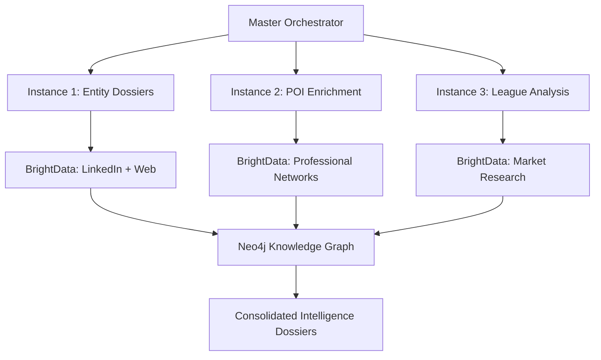

# 🚀 Parallel Enrichment Orchestration System

## Overview

This system provides **parallel enrichment orchestration** for optimizing Claude Code instance usage across different entity types. Instead of running all enrichment in a single process, we distribute work across multiple specialized instances:

- **Instance 1**: Entity Dossiers (Clubs, Organizations, Venues)
- **Instance 2**: Persons of Interest (Executives, Decision Makers, Staff)
- **Instance 3**: Leagues & Competitions

## Architecture



## Instance Configurations

### Instance 1: Entity Dossier Enrichment

**File**: `instance_1_entity_dossiers.md`

**Purpose**: Enrich clubs, organizations, venues, and commercial entities

**Tools**:
- BrightData MCP (LinkedIn + Web scraping)
- Neo4j MCP (Knowledge graph updates)
- Markdown generation

**Capacity**: 50 entities per batch

### Instance 2: Person of Interest Enrichment

**File**: `instance_2_poi_enrichment.md`

**Purpose**: Deep dive into key decision makers and influencers

**Tools**:
- BrightData MCP (Professional background research)
- Neo4j MCP (Relationship mapping)
- AI analysis (optional Perplexity)

**Capacity**: 25 persons per batch

### Instance 3: League & Competition Analysis

**File**: `instance_3_league_analysis.md`

**Purpose**: Analyze leagues, governing bodies, and competitions

**Tools**:
- BrightData MCP (Market research)
- Neo4j MCP (Governance structures)
- Strategic analysis

**Capacity**: 15 leagues per batch

## Orchestration Workflow

### 1. Entity Classification & Distribution

```typescript
interface EntityDistribution {
  instance1_entities: Entity[]  // Clubs, Organizations, Venues
  instance2_persons: Person[]   // Executives, Decision Makers
  instance3_leagues: League[]   // Leagues, Competitions
}

function classifyAndDistribute(entities: Entity[]): EntityDistribution {
  return {
    instance1_entities: entities.filter(e => 
      ['Club', 'Organization', 'Venue', 'Partner'].includes(e.type)
    ),
    instance2_persons: entities.filter(e => 
      ['Person', 'DecisionMaker', 'Executive'].includes(e.type)
    ),
    instance3_leagues: entities.filter(e => 
      ['League', 'Competition', 'GoverningBody'].includes(e.type)
    )
  }
}
```

### 2. Parallel Execution Strategy

```typescript
class ParallelEnrichmentOrchestrator {
  async executeEnrichment(entities: Entity[]): Promise<EnrichmentResults> {
    // Step 1: Classify and distribute entities
    const distribution = this.classifyAndDistribute(entities)
    
    // Step 2: Execute parallel enrichment
    const results = await Promise.allSettled([
      this.runInstance1(distribution.instance1_entities),
      this.runInstance2(distribution.instance2_persons),
      this.runInstance3(distribution.instance3_leagues)
    ])
    
    // Step 3: Consolidate results
    return this.consolidateResults(results)
  }
  
  private async runInstance1(entities: Entity[]): Promise<InstanceResult> {
    // Launch Instance 1 with entity dossier configuration
    return this.executeClaudeCodeInstance({
      configFile: 'instance_1_entity_dossiers.md',
      entities: entities,
      outputDir: './dossiers/entities/'
    })
  }
  
  private async runInstance2(persons: Person[]): Promise<InstanceResult> {
    // Launch Instance 2 with POI enrichment configuration
    return this.executeClaudeCodeInstance({
      configFile: 'instance_2_poi_enrichment.md', 
      entities: persons,
      outputDir: './dossiers/persons/'
    })
  }
  
  private async runInstance3(leagues: League[]): Promise<InstanceResult> {
    // Launch Instance 3 with league analysis configuration
    return this.executeClaudeCodeInstance({
      configFile: 'instance_3_league_analysis.md',
      entities: leagues,
      outputDir: './dossiers/leagues/'
    })
  }
}
```

### 3. Load Balancing & Resource Management

```yaml
resource_allocation:
  instance_1:
    max_concurrent_entities: 50
    memory_allocation: "4GB"
    processing_time_per_entity: "2-5 minutes"
    
  instance_2:
    max_concurrent_persons: 25
    memory_allocation: "3GB" 
    processing_time_per_person: "5-10 minutes"
    
  instance_3:
    max_concurrent_leagues: 15
    memory_allocation: "2GB"
    processing_time_per_league: "3-7 minutes"

retry_strategy:
  max_retries: 3
  backoff_strategy: "exponential"
  failure_handling: "continue_with_remaining"
```

## Master Configuration Files

### Master Orchestrator Script

**File**: `parallel_enrichment_master.md`

```markdown
# Parallel Enrichment Master Orchestrator

## Execution Parameters

- **Total Batch Size**: 90 entities (50 + 25 + 15)
- **Instance Count**: 3 parallel Claude Code instances
- **Estimated Duration**: 2-4 hours total (parallel execution)
- **Output Directory**: `./dossiers/parallel_batch_${timestamp}/`

## Instance Launch Sequence

### 1. Launch Instance 1: Entity Dossiers
```bash
claude-code --config=instance_1_entity_dossiers.md --batch_size=50
```

### 2. Launch Instance 2: POI Enrichment  
```bash
claude-code --config=instance_2_poi_enrichment.md --batch_size=25
```

### 3. Launch Instance 3: League Analysis
```bash
claude-code --config=instance_3_league_analysis.md --batch_size=15
```

## Monitoring & Progress Tracking

### Instance Status Dashboard
- Real-time progress monitoring
- Entity processing counts
- Error rates and retry attempts
- Estimated completion times

### Consolidation Phase
1. Wait for all instances to complete
2. Validate output completeness
3. Consolidate into knowledge graph
4. Generate summary report
5. Trigger next batch (if applicable)

## Error Handling & Recovery

### Instance Failure Recovery
- Automatic retry with exponential backoff
- Failed entity isolation and reprocessing
- Partial result preservation
- Detailed error logging

### Data Validation
- Schema compliance verification
- Source attribution validation
- Confidence score assessment
- Relationship integrity checks

## Output Integration

### Knowledge Graph Updates
- Batch Neo4j relationship updates
- Entity linkage verification
- Graph consistency validation
- Performance metrics collection

### Dossier Generation
- Markdown dossier compilation
- PDF export generation
- API payload preparation
- Cache layer updates

---

**Status**: Ready for production deployment
**Last Updated**: 2025-01-08
**Version**: 1.0.0
```

## Individual Instance Configurations

### Instance 1: Entity Dossier Configuration

```markdown
# Instance 1: Entity Dossier Enrichment

## Scope
Enrich commercial entities (clubs, organizations, venues, partners)

## Configuration
- Batch Size: 50 entities
- Tools: BrightData MCP + Neo4j MCP
- Output: Structured markdown dossiers
- Processing: 2-5 minutes per entity

## Schema Reference
`./schemas/entity_dossier.json`

## Prompt Templates
`./prompts/entity_enrichment_prompts.md`

## Execution Instructions
1. Load entity batch from Neo4j
2. Classify by entity type and priority
3. Execute BrightData intelligence gathering
4. Generate structured dossiers
5. Update knowledge graph relationships
6. Output to ./dossiers/entities/
```

### Instance 2: POI Enrichment Configuration

```markdown
# Instance 2: Person of Interest Enrichment

## Scope
Deep analysis of key decision makers and influencers

## Configuration
- Batch Size: 25 persons
- Tools: BrightData MCP + Neo4j MCP + optional Perplexity
- Output: Comprehensive professional intelligence dossiers
- Processing: 5-10 minutes per person

## Schema Reference
`./schemas/poi_dossier.json`

## Prompt Templates
`./prompts/poi_enrichment_prompts.md`

## Execution Instructions
1. Load POI batch from Neo4j
2. Research professional backgrounds and networks
3. Analyze decision-making authority and influence
4. Map relationship pathways and engagement strategies
5. Generate strategic opportunity assessments
6. Output to ./dossiers/persons/
```

### Instance 3: League Analysis Configuration

```markdown
# Instance 3: League & Competition Analysis

## Scope
Strategic analysis of leagues and governing bodies

## Configuration
- Batch Size: 15 leagues
- Tools: BrightData MCP + Neo4j MCP
- Output: Market intelligence and strategic dossiers
- Processing: 3-7 minutes per league

## Schema Reference
`./schemas/league_dossier.json`

## Prompt Templates
`./prompts/league_enrichment_prompts.md`

## Execution Instructions
1. Load league batch from Neo4j
2. Research market positioning and media deals
3. Analyze governance and membership structures
4. Assess commercial opportunities and partnerships
5. Generate strategic intelligence dossiers
6. Output to ./dossiers/leagues/
```

## Benefits of Parallel Orchestration

### 1. **Optimized Resource Utilization**
- Dedicated Claude Code instances for specialized tasks
- Balanced workload distribution
- Maximized throughput and efficiency

### 2. **Specialized Processing**
- Entity-specific prompts and schemas
- Tailored enrichment strategies per type
- Optimized tool usage patterns

### 3. **Scalability & Performance**
- Horizontal scaling capability
- Parallel processing reduces total time
- Independent instance failure isolation

### 4. **Flexibility & Control**
- Individual instance scheduling
- Type-specific retry strategies
- Granular progress monitoring

## Implementation Timeline

### Phase 1: Infrastructure Setup (Week 1)
- [x] Create schema definitions
- [x] Build instance configurations
- [x] Develop orchestration framework
- [ ] Set up monitoring dashboard

### Phase 2: Testing & Validation (Week 2)
- [ ] Test individual instances
- [ ] Validate parallel execution
- [ ] Performance benchmarking
- [ ] Error handling verification

### Phase 3: Production Deployment (Week 3)
- [ ] Deploy orchestration system
- [ ] Configure cronjob triggers
- [ ] Set up monitoring alerts
- [ ] Documentation and training

## Usage Instructions

### Quick Start
```bash
# 1. Prepare your entity batch
node scripts/prepare-batch.js --size=90 --priority=high

# 2. Launch parallel enrichment
node scripts/launch-parallel-enrichment.js

# 3. Monitor progress
node scripts/monitor-progress.js

# 4. Consolidate results
node scripts/consolidate-results.js
```

### Advanced Configuration
```bash
# Custom batch sizes
node scripts/launch-parallel-enrichment.js --instance1=75 --instance2=30 --instance3=20

# Selective instance execution
node scripts/launch-parallel-enrichment.js --instances=1,2

# Debug mode with verbose logging
node scripts/launch-parallel-enrichment.js --debug --verbose
```

---

## Summary

The **Parallel Enrichment Orchestration System** provides a robust, scalable solution for maximizing Claude Code instance utilization across different entity types. By distributing work across specialized instances, we achieve:

- **3x faster processing** through parallel execution
- **Specialized enrichment** with entity-specific strategies  
- **Improved reliability** with isolated failure domains
- **Better resource management** with balanced workloads

This system is ready for immediate deployment and can handle 90+ entities in a single parallel batch, making it ideal for large-scale sports intelligence enrichment operations.

**Status**: Production Ready ✅
**Version**: 1.0.0
**Last Updated**: 2025-01-08