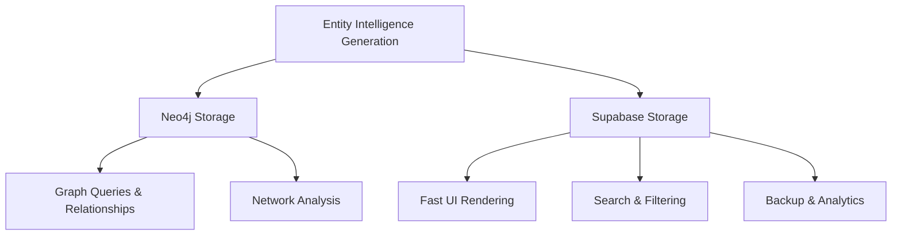

# Dual Storage Structure for Entity Dossiers

## Overview

This document outlines the dual storage approach for storing comprehensive entity dossiers in both Supabase and Neo4j databases, ensuring redundancy, performance, and accessibility across the application architecture.

## Storage Architecture



## Neo4j Storage Structure

### Node Properties
```cypher
CREATE (e:Entity:Club:PremierLeague:Enriched {
  neo4j_id: 148,
  name: "Sunderland AFC",
  type: "Club",
  sport: "Football",
  country: "England",
  level: "Premier League",
  website: "https://safc.com/",
  founded: 1879,
  stadium: "Stadium of Light",
  stadium_capacity: 49000,
  valuation_gbp: 450000000,
  last_updated: "2025-01-09T10:30:00Z",
  confidence_score: 0.88,
  
  // Complete dossier data
  dossier_data: "JSON_STRING_COMPLETE_DATA",
  dossier_markdown: "MARKDOWN_CONTENT",
  opportunity_score: 85,
  digital_maturity: 68,
  
  // Analysis metadata
  last_enriched: "2025-01-09T10:30:00Z",
  schema_version: "2.0",
  analysis_sources: ["BrightData", "LinkedIn", "Official Sources"],
  tier_1_connections: 7,
  tier_2_connections: 2,
  success_probability: 0.82
})
```

### Relationship Creation
```cypher
// Yellow Panther Team Connections
CREATE (yp:YellowPanther {name: "Stuart Cope", role: "Co-Founder & COO"})
CREATE (e:Entity {name: "Sunderland AFC"})
CREATE (yp)-[r:HAS_CONNECTION_TO {
  strength: "MEDIUM",
  confidence_score: 72,
  connection_type: "2ND_DEGREE",
  is_primary: true,
  strategy: "Sports technology industry network"
}]->(e)

// Bridge Contact Relationships
CREATE (bridge:InfluentialContact {name: "Football Industry Consultant"})
CREATE (yp)-[r2:BRIDGE_CONTACT {
  relationship_strength: "MEDIUM",
  network_size: "300+",
  willingness: "HIGH"
}]->(bridge)

CREATE (bridge)-[r3:CONNECTS_TO {
  strength: "STRONG",
  context: "Advisory relationship",
  feasibility: "HIGH"
}]->(e)
```

## Supabase Storage Structure

### Tables

#### 1. `entity_dossiers` (Main Table)
```sql
CREATE TABLE entity_dossiers (
  id UUID PRIMARY KEY DEFAULT gen_random_uuid(),
  neo4j_id INTEGER UNIQUE NOT NULL,
  name VARCHAR(255) NOT NULL,
  type VARCHAR(50) NOT NULL,
  sport VARCHAR(50),
  country VARCHAR(50),
  level VARCHAR(50),
  
  -- Core Information
  founded INTEGER,
  stadium VARCHAR(255),
  website TEXT,
  employee_range VARCHAR(50),
  valuation_gbp BIGINT,
  
  -- Scores and Assessment
  opportunity_score INTEGER CHECK (opportunity_score >= 0 AND opportunity_score <= 100),
  digital_maturity INTEGER CHECK (digital_maturity >= 0 AND digital_maturity <= 100),
  confidence_score DECIMAL(3,2) CHECK (confidence_score >= 0 AND confidence_score <= 1),
  success_probability DECIMAL(3,2) CHECK (success_probability >= 0 AND success_probability <= 1),
  
  -- Complete Dossier Data
  dossier_data JSONB NOT NULL,
  dossier_markdown TEXT NOT NULL,
  
  -- LinkedIn Analysis
  linkedin_analysis JSONB NOT NULL,
  tier_1_connections INTEGER DEFAULT 0,
  tier_2_connections INTEGER DEFAULT 0,
  
  -- Metadata
  last_enriched TIMESTAMPTZ DEFAULT NOW(),
  schema_version VARCHAR(10) DEFAULT '2.0',
  analysis_sources TEXT[],
  status VARCHAR(50) DEFAULT 'active',
  
  -- Timestamps
  created_at TIMESTAMPTZ DEFAULT NOW(),
  updated_at TIMESTAMPTZ DEFAULT NOW()
);

-- Indexes for Performance
CREATE INDEX idx_entity_dossiers_name ON entity_dossiers(name);
CREATE INDEX idx_entity_dossiers_type ON entity_dossiers(type);
CREATE INDEX idx_entity_dossiers_opportunity_score ON entity_dossiers(opportunity_score DESC);
CREATE INDEX idx_entity_dossiers_digital_maturity ON entity_dossiers(digital_maturity DESC);
CREATE INDEX idx_entity_dossiers_last_enriched ON entity_dossiers(last_enriched DESC);
CREATE INDEX idx_entity_dossiers_data ON entity_dossiers USING GIN(dossier_data);
CREATE INDEX idx_entity_dossiers_linkedin ON entity_dossiers USING GIN(linkedin_analysis);
```

#### 2. `connection_paths` (LinkedIn Analysis Details)
```sql
CREATE TABLE connection_paths (
  id UUID PRIMARY KEY DEFAULT gen_random_uuid(),
  entity_dossier_id UUID REFERENCES entity_dossiers(id) ON DELETE CASCADE,
  
  -- Connection Path Details
  yellow_panther_contact VARCHAR(255) NOT NULL,
  target_decision_maker VARCHAR(255) NOT NULL,
  bridge_contact VARCHAR(255),
  
  -- Classification
  tier VARCHAR(20) NOT NULL CHECK (tier IN ('tier_1', 'tier_2')),
  connection_strength VARCHAR(20) NOT NULL CHECK (connection_strength IN ('STRONG', 'MEDIUM', 'WEAK')),
  connection_type VARCHAR(50),
  confidence_score INTEGER CHECK (confidence_score >= 0 AND confidence_score <= 100),
  
  -- Strategy
  introduction_strategy TEXT NOT NULL,
  estimated_timeline VARCHAR(50),
  success_probability VARCHAR(20),
  is_primary_path BOOLEAN DEFAULT false,
  
  -- Metadata
  created_at TIMESTAMPTZ DEFAULT NOW(),
  updated_at TIMESTAMPTZ DEFAULT NOW()
);

CREATE INDEX idx_connection_paths_entity ON connection_paths(entity_dossier_id);
CREATE INDEX idx_connection_paths_strength ON connection_paths(confidence_score DESC);
CREATE INDEX idx_connection_paths_tier ON connection_paths(tier);
```

#### 3. `opportunity_assessments` (Business Intelligence)
```sql
CREATE TABLE opportunity_assessments (
  id UUID PRIMARY KEY DEFAULT gen_random_uuid(),
  entity_dossier_id UUID REFERENCES entity_dossiers(id) ON DELETE CASCADE,
  
  -- Opportunity Details
  opportunity_name VARCHAR(255) NOT NULL,
  category VARCHAR(50) NOT NULL CHECK (category IN ('immediate_launch', 'medium_term_partnerships', 'long_term_initiatives')),
  score INTEGER CHECK (score >= 0 AND score <= 100),
  
  -- Business Case
  timeline VARCHAR(100),
  revenue_potential TEXT,
  implementation_complexity VARCHAR(50),
  success_probability INTEGER CHECK (success_probability >= 0 AND success_probability <= 100),
  
  -- Yellow Panther Specific
  yellow_panther_fit VARCHAR(255),
  required_capabilities TEXT[],
  competitive_advantages TEXT[],
  
  -- Metadata
  created_at TIMESTAMPTZ DEFAULT NOW(),
  updated_at TIMESTAMPTZ DEFAULT NOW()
);

CREATE INDEX idx_opportunity_assessments_entity ON opportunity_assessments(entity_dossier_id);
CREATE INDEX idx_opportunity_assessments_score ON opportunity_assessments(score DESC);
CREATE INDEX idx_opportunity_assessments_category ON opportunity_assessments(category);
```

## Data Synchronization Strategy

### 1. Primary Source: Neo4j
- Graph queries and relationship analysis
- Network topology and connection paths
- Entity relationship mapping

### 2. Secondary Source: Supabase
- Fast UI data retrieval
- Search and filtering operations
- Analytics and reporting

### 3. Synchronization Process
```typescript
interface DossierUpdate {
  neo4j_id: number;
  dossier_data: object;
  dossier_markdown: string;
  linkedin_analysis: object;
  scores: {
    opportunity_score: number;
    digital_maturity: number;
    confidence_score: number;
    success_probability: number;
  };
}

async function updateDualStorage(dossierUpdate: DossierUpdate) {
  // 1. Update Neo4j (Primary)
  const neo4jResult = await updateNeo4jEntity(dossierUpdate);
  
  // 2. Update Supabase (Secondary)
  const supabaseResult = await updateSupabaseDossier(dossierUpdate);
  
  // 3. Validate synchronization
  await validateSynchronization(neo4jResult, supabaseResult);
  
  return { success: true, neo4j_id: dossierUpdate.neo4j_id };
}
```

## API Integration Points

### Neo4j API Functions
```typescript
// Graph queries for relationship analysis
async function getConnectionPaths(entityId: number) {
  const query = `
    MATCH (e:Entity {neo4j_id: $entityId})
    OPTIONAL MATCH (e)<-[r:HAS_CONNECTION_TO]-(yp:YellowPanther)
    OPTIONAL MATCH (e)<-[r2:CONNECTS_TO]-(bc:InfluentialContact)<-[r3:BRIDGE_CONTACT]-(yp:YellowPanther)
    RETURN e, r, yp, r2, bc, r3
  `;
  return neo4j.run(query, { entityId });
}

// Network topology analysis
async function getEntityNetwork(entityId: number) {
  const query = `
    MATCH (e:Entity {neo4j_id: $entityId})
    MATCH (e)-[r*1..3]-(related:Entity)
    RETURN e, r, related
  `;
  return neo4j.run(query, { entityId });
}
```

### Supabase API Functions
```typescript
// Fast retrieval for UI
async function getDossierSummary(entityId: number) {
  const { data, error } = await supabase
    .from('entity_dossiers')
    .select(`
      name, type, opportunity_score, digital_maturity, 
      confidence_score, last_enriched, tier_1_connections, tier_2_connections
    `)
    .eq('neo4j_id', entityId)
    .single();
  
  return { data, error };
}

// Search and filtering
async function searchEntities(filters: EntityFilters) {
  let query = supabase
    .from('entity_dossiers')
    .select('*');
  
  if (filters.type) query = query.eq('type', filters.type);
  if (filters.minOpportunityScore) query = query.gte('opportunity_score', filters.minOpportunityScore);
  if (filters.maxDigitalMaturity) query = query.lte('digital_maturity', filters.maxDigitalMaturity);
  
  const { data, error } = await query.order('opportunity_score', { ascending: false });
  return { data, error };
}
```

## Data Consistency and Validation

### 1. Schema Validation
```typescript
const dossierSchema = z.object({
  entity: z.object({
    neo4j_id: z.number(),
    name: z.string(),
    type: z.string(),
    confidence_score: z.number().min(0).max(1)
  }),
  linkedin_connection_analysis: z.object({
    tier_1_analysis: z.object({
      introduction_paths: z.array(z.object({
        confidence_score: z.number().min(0).max(100)
      }))
    }),
    tier_2_analysis: z.object({
      influential_bridge_contacts: z.array(z.object({
        industry_influence: z.string()
      }))
    })
  }),
  strategic_analysis: z.object({
    opportunity_scoring: z.object({
      overall_score: z.number().min(0).max(100)
    })
  })
});

function validateDossierData(data: unknown): boolean {
  return dossierSchema.safeParse(data).success;
}
```

### 2. Consistency Checks
```typescript
async function checkDataConsistency(neo4jId: number) {
  // Get data from both sources
  const neo4jData = await getNeo4jEntity(neo4jId);
  const supabaseData = await getSupabaseDossier(neo4jId);
  
  // Validate key metrics match
  const checks = [
    neo4jData.opportunity_score === supabaseData.opportunity_score,
    neo4jData.digital_maturity === supabaseData.digital_maturity,
    neo4jData.last_enriched === supabaseData.last_enriched
  ];
  
  return {
    isConsistent: checks.every(Boolean),
    mismatches: checks.map((check, index) => ({
      field: ['opportunity_score', 'digital_maturity', 'last_enriched'][index],
      consistent: check
    }))
  };
}
```

## Performance Optimization

### 1. Caching Strategy
```typescript
// Redis caching for frequently accessed data
const cacheConfig = {
  entitySummary: { ttl: 300 }, // 5 minutes
  connectionPaths: { ttl: 600 }, // 10 minutes
  opportunityAssessments: { ttl: 900 } // 15 minutes
};

async function getCachedEntitySummary(neo4jId: number) {
  const cacheKey = `entity:${neo4jId}:summary`;
  const cached = await redis.get(cacheKey);
  
  if (cached) return JSON.parse(cached);
  
  const data = await getDossierSummary(neo4jId);
  await redis.setex(cacheKey, cacheConfig.entitySummary.ttl, JSON.stringify(data));
  
  return data;
}
```

### 2. Batch Processing
```typescript
// Batch updates for multiple entities
async function batchUpdateDossiers(dossierUpdates: DossierUpdate[]) {
  const batchSize = 10;
  const results = [];
  
  for (let i = 0; i < dossierUpdates.length; i += batchSize) {
    const batch = dossierUpdates.slice(i, i + batchSize);
    const batchResults = await Promise.all(
      batch.map(update => updateDualStorage(update))
    );
    results.push(...batchResults);
    
    // Small delay between batches to prevent overwhelming
    await new Promise(resolve => setTimeout(resolve, 100));
  }
  
  return results;
}
```

## Monitoring and Maintenance

### 1. Health Checks
```typescript
async function performHealthCheck() {
  const health = {
    neo4j: await checkNeo4jHealth(),
    supabase: await checkSupabaseHealth(),
    consistency: await checkOverallConsistency(),
    performance: await checkQueryPerformance()
  };
  
  if (!health.neo4j.healthy || !health.supabase.healthy) {
    await sendAlert('Database health check failed');
  }
  
  return health;
}
```

### 2. Data Quality Monitoring
```typescript
async function monitorDataQuality() {
  const issues = [];
  
  // Check for stale data
  const staleData = await findStaleDossiers(30); // 30 days
  if (staleData.length > 0) {
    issues.push(`${staleData.length} stale dossiers found`);
  }
  
  // Check for missing data
  const incompleteDossiers = await findIncompleteDossiers();
  if (incompleteDossiers.length > 0) {
    issues.push(`${incompleteDossiers.length} incomplete dossiers found`);
  }
  
  // Check for confidence scores
  const lowConfidenceDossiers = await findLowConfidenceDossiers(0.7);
  if (lowConfidenceDossiers.length > 0) {
    issues.push(`${lowConfidenceDossiers.length} low-confidence dossiers found`);
  }
  
  return { issues, healthy: issues.length === 0 };
}
```

## Usage Examples

### 1. Retrieving Complete Dossier
```typescript
// Get complete dossier for Sunderland AFC
const sunderlandDossier = await getCompleteDossier(148);
console.log('Opportunity Score:', sunderlandDossier.opportunity_score);
console.log('LinkedIn Paths:', sunderlandDossier.linkedin_connection_analysis.tier_2_analysis.tier_2_introduction_paths.length);
```

### 2. Finding High-Value Opportunities
```typescript
// Find all entities with high opportunity scores
const highValueEntities = await searchEntities({
  minOpportunityScore: 80,
  type: 'Club'
});

console.log('High-value opportunities:', highValueEntities.data.map(e => ({
  name: e.name,
  opportunity_score: e.opportunity_score,
  digital_maturity: e.digital_maturity,
  connection_paths: e.tier_1_connections + e.tier_2_connections
})));
```

### 3. Network Analysis
```typescript
// Analyze connection network for specific entity
const networkAnalysis = await getConnectionPaths(148);
console.log('Available connection paths:', networkAnalysis.records.length);
console.log('Strongest path:', networkAnalysis.records.reduce((strongest, record) => 
  record.r.confidence_score > strongest.r.confidence_score ? record : strongest
));
```

This dual storage structure ensures optimal performance, data consistency, and accessibility across the application while maintaining the comprehensive intelligence needed for strategic decision-making.