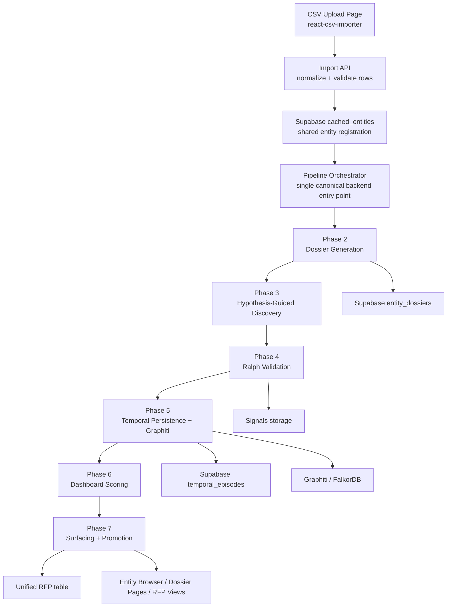

# Final CSV-to-Intelligence Pipeline

**Last Updated:** 2026-03-02
**Status:** Recommended target architecture
**Purpose:** Define the cleanest end-to-end implementation for taking an entity from a CSV import through the full intelligence system and into the shared outputs used by dossier views, RFP views, Graphiti/FalkorDB, and Supabase.

---

## v5 MCP-First Discovery

The v5 path keeps the dossier-first flow, but it changes the retrieval boundary:

- the dossier is still the context builder
- premium questions are still the query seed
- BrightData MCP is the only external retrieval transport for discovery
- DeepSeek remains the judge
- validated results persist to Graphiti, FalkorDB, and Supabase

For v5, the default smoke and pipeline behavior uses the **direct hosted BrightData MCP** endpoint.

The canonical procurement sequence is:
1. ingest entity
2. build dossier context
3. derive premium questions
4. turn questions into BrightData MCP queries
5. score the returned results by relevance
6. scrape the best result from BrightData MCP
7. scrape the top 2-3 results for noisy or high-value questions
8. use `web_data_*` or `extract` when Bright Data offers a better structured path
9. judge with DeepSeek
10. persist validated signals for the next pipeline stage

The remembered proof pattern is the Major League Cricket procurement smoke:
- direct BrightData MCP query
- search hit returned
- result scraped
- DeepSeek confirmed the RFP signal

The frozen method note lives here:
- [V5 Direct Hosted BrightData MCP Procurement Method](./data/V5_DIRECT_HOSTED_MCP_PROCUREMENT_METHOD.md)

---

## 1. Executive Summary

The repository already contains most of the core capabilities needed for the full system:

- Phase 0 dossier generation
- hypothesis-driven discovery
- Ralph Loop validation
- temporal intelligence via Graphiti
- three-axis dashboard scoring
- dossier and RFP persistence in Supabase

What is still missing is one canonical production path that starts with a newly uploaded CSV row, creates or updates the entity in the shared system, runs every phase in the correct order, and persists the outputs so the entity becomes visible everywhere else.

The cleanest implementation is:

1. Use a dedicated CSV upload page with `react-csv-importer`
2. Normalize and upsert imported rows into `cached_entities`
3. Trigger one backend orchestration service
4. Run the canonical intelligence pipeline phases in order
5. Persist dossiers, validated signals, temporal episodes, scores, and detected RFPs into the shared stores
6. Expose run status and final outputs back to the UI

This document defines that canonical architecture.

---

## 2. The Real Phase Inventory In The Current System

From the current code and the February 20, 2026 onward documentation, the system contains these real phases and layers.

### Core Business Phases

**Phase 0: Dossier Generation**

Primary files:
- `backend/dossier_generator.py`
- `backend/dossier_data_collector.py`
- `backend/dossier_section_prompts.py`

Purpose:
- collect multi-source entity intelligence
- generate the 11-section dossier
- extract hypotheses and signals from dossier content

---

**Phase 1: Hypothesis-Driven Discovery**

Primary file:
- `backend/hypothesis_driven_discovery.py`

Purpose:
- use dossier-derived priors or cold-start priors
- generate targeted procurement and capability searches
- prioritize exploration with EIG

---

**Phase 2: Ralph Loop Validation**

Primary file:
- `backend/ralph_loop.py`

Purpose:
- validate raw signals using rule checks, LLM cross-checking, and confidence gating
- separate validated procurement signals from noise

---

**Phase 3: Temporal Intelligence**

Primary files:
- `backend/graphiti_service.py`
- `backend/episode_clustering.py`
- `backend/eig_calculator.py`
- `backend/temporal_mcp_server.py`

Purpose:
- persist episodes and temporal events
- cluster similar events over time
- apply time-weighted EIG
- support pattern and timeline analysis

---

**Phase 4: Dashboard Scoring**

Primary file:
- `backend/dashboard_scorer.py`

Purpose:
- compute procurement maturity
- compute active procurement probability
- classify sales readiness

---

**Phase 5: Feedback / Dossier Enrichment**

Seen in:
- `run_dossier_first_pipeline.py`
- dossier enrichment and outreach logic in the generated dossier structure

Purpose:
- fold discovery and scoring results back into the entity dossier
- improve next-step recommendations and outreach context

---

**Phase 6: Surfacing / Global System Output**

Primary areas:
- `src/app/api/dossier/route.ts`
- `src/app/api/rfp-results/route.ts`
- `src/app/api/rfp-monitoring/route.ts`
- entity browser and dossier pages

Purpose:
- make final outputs visible to users
- expose dossiers, scoring, runs, and RFP detections

---

## 3. The Supporting Layers Around The Phases

The system also contains several layers that are important, but they are not business phases themselves.

### A. MCP / Tooling Layer

This layer provides tool access and orchestration for retrieval, graph operations, and agent workflows.

Key components:
- `backend/graphiti_mcp_server.py`
- `backend/graphiti_mcp_server_official/`
- `backend/temporal_mcp_server.py`
- `src/lib/mcp/`
- `src/app/api/intelligent-enrichment/route.ts`

Role:
- expose graph and temporal tools
- support agent-driven operations
- support UI and background workflows

Important distinction:
- `hypothesis-driven discovery` is a real pipeline phase
- `MCP-guided` is an execution and integration layer across phases, not the canonical phase name

### B. Control Plane / Agent Layer

Key components:
- Claude client in `backend/claude_client.py`
- Claude Agent SDK routes and services in `src/services/` and `src/app/api/claude-agent/`
- enrichment schedulers in `src/services/IntelligentEnrichmentScheduler.ts`

Role:
- coordinate tools
- provide reasoning
- run scheduled or interactive enrichment

This is useful, but it should not replace the canonical backend pipeline. It should call into it.

### C. Storage Layer

The shared storage plane currently spans:

**Supabase**
- `cached_entities`
- `entity_dossiers`
- `temporal_episodes`
- RFP tables including unified RFP storage

**Graphiti / FalkorDB / Neo4j-compatible graph storage**
- graph entities
- relationships
- signals
- temporal episodes

Clean rule:
- Supabase is the shared application data plane for UI and durable artifacts
- Graphiti/FalkorDB is the graph and temporal reasoning plane

---

## 4. Canonical End-To-End Pipeline To Standardize On

The cleanest system should use the following canonical sequence for every imported entity.

### Canonical Phase 0: Intake And Normalization

Input:
- one CSV row mapped by the upload UI

Output:
- normalized `ImportedEntityRow`
- generated `entity_id`
- validation result

Responsibilities:
- validate required columns
- normalize `entity_type`
- normalize `sport` and `country`
- default `priority_score`
- reject malformed rows early

This phase belongs in the Next.js import API, not in the browser and not in Python.

---

### Canonical Phase 1: Entity Registration

Input:
- normalized import row

Output:
- entity upserted into `cached_entities`
- entity available to the rest of the system

Responsibilities:
- upsert `cached_entities`
- preserve source metadata such as `source`, `external_id`, and `imported_at`
- optionally mirror into graph entity storage

This is the point where the imported entity becomes part of the shared entity universe.

---

### Canonical Phase 2: Dossier Generation

Input:
- registered entity

Output:
- generated dossier
- extracted dossier hypotheses
- extracted dossier signals

Responsibilities:
- run `UniversalDossierGenerator`
- persist to `entity_dossiers`
- preserve structured metadata and raw dossier output

This is the first true intelligence phase.

---

### Canonical Phase 3: Hypothesis-Guided Discovery

Input:
- dossier
- extracted signals and hypotheses

Output:
- additional raw discovery signals
- updated hypothesis confidence

Responsibilities:
- convert dossier output into discovery priors
- run targeted procurement and capability searches
- score and rank exploration with EIG

Important implementation note:
- the current dossier and discovery contract needs to be repaired so discovery reads the generator's actual signal structure, not an outdated list-based shape

---

### Canonical Phase 4: Ralph Validation

Input:
- raw discovery signals
- dossier-derived signals if needed

Output:
- validated signals
- rejected signals
- confidence-adjusted final signal set

Responsibilities:
- rule-based filtering
- LLM cross-checking
- minimum confidence and actionability gate

This phase is mandatory before any signal is promoted into the shared system.

---

### Canonical Phase 5: Temporal Persistence And Intelligence

Input:
- validated signals

Output:
- temporal episodes
- signal records
- graph relationships
- timeline context for the entity

Responsibilities:
- persist validated signals into graph-aware storage
- create RFP episodes for validated RFPs
- create discovery episodes for meaningful non-RFP findings
- fetch recent episode context for downstream scoring

This is where Graphiti/FalkorDB should be used directly.

---

### Canonical Phase 6: Final Scoring

Input:
- dossier hypotheses
- validated signals
- temporal episodes

Output:
- procurement maturity
- active procurement probability
- sales readiness
- confidence interval

Responsibilities:
- run `DashboardScorer`
- persist final scoring output with the run record

This is the final analytical phase.

---

### Canonical Phase 7: Surfacing And Promotion

Input:
- final scoring and validated outputs

Output:
- dossier page data
- batch run status
- global RFP visibility
- entity-level summary state

Responsibilities:
- upsert detected RFPs into the unified RFP table
- expose run status to the import UI
- expose dossier and score results to the existing entity and dossier views

This is the point where imported entities become first-class citizens of the overall system.

---

## 5. Clean Architecture Diagram



---

## 6. Recommended Ownership By Layer

### Frontend

The frontend should only do:
- CSV upload
- column mapping
- batch submission
- batch status polling
- final artifact linking

It should not:
- write directly to core tables
- run dossier generation
- run discovery
- run Ralph logic

### Next.js Server Routes

The Next server should own:
- import batch creation
- row normalization
- entity registration
- triggering backend orchestration
- surfacing status to the UI

### Python Backend

The Python backend should own:
- dossier generation
- discovery
- Ralph validation
- temporal persistence
- scoring

This is where the canonical orchestration service should live.

---

## 7. Recommended Canonical Components To Add

### A. Upload And Import

Add:
- `src/app/entity-import/page.tsx`
- `src/components/entity-import/EntityCsvImporter.tsx`
- `src/app/api/entity-import/route.ts`

### B. Run Tracking

Add:
- `entity_import_batches` table
- `entity_pipeline_runs` table

These should track:
- batch
- per-entity run
- current phase
- status
- final outputs

### C. Canonical Backend Orchestrator

Add:
- `backend/pipeline_orchestrator.py`

This should become the single production entry point for:
- one imported entity
- one batch of imported entities

### D. Shared Contracts

Add:
- one import row schema
- one dossier-to-discovery adapter
- one signal-to-RFP promotion adapter

These adapters will remove the current contract drift between modules.

---

## 8. CSV Contract To Standardize On

### Required Columns

- `name`
- `entity_type`
- `sport`
- `country`
- `source`

### Optional Columns

- `external_id`
- `website`
- `league`
- `founded_year`
- `headquarters`
- `stadium_name`
- `capacity`
- `description`
- `priority_score`
- `badge_url`

### Recommended Initial Template

```csv
name,entity_type,sport,country,source,external_id,website,league,founded_year,headquarters,stadium_name,capacity,description,priority_score,badge_url
Arsenal FC,CLUB,Football,England,csv_import,,https://www.arsenal.com,Premier League,1886,London,Emirates Stadium,60704,Premier League football club,90,
```

### Import Rules

- `entity_id` is generated server-side from `name`
- `priority_score` defaults to `50` if missing
- duplicates should upsert rather than create a second entity
- each imported row must retain provenance through `source`

---

## 9. The Most Important Current Gaps To Fix

These are the main issues preventing the current repository from behaving like a true end-to-end production pipeline.

### Gap 1: No real import entry point

`src/app/api/entities/route.ts` still contains mock creation logic for `POST`.

### Gap 2: No single production orchestrator

There are demo and partial runner scripts, but not one canonical backend service that runs every phase for a newly imported entity.

### Gap 3: Dossier-to-discovery contract mismatch

`backend/hypothesis_driven_discovery.py` expects dossier procurement signals in a shape that does not match the structured dossier produced by `backend/dossier_generator.py`.

### Gap 4: Ralph is not consistently in the production path

The recommended architecture requires explicit Ralph validation after discovery and before graph persistence and scoring.

### Gap 5: Temporal context is not consistently fed into scoring

The target system should score using real episodes, not `episodes=None`.

### Gap 6: Validated RFP promotion is not standardized

Imported entities must promote validated RFPs into the shared RFP store so they appear globally, not only inside one dossier artifact.

---

## 10. The Cleanest Final Implementation

The cleanest final implementation for this system is:

### Canonical Input Path

CSV file -> upload page -> import API -> normalized entity rows -> `cached_entities`

### Canonical Processing Path

`cached_entities` -> backend orchestrator -> dossier -> hypothesis-guided discovery -> Ralph validation -> Graphiti temporal persistence -> dashboard scoring

### Canonical Output Path

final run output -> `entity_dossiers` + `entity_pipeline_runs` + `temporal_episodes` + unified RFP table -> entity browser + dossier page + RFP dashboards

### Canonical Control Principle

Agent and MCP layers can assist orchestration, but they should call into this pipeline rather than become separate parallel pipelines.

---

## 11. Recommended Final Phase Model To Use In Documentation And Code

To avoid confusion, the system should be described internally using this final phase model.

**Phase 0:** Intake and normalization  
**Phase 1:** Entity registration  
**Phase 2:** Dossier generation  
**Phase 3:** Hypothesis-guided discovery  
**Phase 4:** Ralph validation  
**Phase 5:** Temporal persistence and intelligence  
**Phase 6:** Final scoring  
**Phase 7:** Surfacing and promotion

This is cleaner than mixing business phases with MCP layers.

MCP-guided orchestration, Claude Agent SDK, Graphiti MCP, and scheduling should be documented as support layers, not as primary business phases.

---

## 12. Implementation Priority Order

1. Build the CSV upload page and import API
2. Persist imported entities into `cached_entities`
3. Add batch and per-entity run tracking
4. Build the canonical Python orchestrator
5. Repair the dossier-to-discovery contract
6. Insert Ralph explicitly into the canonical path
7. Feed real temporal episodes into scoring
8. Promote validated RFPs into the unified RFP system
9. Expose status and final outputs in the upload UI

---

## 13. Final Recommendation

The system should standardize on one pipeline:

**CSV row -> shared entity registration -> dossier -> hypothesis-guided discovery -> Ralph validation -> Graphiti temporal persistence -> dashboard scoring -> RFP and dossier surfacing**

That is the cleanest architecture, the best fit for the code already in the repository, and the most reliable path for taking a new entity from CSV input to final intelligence output.
