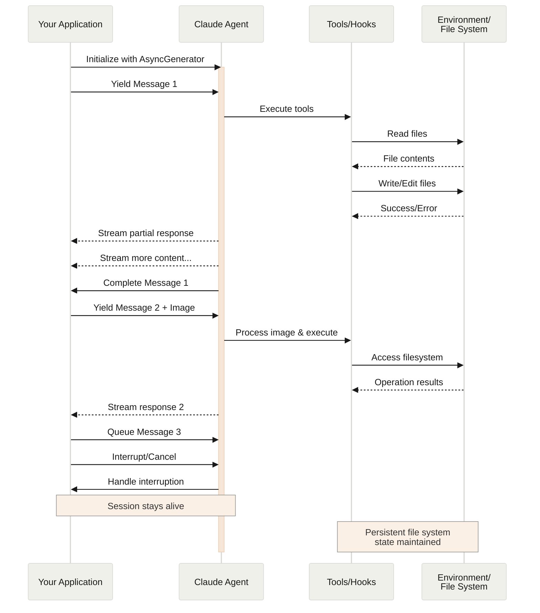
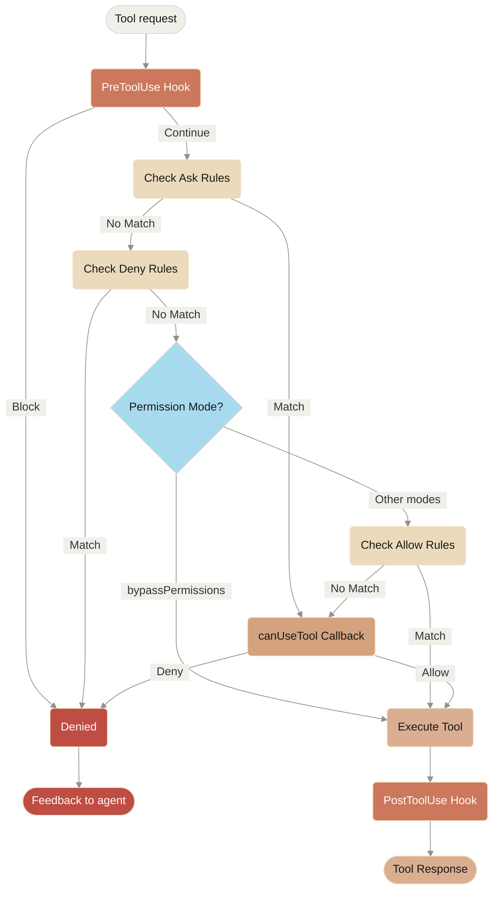

### Using Hooks for Behavior Modification

```python
from claude_agent_sdk import (
    ClaudeSDKClient,
    ClaudeAgentOptions,
    HookMatcher,
    HookContext
)
import asyncio
from typing import Any

async def pre_tool_logger(
    input_data: dict[str, Any],
    tool_use_id: str | None,
    context: HookContext
) -> dict[str, Any]:
    """Log all tool usage before execution."""
    tool_name = input_data.get('tool_name', 'unknown')
    print(f"[PRE-TOOL] About to use: {tool_name}")

    # You can modify or block the tool execution here
    if tool_name == "Bash" and "rm -rf" in str(input_data.get('tool_input', {})):
        return {
            'hookSpecificOutput': {
                'hookEventName': 'PreToolUse',
                'permissionDecision': 'deny',
                'permissionDecisionReason': 'Dangerous command blocked'
            }
        }
    return {}

async def post_tool_logger(
    input_data: dict[str, Any],
    tool_use_id: str | None,
    context: HookContext
) -> dict[str, Any]:
    """Log results after tool execution."""
    tool_name = input_data.get('tool_name', 'unknown')
    print(f"[POST-TOOL] Completed: {tool_name}")
    return {}

async def user_prompt_modifier(
    input_data: dict[str, Any],
    tool_use_id: str | None,
    context: HookContext
) -> dict[str, Any]:
    """Add context to user prompts."""
    original_prompt = input_data.get('prompt', '')

    # Add timestamp to all prompts
    from datetime import datetime
    timestamp = datetime.now().strftime("%Y-%m-%d %H:%M:%S")

    return {
        'hookSpecificOutput': {
            'hookEventName': 'UserPromptSubmit',
            'updatedPrompt': f"[{timestamp}] {original_prompt}"
        }
    }

async def main():
    options = ClaudeAgentOptions(
        hooks={
            'PreToolUse': [
                HookMatcher(hooks=[pre_tool_logger]),
                HookMatcher(matcher='Bash', hooks=[pre_tool_logger])
            ],
            'PostToolUse': [
                HookMatcher(hooks=[post_tool_logger])
            ],
            'UserPromptSubmit': [
                HookMatcher(hooks=[user_prompt_modifier])
            ]
        },
        allowed_tools=["Read", "Write", "Bash"]
    )
    
    async with ClaudeSDKClient(options=options) as client:
        await client.query("List files in current directory")
        
        async for message in client.receive_response():
            # Hooks will automatically log tool usage
            pass

asyncio.run(main())
```

### Real-time Progress Monitoring

```python
from claude_agent_sdk import (
    ClaudeSDKClient,
    ClaudeAgentOptions,
    AssistantMessage,
    ToolUseBlock,
    ToolResultBlock,
    TextBlock
)
import asyncio

async def monitor_progress():
    options = ClaudeAgentOptions(
        allowed_tools=["Write", "Bash"],
        permission_mode="acceptEdits"
    )
    
    async with ClaudeSDKClient(options=options) as client:
        await client.query(
            "Create 5 Python files with different sorting algorithms"
        )
        
        # Monitor progress in real-time
        files_created = []
        async for message in client.receive_messages():
            if isinstance(message, AssistantMessage):
                for block in message.content:
                    if isinstance(block, ToolUseBlock):
                        if block.name == "Write":
                            file_path = block.input.get("file_path", "")
                            print(f"🔨 Creating: {file_path}")
                    elif isinstance(block, ToolResultBlock):
                        print(f"✅ Completed tool execution")
                    elif isinstance(block, TextBlock):
                        print(f"💭 Claude says: {block.text[:100]}...")
            
            # Check if we've received the final result
            if hasattr(message, 'subtype') and message.subtype in ['success', 'error']:
                print(f"\n🎯 Task completed!")
                break

asyncio.run(monitor_progress())
```

## Example Usage

### Basic file operations (using query)

```python
from claude_agent_sdk import query, ClaudeAgentOptions, AssistantMessage, ToolUseBlock
import asyncio

async def create_project():
    options = ClaudeAgentOptions(
        allowed_tools=["Read", "Write", "Bash"],
        permission_mode='acceptEdits',
        cwd="/home/user/project"
    )
    
    async for message in query(
        prompt="Create a Python project structure with setup.py",
        options=options
    ):
        if isinstance(message, AssistantMessage):
            for block in message.content:
                if isinstance(block, ToolUseBlock):
                    print(f"Using tool: {block.name}")

asyncio.run(create_project())
```

### Error handling

```python
from claude_agent_sdk import (
    query,
    CLINotFoundError,
    ProcessError,
    CLIJSONDecodeError
)

try:
    async for message in query(prompt="Hello"):
        print(message)
except CLINotFoundError:
    print("Please install Claude Code: npm install -g @anthropic-ai/claude-code")
except ProcessError as e:
    print(f"Process failed with exit code: {e.exit_code}")
except CLIJSONDecodeError as e:
    print(f"Failed to parse response: {e}")
```

### Streaming mode with client

```python
from claude_agent_sdk import ClaudeSDKClient
import asyncio

async def interactive_session():
    async with ClaudeSDKClient() as client:
        # Send initial message
        await client.query("What's the weather like?")
        
        # Process responses
        async for msg in client.receive_response():
            print(msg)
        
        # Send follow-up
        await client.query("Tell me more about that")
        
        # Process follow-up response
        async for msg in client.receive_response():
            print(msg)

asyncio.run(interactive_session())
```

### Using custom tools with ClaudeSDKClient

```python
from claude_agent_sdk import (
    ClaudeSDKClient,
    ClaudeAgentOptions,
    tool,
    create_sdk_mcp_server,
    AssistantMessage,
    TextBlock
)
import asyncio
from typing import Any

# Define custom tools with @tool decorator
@tool("calculate", "Perform mathematical calculations", {"expression": str})
async def calculate(args: dict[str, Any]) -> dict[str, Any]:
    try:
        result = eval(args["expression"], {"__builtins__": {}})
        return {
            "content": [{
                "type": "text",
                "text": f"Result: {result}"
            }]
        }
    except Exception as e:
        return {
            "content": [{
                "type": "text",
                "text": f"Error: {str(e)}"
            }],
            "is_error": True
        }

@tool("get_time", "Get current time", {})
async def get_time(args: dict[str, Any]) -> dict[str, Any]:
    from datetime import datetime
    current_time = datetime.now().strftime("%Y-%m-%d %H:%M:%S")
    return {
        "content": [{
            "type": "text",
            "text": f"Current time: {current_time}"
        }]
    }

async def main():
    # Create SDK MCP server with custom tools
    my_server = create_sdk_mcp_server(
        name="utilities",
        version="1.0.0",
        tools=[calculate, get_time]
    )

    # Configure options with the server
    options = ClaudeAgentOptions(
        mcp_servers={"utils": my_server},
        allowed_tools=[
            "mcp__utils__calculate",
            "mcp__utils__get_time"
        ]
    )
    
    # Use ClaudeSDKClient for interactive tool usage
    async with ClaudeSDKClient(options=options) as client:
        await client.query("What's 123 * 456?")
        
        # Process calculation response
        async for message in client.receive_response():
            if isinstance(message, AssistantMessage):
                for block in message.content:
                    if isinstance(block, TextBlock):
                        print(f"Calculation: {block.text}")
        
        # Follow up with time query
        await client.query("What time is it now?")
        
        async for message in client.receive_response():
            if isinstance(message, AssistantMessage):
                for block in message.content:
                    if isinstance(block, TextBlock):
                        print(f"Time: {block.text}")

asyncio.run(main())
```

## See also

* [Python SDK guide](/en/api/agent-sdk/python) - Tutorial and examples
* [SDK overview](/en/api/agent-sdk/overview) - General SDK concepts
* [TypeScript SDK reference](/en/docs/claude-code/typescript-sdk-reference) - TypeScript SDK documentation
* [CLI reference](/en/docs/claude-code/cli-reference) - Command-line interface
* [Common workflows](/en/docs/claude-code/common-workflows) - Step-by-step guides
# Streaming Input

> Understanding the two input modes for Claude Agent SDK and when to use each

## Overview

The Claude Agent SDK supports two distinct input modes for interacting with agents:

* **Streaming Input Mode** (Default & Recommended) - A persistent, interactive session
* **Single Message Input** - One-shot queries that use session state and resuming

This guide explains the differences, benefits, and use cases for each mode to help you choose the right approach for your application.

## Streaming Input Mode (Recommended)

Streaming input mode is the **preferred** way to use the Claude Agent SDK. It provides full access to the agent's capabilities and enables rich, interactive experiences.

It allows the agent to operate as a long lived process that takes in user input, handles interruptions, surfaces permission requests, and handles session management.

### How It Works



### Benefits

<CardGroup cols={2}>
  <Card title="Image Uploads" icon="image">
    Attach images directly to messages for visual analysis and understanding
  </Card>

  <Card title="Queued Messages" icon="layer-group">
    Send multiple messages that process sequentially, with ability to interrupt
  </Card>

  <Card title="Tool Integration" icon="wrench">
    Full access to all tools and custom MCP servers during the session
  </Card>

  <Card title="Hooks Support" icon="link">
    Use lifecycle hooks to customize behavior at various points
  </Card>

  <Card title="Real-time Feedback" icon="bolt">
    See responses as they're generated, not just final results
  </Card>

  <Card title="Context Persistence" icon="database">
    Maintain conversation context across multiple turns naturally
  </Card>
</CardGroup>

### Implementation Example

<CodeGroup>
  ```typescript TypeScript
  import { query } from "@anthropic-ai/claude-agent-sdk";
  import { readFileSync } from "fs";

  async function* generateMessages() {
    // First message
    yield {
      type: "user" as const,
      message: {
        role: "user" as const,
        content: "Analyze this codebase for security issues"
      }
    };
    
    // Wait for conditions or user input
    await new Promise(resolve => setTimeout(resolve, 2000));
    
    // Follow-up with image
    yield {
      type: "user" as const,
      message: {
        role: "user" as const,
        content: [
          {
            type: "text",
            text: "Review this architecture diagram"
          },
          {
            type: "image",
            source: {
              type: "base64",
              media_type: "image/png",
              data: readFileSync("diagram.png", "base64")
            }
          }
        ]
      }
    };
  }

  // Process streaming responses
  for await (const message of query({
    prompt: generateMessages(),
    options: {
      maxTurns: 10,
      allowedTools: ["Read", "Grep"]
    }
  })) {
    if (message.type === "result") {
      console.log(message.result);
    }
  }
  ```

  ```python Python
  from claude_agent_sdk import ClaudeSDKClient, ClaudeAgentOptions, AssistantMessage, TextBlock
  import asyncio
  import base64

  async def streaming_analysis():
      async def message_generator():
          # First message
          yield {
              "type": "user",
              "message": {
                  "role": "user",
                  "content": "Analyze this codebase for security issues"
              }
          }

          # Wait for conditions
          await asyncio.sleep(2)

          # Follow-up with image
          with open("diagram.png", "rb") as f:
              image_data = base64.b64encode(f.read()).decode()

          yield {
              "type": "user",
              "message": {
                  "role": "user",
                  "content": [
                      {
                          "type": "text",
                          "text": "Review this architecture diagram"
                      },
                      {
                          "type": "image",
                          "source": {
                              "type": "base64",
                              "media_type": "image/png",
                              "data": image_data
                          }
                      }
                  ]
              }
          }

      # Use ClaudeSDKClient for streaming input
      options = ClaudeAgentOptions(
          max_turns=10,
          allowed_tools=["Read", "Grep"]
      )

      async with ClaudeSDKClient(options) as client:
          # Send streaming input
          await client.query(message_generator())

          # Process responses
          async for message in client.receive_response():
              if isinstance(message, AssistantMessage):
                  for block in message.content:
                      if isinstance(block, TextBlock):
                          print(block.text)

  asyncio.run(streaming_analysis())
  ```
</CodeGroup>

## Single Message Input

Single message input is simpler but more limited.

### When to Use Single Message Input

Use single message input when:

* You need a one-shot response
* You do not need image attachments, hooks, etc.
* You need to operate in a stateless environment, such as a lambda function

### Limitations

<Warning>
  Single message input mode does **not** support:

  * Direct image attachments in messages
  * Dynamic message queueing
  * Real-time interruption
  * Hook integration
  * Natural multi-turn conversations
</Warning>

### Implementation Example

<CodeGroup>
  ```typescript TypeScript
  import { query } from "@anthropic-ai/claude-agent-sdk";

  // Simple one-shot query
  for await (const message of query({
    prompt: "Explain the authentication flow",
    options: {
      maxTurns: 1,
      allowedTools: ["Read", "Grep"]
    }
  })) {
    if (message.type === "result") {
      console.log(message.result);
    }
  }

  // Continue conversation with session management
  for await (const message of query({
    prompt: "Now explain the authorization process",
    options: {
      continue: true,
      maxTurns: 1
    }
  })) {
    if (message.type === "result") {
      console.log(message.result);
    }
  }
  ```

  ```python Python
  from claude_agent_sdk import query, ClaudeAgentOptions, ResultMessage
  import asyncio

  async def single_message_example():
      # Simple one-shot query using query() function
      async for message in query(
          prompt="Explain the authentication flow",
          options=ClaudeAgentOptions(
              max_turns=1,
              allowed_tools=["Read", "Grep"]
          )
      ):
          if isinstance(message, ResultMessage):
              print(message.result)

      # Continue conversation with session management
      async for message in query(
          prompt="Now explain the authorization process",
          options=ClaudeAgentOptions(
              continue_conversation=True,
              max_turns=1
          )
      ):
          if isinstance(message, ResultMessage):
              print(message.result)

  asyncio.run(single_message_example())
  ```
</CodeGroup>
# Handling Permissions

> Control tool usage and permissions in the Claude Agent SDK

<style>
  {`
    .edgeLabel {
      padding: 8px 12px !important;
    }
    .edgeLabel rect {
      rx: 4;
      ry: 4;
      stroke: #D9D8D5 !important;
      stroke-width: 1px !important;
    }
    /* Add rounded corners to flowchart nodes */
    .node rect {
      rx: 8 !important;
      ry: 8 !important;
    }
    `}
</style>

# SDK Permissions

The Claude Agent SDK provides powerful permission controls that allow you to manage how Claude uses tools in your application.

This guide covers how to implement permission systems using the `canUseTool` callback, hooks, and settings.json permission rules. For complete API documentation, see the [TypeScript SDK reference](/en/docs/claude-code/typescript-sdk-reference).

## Overview

The Claude Agent SDK provides four complementary ways to control tool usage:

1. **[Permission Modes](#permission-modes)** - Global permission behavior settings that affect all tools
2. **[canUseTool callback](/en/docs/claude-code/typescript-sdk-reference#canusetool)** - Runtime permission handler for cases not covered by other rules
3. **[Hooks](/en/docs/claude-code/typescript-sdk-reference#hook-types)** - Fine-grained control over every tool execution with custom logic
4. **[Permission rules (settings.json)](/en/docs/claude-code/settings#permission-settings)** - Declarative allow/deny rules with integrated bash command parsing

Use cases for each approach:

* Permission modes - Set overall permission behavior (planning, auto-accepting edits, bypassing checks)
* `canUseTool` - Dynamic approval for uncovered cases, prompts user for permission
* Hooks - Programmatic control over all tool executions
* Permission rules - Static policies with intelligent bash command parsing

## Permission Flow Diagram



**Processing Order:** PreToolUse Hook → Ask Rules → Deny Rules → Permission Mode Check → Allow Rules → canUseTool Callback → PostToolUse Hook

## Permission Modes

Permission modes provide global control over how Claude uses tools. You can set the permission mode when calling `query()` or change it dynamically during streaming sessions.

### Available Modes

The SDK supports four permission modes, each with different behavior:

| Mode                | Description                  | Tool Behavior                                                                                              |
| :------------------ | :--------------------------- | :--------------------------------------------------------------------------------------------------------- |
| `default`           | Standard permission behavior | Normal permission checks apply                                                                             |
| `plan`              | Planning mode - no execution | Claude can only use read-only tools; presents a plan before execution **(Not currently supported in SDK)** |
| `acceptEdits`       | Auto-accept file edits       | File edits and filesystem operations are automatically approved                                            |
| `bypassPermissions` | Bypass all permission checks | All tools run without permission prompts (use with caution)                                                |

### Setting Permission Mode

You can set the permission mode in two ways:

#### 1. Initial Configuration

Set the mode when creating a query:

<CodeGroup>
  ```typescript TypeScript
  import { query } from "@anthropic-ai/claude-agent-sdk";

  const result = await query({
    prompt: "Help me refactor this code",
    options: {
      permissionMode: 'default'  // Standard permission mode
    }
  });
  ```

  ```python Python
  from claude_agent_sdk import query

  result = await query(
      prompt="Help me refactor this code",
      options={
          "permission_mode": "default"  # Standard permission mode
      }
  )
  ```
</CodeGroup>

#### 2. Dynamic Mode Changes (Streaming Only)

Change the mode during a streaming session:

<CodeGroup>
  ```typescript TypeScript
  import { query } from "@anthropic-ai/claude-agent-sdk";

  // Create an async generator for streaming input
  async function* streamInput() {
    yield { 
      type: 'user',
      message: { 
        role: 'user', 
        content: "Let's start with default permissions" 
      }
    };
    
    // Later in the conversation...
    yield {
      type: 'user',
      message: {
        role: 'user',
        content: "Now let's speed up development"
      }
    };
  }

  const q = query({
    prompt: streamInput(),
    options: {
      permissionMode: 'default'  // Start in default mode
    }
  });

  // Change mode dynamically
  await q.setPermissionMode('acceptEdits');

  // Process messages
  for await (const message of q) {
    console.log(message);
  }
  ```

  ```python Python
  from claude_agent_sdk import query

  async def stream_input():
      """Async generator for streaming input"""
      yield {
          "type": "user",
          "message": {
              "role": "user",
              "content": "Let's start with default permissions"
          }
      }
      
      # Later in the conversation...
      yield {
          "type": "user",
          "message": {
              "role": "user",
              "content": "Now let's speed up development"
          }
      }

  q = query(
      prompt=stream_input(),
      options={
          "permission_mode": "default"  # Start in default mode
      }
  )

  # Change mode dynamically
  await q.set_permission_mode("acceptEdits")

  # Process messages
  async for message in q:
      print(message)
  ```
</CodeGroup>

### Mode-Specific Behaviors

#### Accept Edits Mode (`acceptEdits`)

In accept edits mode:

* All file edits are automatically approved
* Filesystem operations (mkdir, touch, rm, etc.) are auto-approved
* Other tools still require normal permissions
* Speeds up development when you trust Claude's edits
* Useful for rapid prototyping and iterations

Auto-approved operations:

* File edits (Edit, MultiEdit, Write tools)
* Bash filesystem commands (mkdir, touch, rm, mv, cp)
* File creation and deletion

#### Bypass Permissions Mode (`bypassPermissions`)

In bypass permissions mode:

* **ALL tool uses are automatically approved**
* No permission prompts appear
* Hooks still execute (can still block operations)
* **Use with extreme caution** - Claude has full system access
* Recommended only for controlled environments

### Mode Priority in Permission Flow

Permission modes are evaluated at a specific point in the permission flow:

1. **Hooks execute first** - Can override any mode
2. **Deny rules** are checked - Block tools regardless of mode
3. **`bypassPermissions` mode** - If active, allows all remaining tools
4. **Allow rules** are checked
5. **Other modes** affect specific tool behaviors
6. **`canUseTool` callback** - Handles remaining cases

This means:

* Hooks can always block tool use, even in `bypassPermissions` mode
* Explicit deny rules override all permission modes
* `bypassPermissions` mode overrides allow rules and `canUseTool`

### Best Practices

1. **Use default mode** for controlled execution with normal permission checks
2. **Use acceptEdits mode** when working on isolated files or directories
3. **Avoid bypassPermissions** in production or on systems with sensitive data
4. **Combine modes with hooks** for fine-grained control
5. **Switch modes dynamically** based on task progress and confidence

Example of mode progression:

```typescript
// Start in default mode for controlled execution
permissionMode: 'default'

// Switch to acceptEdits for rapid iteration
await q.setPermissionMode('acceptEdits')
```

## canUseTool

The `canUseTool` callback is passed as an option when calling the `query` function. It receives the tool name and input parameters, and must return a decision- either allow or deny.

canUseTool fires whenever Claude Code would show a permission prompt to a user, e.g. hooks and permission rules do not cover it and it is not in autoaccept mode.

Here's a complete example showing how to implement interactive tool approval:

<CodeGroup>
  ```typescript TypeScript
  import { query } from "@anthropic-ai/claude-agent-sdk";

  async function promptForToolApproval(toolName: string, input: any) {
    console.log("\n🔧 Tool Request:");
    console.log(`   Tool: ${toolName}`);
    
    // Display tool parameters
    if (input && Object.keys(input).length > 0) {
      console.log("   Parameters:");
      for (const [key, value] of Object.entries(input)) {
        let displayValue = value;
        if (typeof value === 'string' && value.length > 100) {
          displayValue = value.substring(0, 100) + "...";
        } else if (typeof value === 'object') {
          displayValue = JSON.stringify(value, null, 2);
        }
        console.log(`     ${key}: ${displayValue}`);
      }
    }
    
    // Get user approval (replace with your UI logic)
    const approved = await getUserApproval();
    
    if (approved) {
      console.log("   ✅ Approved\n");
      return {
        behavior: "allow",
        updatedInput: input
      };
    } else {
      console.log("   ❌ Denied\n");
      return {
        behavior: "deny",
        message: "User denied permission for this tool"
      };
    }
  }

  // Use the permission callback
  const result = await query({
    prompt: "Help me analyze this codebase",
    options: {
      canUseTool: async (toolName, input) => {
        return promptForToolApproval(toolName, input);
      }
    }
  });
  ```

  ```python Python
  from claude_agent_sdk import query

  async def prompt_for_tool_approval(tool_name: str, input_params: dict):
      print(f"\n🔧 Tool Request:")
      print(f"   Tool: {tool_name}")
      
      # Display parameters
      if input_params:
          print("   Parameters:")
          for key, value in input_params.items():
              display_value = value
              if isinstance(value, str) and len(value) > 100:
                  display_value = value[:100] + "..."
              elif isinstance(value, (dict, list)):
                  display_value = json.dumps(value, indent=2)
              print(f"     {key}: {display_value}")
      
      # Get user approval
      answer = input("\n   Approve this tool use? (y/n): ")
      
      if answer.lower() in ['y', 'yes']:
          print("   ✅ Approved\n")
          return {
              "behavior": "allow",
              "updatedInput": input_params
          }
      else:
          print("   ❌ Denied\n")
          return {
              "behavior": "deny",
              "message": "User denied permission for this tool"
          }

  # Use the permission callback
  result = await query(
      prompt="Help me analyze this codebase",
      options={
          "can_use_tool": prompt_for_tool_approval
      }
  )
  ```
</CodeGroup>

## Using Hooks for Tool Control

Hooks provide programmatic control over tool execution at various stages. Hooks are called for every tool use, giving you complete control over the permission pipeline.

### Hook Implementation

<CodeGroup>
  ```typescript TypeScript
  import { query } from "@anthropic-ai/claude-agent-sdk";

  const result = await query({
    prompt: "Help me refactor this code",
    options: {
      hooks: {
        PreToolUse: [{
          hooks: [async (input, toolUseId, { signal }) => {
            console.log(`Tool request: ${input.tool_name}`);
            
            // Parse and validate tool input yourself
            if (input.tool_name === "Bash") {
              const command = input.tool_input.command;
              if (command.startsWith("rm -rf")) {
                return {
                  decision: "block",
                  reason: "Dangerous command blocked"
                };
              }
            }
            
            return { continue: true };
          }]
        }],
        PostToolUse: [{
          hooks: [async (input, toolUseId, { signal }) => {
            console.log(`Tool completed: ${input.tool_name}`);
            // Log or audit tool results
            return { continue: true };
          }]
        }]
      }
    }
  });
  ```

  ```python Python
  from claude_agent_sdk import query, ClaudeAgentOptions, HookMatcher, HookContext
  from typing import Any

  async def pre_tool_hook(
      input_data: dict[str, Any],
      tool_use_id: str | None,
      context: HookContext
  ) -> dict[str, Any]:
      print(f"Tool request: {input_data['tool_name']}")

      # Custom validation logic
      if input_data['tool_name'] == 'Bash':
          command = input_data['tool_input'].get('command', '')
          if command.startswith('rm -rf'):
              return {
                  'hookSpecificOutput': {
                      'hookEventName': 'PreToolUse',
                      'permissionDecision': 'deny',
                      'permissionDecisionReason': 'Dangerous command blocked'
                  }
              }

      return {}

  async def post_tool_hook(
      input_data: dict[str, Any],
      tool_use_id: str | None,
      context: HookContext
  ) -> dict[str, Any]:
      print(f"Tool completed: {input_data['tool_name']}")
      # Log or audit tool results
      return {}

  options = ClaudeAgentOptions(
      hooks={
          'PreToolUse': [
              HookMatcher(matcher='Bash', hooks=[pre_tool_hook])
          ],
          'PostToolUse': [
              HookMatcher(hooks=[post_tool_hook])
          ]
      }
  )

  result = await query(
      prompt="Help me refactor this code",
      options=options
  )
  ```
</CodeGroup>

### Key Differences from canUseTool

* **Scope**: Hooks are called for all tool uses; `canUseTool` handles cases not covered by permission rules
* **Control**: Hooks require parsing and validating inputs yourself
* **Events**: Hooks support multiple events (PreToolUse, PostToolUse, etc.) for different stages

## Using Permission Rules (settings.json)

Permission rules in `settings.json` provide declarative control with built-in bash command parsing. These rules are evaluated before `canUseTool` is called. For more details on settings configuration, see the [Claude Code settings documentation](/en/docs/claude-code/settings).

### Configuration Structure

```json
{
  "permissions": {
    "allow": [
      "Bash(npm run lint)",
      "Bash(npm run test:*)",
      "Read(~/.zshrc)"
    ],
    "deny": [
      "Bash(curl:*)",
      "Read(./.env)",
      "Read(./secrets/**)",
      "WebFetch"
    ],
    "ask": [
      "Bash(git push:*)",
      "Write(./production/**)"
    ]
  }
}
```

### Rule Syntax

Permission rules follow the pattern: `ToolName(pattern)`

* **Bash rules**: Use prefix matching (not regex). Example: `Bash(npm:*)` matches any command starting with "npm"
* **File rules**: Support glob patterns. Example: `Read(./src/**/*.ts)` matches TypeScript files in src
* **Tool-only rules**: Omit parentheses to control entire tools. Example: `WebFetch` blocks all web fetches

For more information on configuring permissions, see [Configuring permissions](/en/docs/claude-code/iam#configuring-permissions).

### Using with SDK

While rules cannot be set programtically in the SDK yet, they will be read from the settings.json file in the path that the SDK is loaded in.

### Permission Evaluation Order

1. **Deny rules** are checked first - if matched, tool use is blocked
2. **Allow rules** are checked next - if matched, tool use is permitted
3. **Ask rules** are checked - if matched, user is prompted
4. **canUseTool callback** is invoked for any remaining cases

### Bash Command Parsing

The SDK includes an integrated bash parser that understands command structure:

* Handles pipes, redirects, and command substitution
* Recognizes dangerous patterns like `rm -rf` or `curl | sh`
* Supports wildcards and prefix matching

Example of how bash patterns work:

* `Bash(git:*)` - Matches any git command
* `Bash(npm run test)` - Matches exact command
* `Bash(npm run test:*)` - Matches Bash commands starting with `npm run test` such as `npm run test anyFile.test.ts`

For more information on configuring permissions, see [Configuring permissions](/en/docs/claude-code/iam#configuring-permissions).

## Best Practices

1. **Start with default mode** for standard permission checks
2. **Use permission rules** for static policies, especially bash commands (see [permission settings](/en/docs/claude-code/settings#permission-settings))
3. **Use hooks** to log, audit, or transform all tool uses (see [hook types](/en/docs/claude-code/typescript-sdk-reference#hook-types))
4. **Use canUseTool** for dynamic decisions on uncovered cases (see [CanUseTool type](/en/docs/claude-code/typescript-sdk-reference#canusetool))
5. **Layer defenses** by combining modes, rules, hooks, and callbacks for critical applications
# Session Management

> Understanding how the Claude Agent SDK handles sessions and session resumption

# Session Management

The Claude Agent SDK provides session management capabilities for handling conversation state and resumption. Sessions allow you to continue conversations across multiple interactions while maintaining full context.

## How Sessions Work

When you start a new query, the SDK automatically creates a session and returns a session ID in the initial system message. You can capture this ID to resume the session later.

### Getting the Session ID

<CodeGroup>
  ```typescript TypeScript
  import { query } from "@anthropic-ai/claude-agent-sdk"

  let sessionId: string | undefined

  const response = query({
    prompt: "Help me build a web application",
    options: {
      model: "claude-sonnet-4-5"
    }
  })

  for await (const message of response) {
    // The first message is a system init message with the session ID
    if (message.type === 'system' && message.subtype === 'init') {
      sessionId = message.session_id
      console.log(`Session started with ID: ${sessionId}`)
      // You can save this ID for later resumption
    }

    // Process other messages...
    console.log(message)
  }

  // Later, you can use the saved sessionId to resume
  if (sessionId) {
    const resumedResponse = query({
      prompt: "Continue where we left off",
      options: {
        resume: sessionId
      }
    })
  }
  ```

  ```python Python
  from claude_agent_sdk import query, ClaudeAgentOptions

  session_id = None

  async for message in query(
      prompt="Help me build a web application",
      options=ClaudeAgentOptions(
          model="claude-sonnet-4-5"
      )
  ):
      # The first message is a system init message with the session ID
      if hasattr(message, 'subtype') and message.subtype == 'init':
          session_id = message.data.get('session_id')
          print(f"Session started with ID: {session_id}")
          # You can save this ID for later resumption

      # Process other messages...
      print(message)

  # Later, you can use the saved session_id to resume
  if session_id:
      async for message in query(
          prompt="Continue where we left off",
          options=ClaudeAgentOptions(
              resume=session_id
          )
      ):
          print(message)
  ```
</CodeGroup>

## Resuming Sessions

The SDK supports resuming sessions from previous conversation states, enabling continuous development workflows. Use the `resume` option with a session ID to continue a previous conversation.

<CodeGroup>
  ```typescript TypeScript
  import { query } from "@anthropic-ai/claude-agent-sdk"

  // Resume a previous session using its ID
  const response = query({
    prompt: "Continue implementing the authentication system from where we left off",
    options: {
      resume: "session-xyz", // Session ID from previous conversation
      model: "claude-sonnet-4-5",
      allowedTools: ["Read", "Edit", "Write", "Glob", "Grep", "Bash"]
    }
  })

  // The conversation continues with full context from the previous session
  for await (const message of response) {
    console.log(message)
  }
  ```

  ```python Python
  from claude_agent_sdk import query, ClaudeAgentOptions

  # Resume a previous session using its ID
  async for message in query(
      prompt="Continue implementing the authentication system from where we left off",
      options=ClaudeAgentOptions(
          resume="session-xyz",  # Session ID from previous conversation
          model="claude-sonnet-4-5",
          allowed_tools=["Read", "Edit", "Write", "Glob", "Grep", "Bash"]
      )
  ):
      print(message)

  # The conversation continues with full context from the previous session
  ```
</CodeGroup>

The SDK automatically handles loading the conversation history and context when you resume a session, allowing Claude to continue exactly where it left off.

## Forking Sessions

When resuming a session, you can choose to either continue the original session or fork it into a new branch. By default, resuming continues the original session. Use the `forkSession` option (TypeScript) or `fork_session` option (Python) to create a new session ID that starts from the resumed state.

### When to Fork a Session

Forking is useful when you want to:

* Explore different approaches from the same starting point
* Create multiple conversation branches without modifying the original
* Test changes without affecting the original session history
* Maintain separate conversation paths for different experiments

### Forking vs Continuing

| Behavior             | `forkSession: false` (default) | `forkSession: true`                  |
| -------------------- | ------------------------------ | ------------------------------------ |
| **Session ID**       | Same as original               | New session ID generated             |
| **History**          | Appends to original session    | Creates new branch from resume point |
| **Original Session** | Modified                       | Preserved unchanged                  |
| **Use Case**         | Continue linear conversation   | Branch to explore alternatives       |

### Example: Forking a Session

<CodeGroup>
  ```typescript TypeScript
  import { query } from "@anthropic-ai/claude-agent-sdk"

  // First, capture the session ID
  let sessionId: string | undefined

  const response = query({
    prompt: "Help me design a REST API",
    options: { model: "claude-sonnet-4-5" }
  })

  for await (const message of response) {
    if (message.type === 'system' && message.subtype === 'init') {
      sessionId = message.session_id
      console.log(`Original session: ${sessionId}`)
    }
  }

  // Fork the session to try a different approach
  const forkedResponse = query({
    prompt: "Now let's redesign this as a GraphQL API instead",
    options: {
      resume: sessionId,
      forkSession: true,  // Creates a new session ID
      model: "claude-sonnet-4-5"
    }
  })

  for await (const message of forkedResponse) {
    if (message.type === 'system' && message.subtype === 'init') {
      console.log(`Forked session: ${message.session_id}`)
      // This will be a different session ID
    }
  }

  // The original session remains unchanged and can still be resumed
  const originalContinued = query({
    prompt: "Add authentication to the REST API",
    options: {
      resume: sessionId,
      forkSession: false,  // Continue original session (default)
      model: "claude-sonnet-4-5"
    }
  })
  ```

  ```python Python
  from claude_agent_sdk import query, ClaudeAgentOptions

  # First, capture the session ID
  session_id = None

  async for message in query(
      prompt="Help me design a REST API",
      options=ClaudeAgentOptions(model="claude-sonnet-4-5")
  ):
      if hasattr(message, 'subtype') and message.subtype == 'init':
          session_id = message.data.get('session_id')
          print(f"Original session: {session_id}")

  # Fork the session to try a different approach
  async for message in query(
      prompt="Now let's redesign this as a GraphQL API instead",
      options=ClaudeAgentOptions(
          resume=session_id,
          fork_session=True,  # Creates a new session ID
          model="claude-sonnet-4-5"
      )
  ):
      if hasattr(message, 'subtype') and message.subtype == 'init':
          forked_id = message.data.get('session_id')
          print(f"Forked session: {forked_id}")
          # This will be a different session ID

  # The original session remains unchanged and can still be resumed
  async for message in query(
      prompt="Add authentication to the REST API",
      options=ClaudeAgentOptions(
          resume=session_id,
          fork_session=False,  # Continue original session (default)
          model="claude-sonnet-4-5"
      )
  ):
      print(message)
  ```
</CodeGroup>
# Modifying system prompts

> Learn how to customize Claude's behavior by modifying system prompts using three approaches - output styles, systemPrompt with append, and custom system prompts.

System prompts define Claude's behavior, capabilities, and response style. The Claude Agent SDK provides three ways to customize system prompts: using output styles (persistent, file-based configurations), appending to Claude Code's prompt, or using a fully custom prompt.

## Understanding system prompts

A system prompt is the initial instruction set that shapes how Claude behaves throughout a conversation.

<Note>
  **Default behavior:** The Agent SDK uses an **empty system prompt** by default for maximum flexibility. To use Claude Code's system prompt (tool instructions, code guidelines, etc.), specify `systemPrompt: { preset: "claude_code" }` in TypeScript or `system_prompt="claude_code"` in Python.
</Note>

Claude Code's system prompt includes:

* Tool usage instructions and available tools
* Code style and formatting guidelines
* Response tone and verbosity settings
* Security and safety instructions
* Context about the current working directory and environment

## Methods of modification

### Method 1: CLAUDE.md files (project-level instructions)

CLAUDE.md files provide project-specific context and instructions that are automatically read by the Agent SDK when it runs in a directory. They serve as persistent "memory" for your project.

#### How CLAUDE.md works with the SDK

**Location and discovery:**

* **Project-level:** `CLAUDE.md` or `.claude/CLAUDE.md` in your working directory
* **User-level:** `~/.claude/CLAUDE.md` for global instructions across all projects

**IMPORTANT:** The SDK only reads CLAUDE.md files when you explicitly configure `settingSources` (TypeScript) or `setting_sources` (Python):

* Include `'project'` to load project-level CLAUDE.md
* Include `'user'` to load user-level CLAUDE.md (`~/.claude/CLAUDE.md`)

The `claude_code` system prompt preset does NOT automatically load CLAUDE.md - you must also specify setting sources.

**Content format:**
CLAUDE.md files use plain markdown and can contain:

* Coding guidelines and standards
* Project-specific context
* Common commands or workflows
* API conventions
* Testing requirements

#### Example CLAUDE.md

```markdown
# Project Guidelines

## Code Style

- Use TypeScript strict mode
- Prefer functional components in React
- Always include JSDoc comments for public APIs

## Testing

- Run `npm test` before committing
- Maintain >80% code coverage
- Use jest for unit tests, playwright for E2E

## Commands

- Build: `npm run build`
- Dev server: `npm run dev`
- Type check: `npm run typecheck`
```

#### Using CLAUDE.md with the SDK

<CodeGroup>
  ```typescript TypeScript
  import { query } from "@anthropic-ai/claude-agent-sdk";

  // IMPORTANT: You must specify settingSources to load CLAUDE.md
  // The claude_code preset alone does NOT load CLAUDE.md files
  const messages = [];

  for await (const message of query({
    prompt: "Add a new React component for user profiles",
    options: {
      systemPrompt: {
        type: "preset",
        preset: "claude_code", // Use Claude Code's system prompt
      },
      settingSources: ["project"], // Required to load CLAUDE.md from project
    },
  })) {
    messages.push(message);
  }

  // Now Claude has access to your project guidelines from CLAUDE.md
  ```

  ```python Python
  from claude_agent_sdk import query, ClaudeAgentOptions

  # IMPORTANT: You must specify setting_sources to load CLAUDE.md
  # The claude_code preset alone does NOT load CLAUDE.md files
  messages = []

  async for message in query(
      prompt="Add a new React component for user profiles",
      options=ClaudeAgentOptions(
          system_prompt={
              "type": "preset",
              "preset": "claude_code"  # Use Claude Code's system prompt
          },
          setting_sources=["project"]  # Required to load CLAUDE.md from project
      )
  ):
      messages.append(message)

  # Now Claude has access to your project guidelines from CLAUDE.md
  ```
</CodeGroup>

#### When to use CLAUDE.md

**Best for:**

* **Team-shared context** - Guidelines everyone should follow
* **Project conventions** - Coding standards, file structure, naming patterns
* **Common commands** - Build, test, deploy commands specific to your project
* **Long-term memory** - Context that should persist across all sessions
* **Version-controlled instructions** - Commit to git so the team stays in sync

**Key characteristics:**

* ✅ Persistent across all sessions in a project
* ✅ Shared with team via git
* ✅ Automatic discovery (no code changes needed)
* ⚠️ Requires loading settings via `settingSources`

### Method 2: Output styles (persistent configurations)

Output styles are saved configurations that modify Claude's system prompt. They're stored as markdown files and can be reused across sessions and projects.

#### Creating an output style

<CodeGroup>
  ```typescript TypeScript
  import { writeFile, mkdir } from "fs/promises";
  import { join } from "path";
  import { homedir } from "os";

  async function createOutputStyle(
    name: string,
    description: string,
    prompt: string
  ) {
    // User-level: ~/.claude/output-styles
    // Project-level: .claude/output-styles
    const outputStylesDir = join(homedir(), ".claude", "output-styles");

    await mkdir(outputStylesDir, { recursive: true });

    const content = `---
  name: ${name}
  description: ${description}
  ---

  ${prompt}`;

    const filePath = join(
      outputStylesDir,
      `${name.toLowerCase().replace(/\s+/g, "-")}.md`
    );
    await writeFile(filePath, content, "utf-8");
  }

  // Example: Create a code review specialist
  await createOutputStyle(
    "Code Reviewer",
    "Thorough code review assistant",
    `You are an expert code reviewer.

  For every code submission:
  1. Check for bugs and security issues
  2. Evaluate performance
  3. Suggest improvements
  4. Rate code quality (1-10)`
  );
  ```

  ```python Python
  from pathlib import Path

  async def create_output_style(name: str, description: str, prompt: str):
      # User-level: ~/.claude/output-styles
      # Project-level: .claude/output-styles
      output_styles_dir = Path.home() / '.claude' / 'output-styles'

      output_styles_dir.mkdir(parents=True, exist_ok=True)

      content = f"""---
  name: {name}
  description: {description}
  ---

  {prompt}"""

      file_name = name.lower().replace(' ', '-') + '.md'
      file_path = output_styles_dir / file_name
      file_path.write_text(content, encoding='utf-8')

  # Example: Create a code review specialist
  await create_output_style(
      'Code Reviewer',
      'Thorough code review assistant',
      """You are an expert code reviewer.

  For every code submission:
  1. Check for bugs and security issues
  2. Evaluate performance
  3. Suggest improvements
  4. Rate code quality (1-10)"""
  )
  ```
</CodeGroup>

#### Using output styles

Once created, activate output styles via:

* **CLI**: `/output-style [style-name]`
* **Settings**: `.claude/settings.local.json`
* **Create new**: `/output-style:new [description]`

**Note for SDK users:** Output styles are loaded when you include `settingSources: ['user']` or `settingSources: ['project']` (TypeScript) / `setting_sources=["user"]` or `setting_sources=["project"]` (Python) in your options.

### Method 3: Using `systemPrompt` with append

You can use the Claude Code preset with an `append` property to add your custom instructions while preserving all built-in functionality.

<CodeGroup>
  ```typescript TypeScript
  import { query } from "@anthropic-ai/claude-agent-sdk";

  const messages = [];

  for await (const message of query({
    prompt: "Help me write a Python function to calculate fibonacci numbers",
    options: {
      systemPrompt: {
        type: "preset",
        preset: "claude_code",
        append:
          "Always include detailed docstrings and type hints in Python code.",
      },
    },
  })) {
    messages.push(message);
    if (message.type === "assistant") {
      console.log(message.message.content);
    }
  }
  ```

  ```python Python
  from claude_agent_sdk import query, ClaudeAgentOptions

  messages = []

  async for message in query(
      prompt="Help me write a Python function to calculate fibonacci numbers",
      options=ClaudeAgentOptions(
          system_prompt={
              "type": "preset",
              "preset": "claude_code",
              "append": "Always include detailed docstrings and type hints in Python code."
          }
      )
  ):
      messages.append(message)
      if message.type == 'assistant':
          print(message.message.content)
  ```
</CodeGroup>

### Method 4: Custom system prompts

You can provide a custom string as `systemPrompt` to replace the default entirely with your own instructions.

<CodeGroup>
  ```typescript TypeScript
  import { query } from "@anthropic-ai/claude-agent-sdk";

  const customPrompt = `You are a Python coding specialist.
  Follow these guidelines:
  - Write clean, well-documented code
  - Use type hints for all functions
  - Include comprehensive docstrings
  - Prefer functional programming patterns when appropriate
  - Always explain your code choices`;

  const messages = [];

  for await (const message of query({
    prompt: "Create a data processing pipeline",
    options: {
      systemPrompt: customPrompt,
    },
  })) {
    messages.push(message);
    if (message.type === "assistant") {
      console.log(message.message.content);
    }
  }
  ```

  ```python Python
  from claude_agent_sdk import query, ClaudeAgentOptions

  custom_prompt = """You are a Python coding specialist.
  Follow these guidelines:
  - Write clean, well-documented code
  - Use type hints for all functions
  - Include comprehensive docstrings
  - Prefer functional programming patterns when appropriate
  - Always explain your code choices"""

  messages = []

  async for message in query(
      prompt="Create a data processing pipeline",
      options=ClaudeAgentOptions(
          system_prompt=custom_prompt
      )
  ):
      messages.append(message)
      if message.type == 'assistant':
          print(message.message.content)
  ```
</CodeGroup>

## Comparison of all four approaches

| Feature                 | CLAUDE.md        | Output Styles   | `systemPrompt` with append | Custom `systemPrompt`  |
| ----------------------- | ---------------- | --------------- | -------------------------- | ---------------------- |
| **Persistence**         | Per-project file | Saved as files  | Session only               | Session only           |
| **Reusability**         | Per-project      | Across projects | Code duplication           | Code duplication       |
| **Management**          | On filesystem    | CLI + files     | In code                    | In code                |
| **Default tools**       | Preserved        | Preserved       | Preserved                  | Lost (unless included) |
| **Built-in safety**     | Maintained       | Maintained      | Maintained                 | Must be added          |
| **Environment context** | Automatic        | Automatic       | Automatic                  | Must be provided       |
| **Customization level** | Additions only   | Replace default | Additions only             | Complete control       |
| **Version control**     | With project     | Yes             | With code                  | With code              |
| **Scope**               | Project-specific | User or project | Code session               | Code session           |

**Note:** "With append" means using `systemPrompt: { type: "preset", preset: "claude_code", append: "..." }` in TypeScript or `system_prompt={"type": "preset", "preset": "claude_code", "append": "..."}` in Python.

## Use cases and best practices

### When to use CLAUDE.md

**Best for:**

* Project-specific coding standards and conventions
* Documenting project structure and architecture
* Listing common commands (build, test, deploy)
* Team-shared context that should be version controlled
* Instructions that apply to all SDK usage in a project

**Examples:**

* "All API endpoints should use async/await patterns"
* "Run `npm run lint:fix` before committing"
* "Database migrations are in the `migrations/` directory"

**Important:** To load CLAUDE.md files, you must explicitly set `settingSources: ['project']` (TypeScript) or `setting_sources=["project"]` (Python). The `claude_code` system prompt preset does NOT automatically load CLAUDE.md without this setting.

### When to use output styles

**Best for:**

* Persistent behavior changes across sessions
* Team-shared configurations
* Specialized assistants (code reviewer, data scientist, DevOps)
* Complex prompt modifications that need versioning

**Examples:**

* Creating a dedicated SQL optimization assistant
* Building a security-focused code reviewer
* Developing a teaching assistant with specific pedagogy

### When to use `systemPrompt` with append

**Best for:**

* Adding specific coding standards or preferences
* Customizing output formatting
* Adding domain-specific knowledge
* Modifying response verbosity
* Enhancing Claude Code's default behavior without losing tool instructions

### When to use custom `systemPrompt`

**Best for:**

* Complete control over Claude's behavior
* Specialized single-session tasks
* Testing new prompt strategies
* Situations where default tools aren't needed
* Building specialized agents with unique behavior

## Combining approaches

You can combine these methods for maximum flexibility:

### Example: Output style with session-specific additions

<CodeGroup>
  ```typescript TypeScript
  import { query } from "@anthropic-ai/claude-agent-sdk";

  // Assuming "Code Reviewer" output style is active (via /output-style)
  // Add session-specific focus areas
  const messages = [];

  for await (const message of query({
    prompt: "Review this authentication module",
    options: {
      systemPrompt: {
        type: "preset",
        preset: "claude_code",
        append: `
          For this review, prioritize:
          - OAuth 2.0 compliance
          - Token storage security
          - Session management
        `,
      },
    },
  })) {
    messages.push(message);
  }
  ```

  ```python Python
  from claude_agent_sdk import query, ClaudeAgentOptions

  # Assuming "Code Reviewer" output style is active (via /output-style)
  # Add session-specific focus areas
  messages = []

  async for message in query(
      prompt="Review this authentication module",
      options=ClaudeAgentOptions(
          system_prompt={
              "type": "preset",
              "preset": "claude_code",
              "append": """
              For this review, prioritize:
              - OAuth 2.0 compliance
              - Token storage security
              - Session management
              """
          }
      )
  ):
      messages.append(message)
  ```
</CodeGroup>

## See also

* [Output styles](/en/docs/claude-code/output-styles) - Complete output styles documentation
* [TypeScript SDK guide](/en/api/agent-sdk/typescript) - Complete SDK usage guide
* [TypeScript SDK reference](/en/docs/claude-code/typescript-sdk-reference) - Full API documentation
* [Configuration guide](/en/docs/claude-code/configuration) - General configuration options
# MCP in the SDK

> Extend Claude Code with custom tools using Model Context Protocol servers

## Overview

Model Context Protocol (MCP) servers extend Claude Code with custom tools and capabilities. MCPs can run as external processes, connect via HTTP/SSE, or execute directly within your SDK application.

## Configuration

### Basic Configuration

Configure MCP servers in `.mcp.json` at your project root:

<CodeGroup>
  ```json TypeScript
  {
    "mcpServers": {
      "filesystem": {
        "command": "npx",
        "args": ["@modelcontextprotocol/server-filesystem"],
        "env": {
          "ALLOWED_PATHS": "/Users/me/projects"
        }
      }
    }
  }
  ```

  ```json Python
  {
    "mcpServers": {
      "filesystem": {
        "command": "python",
        "args": ["-m", "mcp_server_filesystem"],
        "env": {
          "ALLOWED_PATHS": "/Users/me/projects"
        }
      }
    }
  }
  ```
</CodeGroup>

### Using MCP Servers in SDK

<CodeGroup>
  ```typescript TypeScript
  import { query } from "@anthropic-ai/claude-agent-sdk";

  for await (const message of query({
    prompt: "List files in my project",
    options: {
      mcpServers: {
        "filesystem": {
          command: "npx",
          args: ["@modelcontextprotocol/server-filesystem"],
          env: {
            ALLOWED_PATHS: "/Users/me/projects"
          }
        }
      },
      allowedTools: ["mcp__filesystem__list_files"]
    }
  })) {
    if (message.type === "result" && message.subtype === "success") {
      console.log(message.result);
    }
  }
  ```

  ```python Python
  from claude_agent_sdk import query

  async for message in query(
      prompt="List files in my project",
      options={
          "mcpServers": {
              "filesystem": {
                  "command": "python",
                  "args": ["-m", "mcp_server_filesystem"],
                  "env": {
                      "ALLOWED_PATHS": "/Users/me/projects"
                  }
              }
          },
          "allowedTools": ["mcp__filesystem__list_files"]
      }
  ):
      if message["type"] == "result" and message["subtype"] == "success":
          print(message["result"])
  ```
</CodeGroup>

## Transport Types

### stdio Servers

External processes communicating via stdin/stdout:

<CodeGroup>
  ```typescript TypeScript
  // .mcp.json configuration
  {
    "mcpServers": {
      "my-tool": {
        "command": "node",
        "args": ["./my-mcp-server.js"],
        "env": {
          "DEBUG": "${DEBUG:-false}"
        }
      }
    }
  }
  ```

  ```python Python
  # .mcp.json configuration
  {
    "mcpServers": {
      "my-tool": {
        "command": "python",
        "args": ["./my_mcp_server.py"],
        "env": {
          "DEBUG": "${DEBUG:-false}"
        }
      }
    }
  }
  ```
</CodeGroup>

### HTTP/SSE Servers

Remote servers with network communication:

<CodeGroup>
  ```typescript TypeScript
  // SSE server configuration
  {
    "mcpServers": {
      "remote-api": {
        "type": "sse",
        "url": "https://api.example.com/mcp/sse",
        "headers": {
          "Authorization": "Bearer ${API_TOKEN}"
        }
      }
    }
  }

  // HTTP server configuration
  {
    "mcpServers": {
      "http-service": {
        "type": "http",
        "url": "https://api.example.com/mcp",
        "headers": {
          "X-API-Key": "${API_KEY}"
        }
      }
    }
  }
  ```

  ```python Python
  # SSE server configuration
  {
    "mcpServers": {
      "remote-api": {
        "type": "sse",
        "url": "https://api.example.com/mcp/sse",
        "headers": {
          "Authorization": "Bearer ${API_TOKEN}"
        }
      }
    }
  }

  # HTTP server configuration
  {
    "mcpServers": {
      "http-service": {
        "type": "http",
        "url": "https://api.example.com/mcp",
        "headers": {
          "X-API-Key": "${API_KEY}"
        }
      }
    }
  }
  ```
</CodeGroup>

### SDK MCP Servers

In-process servers running within your application. For detailed information on creating custom tools, see the [Custom Tools guide](/en/api/agent-sdk/custom-tools):

## Resource Management

MCP servers can expose resources that Claude can list and read:

<CodeGroup>
  ```typescript TypeScript
  import { query } from "@anthropic-ai/claude-agent-sdk";

  // List available resources
  for await (const message of query({
    prompt: "What resources are available from the database server?",
    options: {
      mcpServers: {
        "database": {
          command: "npx",
          args: ["@modelcontextprotocol/server-database"]
        }
      },
      allowedTools: ["mcp__list_resources", "mcp__read_resource"]
    }
  })) {
    if (message.type === "result") console.log(message.result);
  }
  ```

  ```python Python
  from claude_agent_sdk import query

  # List available resources
  async for message in query(
      prompt="What resources are available from the database server?",
      options={
          "mcpServers": {
              "database": {
                  "command": "python",
                  "args": ["-m", "mcp_server_database"]
              }
          },
          "allowedTools": ["mcp__list_resources", "mcp__read_resource"]
      }
  ):
      if message["type"] == "result":
          print(message["result"])
  ```
</CodeGroup>

## Authentication

### Environment Variables

<CodeGroup>
  ```typescript TypeScript
  // .mcp.json with environment variables
  {
    "mcpServers": {
      "secure-api": {
        "type": "sse",
        "url": "https://api.example.com/mcp",
        "headers": {
          "Authorization": "Bearer ${API_TOKEN}",
          "X-API-Key": "${API_KEY:-default-key}"
        }
      }
    }
  }

  // Set environment variables
  process.env.API_TOKEN = "your-token";
  process.env.API_KEY = "your-key";
  ```

  ```python Python
  # .mcp.json with environment variables
  {
    "mcpServers": {
      "secure-api": {
        "type": "sse",
        "url": "https://api.example.com/mcp",
        "headers": {
          "Authorization": "Bearer ${API_TOKEN}",
          "X-API-Key": "${API_KEY:-default-key}"
        }
      }
    }
  }

  # Set environment variables
  import os
  os.environ["API_TOKEN"] = "your-token"
  os.environ["API_KEY"] = "your-key"
  ```
</CodeGroup>

### OAuth2 Authentication

OAuth2 MCP authentication in-client is not currently supported.

## Error Handling

Handle MCP connection failures gracefully:

<CodeGroup>
  ```typescript TypeScript
  import { query } from "@anthropic-ai/claude-agent-sdk";

  for await (const message of query({
    prompt: "Process data",
    options: {
      mcpServers: {
        "data-processor": dataServer
      }
    }
  })) {
    if (message.type === "system" && message.subtype === "init") {
      // Check MCP server status
      const failedServers = message.mcp_servers.filter(
        s => s.status !== "connected"
      );
      
      if (failedServers.length > 0) {
        console.warn("Failed to connect:", failedServers);
      }
    }
    
    if (message.type === "result" && message.subtype === "error_during_execution") {
      console.error("Execution failed");
    }
  }
  ```

  ```python Python
  from claude_agent_sdk import query

  async for message in query(
      prompt="Process data",
      options={
          "mcpServers": {
              "data-processor": data_server
          }
      }
  ):
      if message["type"] == "system" and message["subtype"] == "init":
          # Check MCP server status
          failed_servers = [
              s for s in message["mcp_servers"]
              if s["status"] != "connected"
          ]
          
          if failed_servers:
              print(f"Failed to connect: {failed_servers}")
      
      if message["type"] == "result" and message["subtype"] == "error_during_execution":
          print("Execution failed")
  ```
</CodeGroup>

## Related Resources

* [Custom Tools Guide](/en/api/agent-sdk/custom-tools) - Detailed guide on creating SDK MCP servers
* [TypeScript SDK Reference](/en/api/agent-sdk/typescript)
* [Python SDK Reference](/en/api/agent-sdk/python)
* [SDK Permissions](/en/api/agent-sdk/sdk-permissions)
* [Common Workflows](/en/docs/claude-code/common-workflows)
# Custom Tools

> Build and integrate custom tools to extend Claude Agent SDK functionality

Custom tools allow you to extend Claude Code's capabilities with your own functionality through in-process MCP servers, enabling Claude to interact with external services, APIs, or perform specialized operations.

## Creating Custom Tools

Use the `createSdkMcpServer` and `tool` helper functions to define type-safe custom tools:

<CodeGroup>
  ```typescript TypeScript
  import { query, tool, createSdkMcpServer } from "@anthropic-ai/claude-agent-sdk";
  import { z } from "zod";

  // Create an SDK MCP server with custom tools
  const customServer = createSdkMcpServer({
    name: "my-custom-tools",
    version: "1.0.0",
    tools: [
      tool(
        "get_weather",
        "Get current weather for a location",
        {
          location: z.string().describe("City name or coordinates"),
          units: z.enum(["celsius", "fahrenheit"]).default("celsius").describe("Temperature units")
        },
        async (args) => {
          // Call weather API
          const response = await fetch(
            `https://api.weather.com/v1/current?q=${args.location}&units=${args.units}`
          );
          const data = await response.json();
          
          return {
            content: [{
              type: "text",
              text: `Temperature: ${data.temp}°\nConditions: ${data.conditions}\nHumidity: ${data.humidity}%`
            }]
          };
        }
      )
    ]
  });
  ```

  ```python Python
  from claude_agent_sdk import tool, create_sdk_mcp_server, ClaudeSDKClient, ClaudeAgentOptions
  from typing import Any
  import aiohttp

  # Define a custom tool using the @tool decorator
  @tool("get_weather", "Get current weather for a location", {"location": str, "units": str})
  async def get_weather(args: dict[str, Any]) -> dict[str, Any]:
      # Call weather API
      units = args.get('units', 'celsius')
      async with aiohttp.ClientSession() as session:
          async with session.get(
              f"https://api.weather.com/v1/current?q={args['location']}&units={units}"
          ) as response:
              data = await response.json()

      return {
          "content": [{
              "type": "text",
              "text": f"Temperature: {data['temp']}°\nConditions: {data['conditions']}\nHumidity: {data['humidity']}%"
          }]
      }

  # Create an SDK MCP server with the custom tool
  custom_server = create_sdk_mcp_server(
      name="my-custom-tools",
      version="1.0.0",
      tools=[get_weather]  # Pass the decorated function
  )
  ```
</CodeGroup>

## Using Custom Tools

Pass the custom server to the `query` function via the `mcpServers` option as a dictionary/object.

<Note>
  **Important:** Custom MCP tools require streaming input mode. You must use an async generator/iterable for the `prompt` parameter - a simple string will not work with MCP servers.
</Note>

### Tool Name Format

When MCP tools are exposed to Claude, their names follow a specific format:

* Pattern: `mcp__{server_name}__{tool_name}`
* Example: A tool named `get_weather` in server `my-custom-tools` becomes `mcp__my-custom-tools__get_weather`

### Configuring Allowed Tools

You can control which tools Claude can use via the `allowedTools` option:

<CodeGroup>
  ```typescript TypeScript
  import { query } from "@anthropic-ai/claude-code";

  // Use the custom tools in your query with streaming input
  async function* generateMessages() {
    yield {
      type: "user" as const,
      message: {
        role: "user" as const,
        content: "What's the weather in San Francisco?"
      }
    };
  }

  for await (const message of query({
    prompt: generateMessages(),  // Use async generator for streaming input
    options: {
      mcpServers: {
        "my-custom-tools": customServer  // Pass as object/dictionary, not array
      },
      // Optionally specify which tools Claude can use
      allowedTools: [
        "mcp__my-custom-tools__get_weather",  // Allow the weather tool
        // Add other tools as needed
      ],
      maxTurns: 3
    }
  })) {
    if (message.type === "result" && message.subtype === "success") {
      console.log(message.result);
    }
  }
  ```

  ```python Python
  from claude_agent_sdk import ClaudeSDKClient, ClaudeAgentOptions
  import asyncio

  # Use the custom tools with Claude
  options = ClaudeAgentOptions(
      mcp_servers={"my-custom-tools": custom_server},
      allowed_tools=[
          "mcp__my-custom-tools__get_weather",  # Allow the weather tool
          # Add other tools as needed
      ]
  )

  async def main():
      async with ClaudeSDKClient(options=options) as client:
          await client.query("What's the weather in San Francisco?")

          # Extract and print response
          async for msg in client.receive_response():
              print(msg)

  asyncio.run(main())
  ```
</CodeGroup>

### Multiple Tools Example

When your MCP server has multiple tools, you can selectively allow them:

<CodeGroup>
  ```typescript TypeScript
  const multiToolServer = createSdkMcpServer({
    name: "utilities",
    version: "1.0.0",
    tools: [
      tool("calculate", "Perform calculations", { /* ... */ }, async (args) => { /* ... */ }),
      tool("translate", "Translate text", { /* ... */ }, async (args) => { /* ... */ }),
      tool("search_web", "Search the web", { /* ... */ }, async (args) => { /* ... */ })
    ]
  });

  // Allow only specific tools with streaming input
  async function* generateMessages() {
    yield {
      type: "user" as const,
      message: {
        role: "user" as const,
        content: "Calculate 5 + 3 and translate 'hello' to Spanish"
      }
    };
  }

  for await (const message of query({
    prompt: generateMessages(),  // Use async generator for streaming input
    options: {
      mcpServers: {
        utilities: multiToolServer
      },
      allowedTools: [
        "mcp__utilities__calculate",   // Allow calculator
        "mcp__utilities__translate",   // Allow translator
        // "mcp__utilities__search_web" is NOT allowed
      ]
    }
  })) {
    // Process messages
  }
  ```

  ```python Python
  from claude_agent_sdk import ClaudeSDKClient, ClaudeAgentOptions, tool, create_sdk_mcp_server
  from typing import Any
  import asyncio

  # Define multiple tools using the @tool decorator
  @tool("calculate", "Perform calculations", {"expression": str})
  async def calculate(args: dict[str, Any]) -> dict[str, Any]:
      result = eval(args["expression"])  # Use safe eval in production
      return {"content": [{"type": "text", "text": f"Result: {result}"}]}

  @tool("translate", "Translate text", {"text": str, "target_lang": str})
  async def translate(args: dict[str, Any]) -> dict[str, Any]:
      # Translation logic here
      return {"content": [{"type": "text", "text": f"Translated: {args['text']}"}]}

  @tool("search_web", "Search the web", {"query": str})
  async def search_web(args: dict[str, Any]) -> dict[str, Any]:
      # Search logic here
      return {"content": [{"type": "text", "text": f"Search results for: {args['query']}"}]}

  multi_tool_server = create_sdk_mcp_server(
      name="utilities",
      version="1.0.0",
      tools=[calculate, translate, search_web]  # Pass decorated functions
  )

  # Allow only specific tools with streaming input
  async def message_generator():
      yield {
          "type": "user",
          "message": {
              "role": "user",
              "content": "Calculate 5 + 3 and translate 'hello' to Spanish"
          }
      }

  async for message in query(
      prompt=message_generator(),  # Use async generator for streaming input
      options=ClaudeAgentOptions(
          mcp_servers={"utilities": multi_tool_server},
          allowed_tools=[
              "mcp__utilities__calculate",   # Allow calculator
              "mcp__utilities__translate",   # Allow translator
              # "mcp__utilities__search_web" is NOT allowed
          ]
      )
  ):
      if hasattr(message, 'result'):
          print(message.result)
  ```
</CodeGroup>

## Type Safety with Python

The `@tool` decorator supports various schema definition approaches for type safety:

<CodeGroup>
  ```typescript TypeScript
  import { z } from "zod";

  tool(
    "process_data",
    "Process structured data with type safety",
    {
      // Zod schema defines both runtime validation and TypeScript types
      data: z.object({
        name: z.string(),
        age: z.number().min(0).max(150),
        email: z.string().email(),
        preferences: z.array(z.string()).optional()
      }),
      format: z.enum(["json", "csv", "xml"]).default("json")
    },
    async (args) => {
      // args is fully typed based on the schema
      // TypeScript knows: args.data.name is string, args.data.age is number, etc.
      console.log(`Processing ${args.data.name}'s data as ${args.format}`);
      
      // Your processing logic here
      return {
        content: [{
          type: "text",
          text: `Processed data for ${args.data.name}`
        }]
      };
    }
  )
  ```

  ```python Python
  from typing import Any

  # Simple type mapping - recommended for most cases
  @tool(
      "process_data",
      "Process structured data with type safety",
      {
          "name": str,
          "age": int,
          "email": str,
          "preferences": list  # Optional parameters can be handled in the function
      }
  )
  async def process_data(args: dict[str, Any]) -> dict[str, Any]:
      # Access arguments with type hints for IDE support
      name = args["name"]
      age = args["age"]
      email = args["email"]
      preferences = args.get("preferences", [])
      
      print(f"Processing {name}'s data (age: {age})")
      
      return {
          "content": [{
              "type": "text",
              "text": f"Processed data for {name}"
          }]
      }

  # For more complex schemas, you can use JSON Schema format
  @tool(
      "advanced_process",
      "Process data with advanced validation",
      {
          "type": "object",
          "properties": {
              "name": {"type": "string"},
              "age": {"type": "integer", "minimum": 0, "maximum": 150},
              "email": {"type": "string", "format": "email"},
              "format": {"type": "string", "enum": ["json", "csv", "xml"], "default": "json"}
          },
          "required": ["name", "age", "email"]
      }
  )
  async def advanced_process(args: dict[str, Any]) -> dict[str, Any]:
      # Process with advanced schema validation
      return {
          "content": [{
              "type": "text",
              "text": f"Advanced processing for {args['name']}"
          }]
      }
  ```
</CodeGroup>

## Error Handling

Handle errors gracefully to provide meaningful feedback:

<CodeGroup>
  ```typescript TypeScript
  tool(
    "fetch_data",
    "Fetch data from an API",
    {
      endpoint: z.string().url().describe("API endpoint URL")
    },
    async (args) => {
      try {
        const response = await fetch(args.endpoint);
        
        if (!response.ok) {
          return {
            content: [{
              type: "text",
              text: `API error: ${response.status} ${response.statusText}`
            }]
          };
        }
        
        const data = await response.json();
        return {
          content: [{
            type: "text",
            text: JSON.stringify(data, null, 2)
          }]
        };
      } catch (error) {
        return {
          content: [{
            type: "text",
            text: `Failed to fetch data: ${error.message}`
          }]
        };
      }
    }
  )
  ```

  ```python Python
  import json
  import aiohttp
  from typing import Any

  @tool(
      "fetch_data",
      "Fetch data from an API",
      {"endpoint": str}  # Simple schema
  )
  async def fetch_data(args: dict[str, Any]) -> dict[str, Any]:
      try:
          async with aiohttp.ClientSession() as session:
              async with session.get(args["endpoint"]) as response:
                  if response.status != 200:
                      return {
                          "content": [{
                              "type": "text",
                              "text": f"API error: {response.status} {response.reason}"
                          }]
                      }
                  
                  data = await response.json()
                  return {
                      "content": [{
                          "type": "text",
                          "text": json.dumps(data, indent=2)
                      }]
                  }
      except Exception as e:
          return {
              "content": [{
                  "type": "text",
                  "text": f"Failed to fetch data: {str(e)}"
              }]
          }
  ```
</CodeGroup>

## Example Tools

### Database Query Tool

<CodeGroup>
  ```typescript TypeScript
  const databaseServer = createSdkMcpServer({
    name: "database-tools",
    version: "1.0.0",
    tools: [
      tool(
        "query_database",
        "Execute a database query",
        {
          query: z.string().describe("SQL query to execute"),
          params: z.array(z.any()).optional().describe("Query parameters")
        },
        async (args) => {
          const results = await db.query(args.query, args.params || []);
          return {
            content: [{
              type: "text",
              text: `Found ${results.length} rows:\n${JSON.stringify(results, null, 2)}`
            }]
          };
        }
      )
    ]
  });
  ```

  ```python Python
  from typing import Any
  import json

  @tool(
      "query_database",
      "Execute a database query",
      {"query": str, "params": list}  # Simple schema with list type
  )
  async def query_database(args: dict[str, Any]) -> dict[str, Any]:
      results = await db.query(args["query"], args.get("params", []))
      return {
          "content": [{
              "type": "text",
              "text": f"Found {len(results)} rows:\n{json.dumps(results, indent=2)}"
          }]
      }

  database_server = create_sdk_mcp_server(
      name="database-tools",
      version="1.0.0",
      tools=[query_database]  # Pass the decorated function
  )
  ```
</CodeGroup>

### API Gateway Tool

<CodeGroup>
  ```typescript TypeScript
  const apiGatewayServer = createSdkMcpServer({
    name: "api-gateway",
    version: "1.0.0",
    tools: [
      tool(
        "api_request",
        "Make authenticated API requests to external services",
        {
          service: z.enum(["stripe", "github", "openai", "slack"]).describe("Service to call"),
          endpoint: z.string().describe("API endpoint path"),
          method: z.enum(["GET", "POST", "PUT", "DELETE"]).describe("HTTP method"),
          body: z.record(z.any()).optional().describe("Request body"),
          query: z.record(z.string()).optional().describe("Query parameters")
        },
        async (args) => {
          const config = {
            stripe: { baseUrl: "https://api.stripe.com/v1", key: process.env.STRIPE_KEY },
            github: { baseUrl: "https://api.github.com", key: process.env.GITHUB_TOKEN },
            openai: { baseUrl: "https://api.openai.com/v1", key: process.env.OPENAI_KEY },
            slack: { baseUrl: "https://slack.com/api", key: process.env.SLACK_TOKEN }
          };
          
          const { baseUrl, key } = config[args.service];
          const url = new URL(`${baseUrl}${args.endpoint}`);
          
          if (args.query) {
            Object.entries(args.query).forEach(([k, v]) => url.searchParams.set(k, v));
          }
          
          const response = await fetch(url, {
            method: args.method,
            headers: { Authorization: `Bearer ${key}`, "Content-Type": "application/json" },
            body: args.body ? JSON.stringify(args.body) : undefined
          });
          
          const data = await response.json();
          return {
            content: [{
              type: "text",
              text: JSON.stringify(data, null, 2)
            }]
          };
        }
      )
    ]
  });
  ```

  ```python Python
  import os
  import json
  import aiohttp
  from typing import Any

  # For complex schemas with enums, use JSON Schema format
  @tool(
      "api_request",
      "Make authenticated API requests to external services",
      {
          "type": "object",
          "properties": {
              "service": {"type": "string", "enum": ["stripe", "github", "openai", "slack"]},
              "endpoint": {"type": "string"},
              "method": {"type": "string", "enum": ["GET", "POST", "PUT", "DELETE"]},
              "body": {"type": "object"},
              "query": {"type": "object"}
          },
          "required": ["service", "endpoint", "method"]
      }
  )
  async def api_request(args: dict[str, Any]) -> dict[str, Any]:
      config = {
          "stripe": {"base_url": "https://api.stripe.com/v1", "key": os.environ["STRIPE_KEY"]},
          "github": {"base_url": "https://api.github.com", "key": os.environ["GITHUB_TOKEN"]},
          "openai": {"base_url": "https://api.openai.com/v1", "key": os.environ["OPENAI_KEY"]},
          "slack": {"base_url": "https://slack.com/api", "key": os.environ["SLACK_TOKEN"]}
      }
      
      service_config = config[args["service"]]
      url = f"{service_config['base_url']}{args['endpoint']}"
      
      if args.get("query"):
          params = "&".join([f"{k}={v}" for k, v in args["query"].items()])
          url += f"?{params}"
      
      headers = {"Authorization": f"Bearer {service_config['key']}", "Content-Type": "application/json"}
      
      async with aiohttp.ClientSession() as session:
          async with session.request(
              args["method"], url, headers=headers, json=args.get("body")
          ) as response:
              data = await response.json()
              return {
                  "content": [{
                      "type": "text",
                      "text": json.dumps(data, indent=2)
                  }]
              }

  api_gateway_server = create_sdk_mcp_server(
      name="api-gateway",
      version="1.0.0",
      tools=[api_request]  # Pass the decorated function
  )
  ```
</CodeGroup>

### Calculator Tool

<CodeGroup>
  ```typescript TypeScript
  const calculatorServer = createSdkMcpServer({
    name: "calculator",
    version: "1.0.0",
    tools: [
      tool(
        "calculate",
        "Perform mathematical calculations",
        {
          expression: z.string().describe("Mathematical expression to evaluate"),
          precision: z.number().optional().default(2).describe("Decimal precision")
        },
        async (args) => {
          try {
            // Use a safe math evaluation library in production
            const result = eval(args.expression); // Example only!
            const formatted = Number(result).toFixed(args.precision);
            
            return {
              content: [{
                type: "text",
                text: `${args.expression} = ${formatted}`
              }]
            };
          } catch (error) {
            return {
              content: [{
                type: "text",
                text: `Error: Invalid expression - ${error.message}`
              }]
            };
          }
        }
      ),
      tool(
        "compound_interest",
        "Calculate compound interest for an investment",
        {
          principal: z.number().positive().describe("Initial investment amount"),
          rate: z.number().describe("Annual interest rate (as decimal, e.g., 0.05 for 5%)"),
          time: z.number().positive().describe("Investment period in years"),
          n: z.number().positive().default(12).describe("Compounding frequency per year")
        },
        async (args) => {
          const amount = args.principal * Math.pow(1 + args.rate / args.n, args.n * args.time);
          const interest = amount - args.principal;
          
          return {
            content: [{
              type: "text",
              text: `Investment Analysis:\n` +
                    `Principal: $${args.principal.toFixed(2)}\n` +
                    `Rate: ${(args.rate * 100).toFixed(2)}%\n` +
                    `Time: ${args.time} years\n` +
                    `Compounding: ${args.n} times per year\n\n` +
                    `Final Amount: $${amount.toFixed(2)}\n` +
                    `Interest Earned: $${interest.toFixed(2)}\n` +
                    `Return: ${((interest / args.principal) * 100).toFixed(2)}%`
            }]
          };
        }
      )
    ]
  });
  ```

  ```python Python
  import math
  from typing import Any

  @tool(
      "calculate",
      "Perform mathematical calculations",
      {"expression": str, "precision": int}  # Simple schema
  )
  async def calculate(args: dict[str, Any]) -> dict[str, Any]:
      try:
          # Use a safe math evaluation library in production
          result = eval(args["expression"], {"__builtins__": {}})
          precision = args.get("precision", 2)
          formatted = round(result, precision)
          
          return {
              "content": [{
                  "type": "text",
                  "text": f"{args['expression']} = {formatted}"
              }]
          }
      except Exception as e:
          return {
              "content": [{
                  "type": "text",
                  "text": f"Error: Invalid expression - {str(e)}"
              }]
          }

  @tool(
      "compound_interest",
      "Calculate compound interest for an investment",
      {"principal": float, "rate": float, "time": float, "n": int}
  )
  async def compound_interest(args: dict[str, Any]) -> dict[str, Any]:
      principal = args["principal"]
      rate = args["rate"]
      time = args["time"]
      n = args.get("n", 12)
      
      amount = principal * (1 + rate / n) ** (n * time)
      interest = amount - principal
      
      return {
          "content": [{
              "type": "text",
              "text": f"""Investment Analysis:
  Principal: ${principal:.2f}
  Rate: {rate * 100:.2f}%
  Time: {time} years
  Compounding: {n} times per year

  Final Amount: ${amount:.2f}
  Interest Earned: ${interest:.2f}
  Return: {(interest / principal) * 100:.2f}%"""
          }]
      }

  calculator_server = create_sdk_mcp_server(
      name="calculator",
      version="1.0.0",
      tools=[calculate, compound_interest]  # Pass decorated functions
  )
  ```
</CodeGroup>

## Related Documentation

* [TypeScript SDK Reference](/en/api/agent-sdk/typescript)
* [Python SDK Reference](/en/api/agent-sdk/python)
* [MCP Documentation](https://modelcontextprotocol.io)
* [SDK Configuration](/en/api/agent-sdk/sdk-configuration)
# Subagents in the SDK

> Working with subagents in the Claude Agent SDK

Subagents in the Claude Agent SDK are specialized AIs that are orchestrated by the main agent.
Use subagents for context management and parallelization.

This guide explains how to define and use subagents in the SDK using the `agents` parameter.

## Overview

Subagents can be defined in two ways when using the SDK:

1. **Programmatically** - Using the `agents` parameter in your `query()` options (recommended for SDK applications)
2. **Filesystem-based** - Placing markdown files with YAML frontmatter in designated directories (`.claude/agents/`)

This guide primarily focuses on the programmatic approach using the `agents` parameter, which provides a more integrated development experience for SDK applications.

## Benefits of Using Subagents

### Context Management

Subagents maintain separate context from the main agent, preventing information overload and keeping interactions focused. This isolation ensures that specialized tasks don't pollute the main conversation context with irrelevant details.

**Example**: A `research-assistant` subagent can explore dozens of files and documentation pages without cluttering the main conversation with all the intermediate search results - only returning the relevant findings.

### Parallelization

Multiple subagents can run concurrently, dramatically speeding up complex workflows.

**Example**: During a code review, you can run `style-checker`, `security-scanner`, and `test-coverage` subagents simultaneously, reducing review time from minutes to seconds.

### Specialized Instructions and Knowledge

Each subagent can have tailored system prompts with specific expertise, best practices, and constraints.

**Example**: A `database-migration` subagent can have detailed knowledge about SQL best practices, rollback strategies, and data integrity checks that would be unnecessary noise in the main agent's instructions.

### Tool Restrictions

Subagents can be limited to specific tools, reducing the risk of unintended actions.

**Example**: A `doc-reviewer` subagent might only have access to Read and Grep tools, ensuring it can analyze but never accidentally modify your documentation files.

## Creating Subagents

### Programmatic Definition (Recommended)

Define subagents directly in your code using the `agents` parameter:

```typescript
import { query } from '@anthropic-ai/claude-agent-sdk';

const result = query({
  prompt: "Review the authentication module for security issues",
  options: {
    agents: {
      'code-reviewer': {
        description: 'Expert code review specialist. Use for quality, security, and maintainability reviews.',
        prompt: `You are a code review specialist with expertise in security, performance, and best practices.

When reviewing code:
- Identify security vulnerabilities
- Check for performance issues
- Verify adherence to coding standards
- Suggest specific improvements

Be thorough but concise in your feedback.`,
        tools: ['Read', 'Grep', 'Glob'],
        model: 'sonnet'
      },
      'test-runner': {
        description: 'Runs and analyzes test suites. Use for test execution and coverage analysis.',
        prompt: `You are a test execution specialist. Run tests and provide clear analysis of results.

Focus on:
- Running test commands
- Analyzing test output
- Identifying failing tests
- Suggesting fixes for failures`,
        tools: ['Bash', 'Read', 'Grep'],
      }
    }
  }
});

for await (const message of result) {
  console.log(message);
}
```
