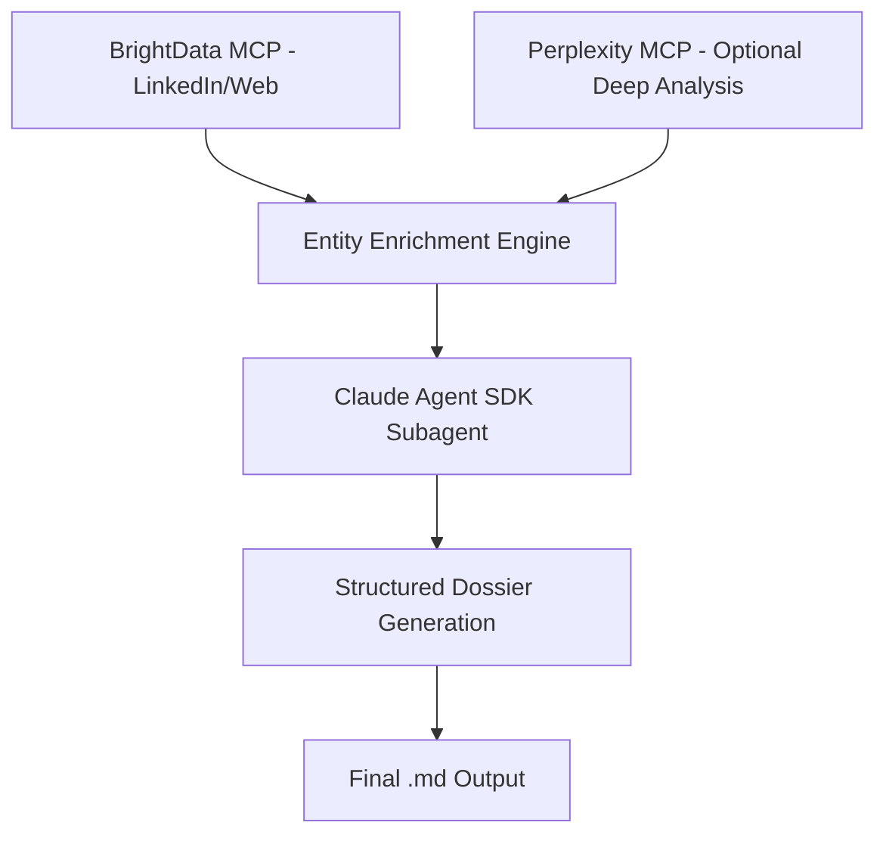

# 🎯 Advanced Sports Intelligence Enrichment Schema

**Purpose**: Claude Agent SDK-powered multi-source enrichment system for sports entities with fine-tuned prompts and subagent orchestration.

## Architecture Overview



---

## 1. Base Entity Model (`Entity`)

All entities inherit from this shared foundation.

```yaml
Entity:
  id: UUID
  neo4j_id: string
  type: [Club | Sportsperson | PersonOfInterest | League | Organization]
  name: string
  image/logo_url: string
  description: text
  location: string
  country: string
  sport: string (nullable for non-sports POIs)
  website: string
  created_at: datetime
  updated_at: datetime
  enrichment_metadata:
    last_brightdata_scan: datetime
    last_perplexity_analysis: datetime (nullable)
    data_sources: [string]
    confidence_score: float (0-1)
```

---

## 2. Club Entity Schema

```yaml
Club:
  parent: Entity
  
  # Core Identity
  core:
    division: string (e.g. Premier League)
    stadium: string
    founded_year: int
    revenue_est: float (nullable)
    employee_count: int
    valuation: float
  
  # Digital Presence
  digital:
    website: string
    socials:
      twitter: string
      instagram: string
      linkedin: string
      facebook: string
    mobile_app: boolean
    digital_maturity_score: int (0-100)
    current_tech_partners: [string]
  
  # Commercial
  commercial:
    main_sponsors: [string]
    kit_supplier: string
    broadcast_partners: [string]
    commercial_revenue: string
    sponsorship_pipeline: [string]
  
  # Personnel Network
  personnel:
    squad: [Sportsperson.id]
    staff_contacts: [PersonOfInterest.id]
    key_decision_makers: [PersonOfInterest.id]
    coaching_staff: [PersonOfInterest.id]
  
  # Performance
  sporting:
    current_league_position: int
    recent_form: string
    european_competition: boolean
    transfer_budget: string
    youth_academy_rating: string
```

---

## 3. Sportsperson Entity Schema

```yaml
Sportsperson:
  parent: Entity
  
  # Identity
  personal:
    full_name: string
    date_of_birth: date
    nationality: string
    position/role: string
    height: string
    weight: string
  
  # Career
  career:
    current_club: Club.id (nullable if free agent)
    contract_expires: date
    market_value: string
    agent_id: PersonOfInterest.id
    previous_clubs: [Club.id]
  
  # Performance
  performance:
    seasonal_stats:
      appearances: int
      goals: int
      assists: int
      clean_sheets: int (if goalkeeper)
    career_stats:
      total_goals: int
      total_appearances: int
      trophies_won: int
  
  # Commercial
  commercial:
    sponsors: [PersonOfInterest.id]
    endorsements: [string]
    social_media_following:
      instagram: int
      twitter: int
    personal_brand_value: string
```

---

## 4. Person of Interest (POI) Entity Schema

```yaml
PersonOfInterest:
  parent: Entity
  
  # Professional Identity
  professional:
    role: string
    seniority: [C_LEVEL | DIRECTOR | MANAGER | SPECIALIST | CONSULTANT]
    department: string
    organisation: Club.id or External_Org.id
    reporting_line: string
    decision_making_authority: string
  
  # Contact Information
  contact:
    email: string
    phone: string
    linkedin_url: string
    twitter: string
    preferred_contact_method: string
  
  # Influence Network
  influence:
    influence_level: [HIGH | MEDIUM | LOW]
    decision_scope: [string]
    direct_reports: [PersonOfInterest.id]
    key_relationships: [Entity.id]
    board_positions: [string]
  
  # Strategic Focus
  strategic:
    current_priorities: [string]
    budget_responsibility: string
    technology_interests: [string]
    partnership_history: [string]
    innovation_focus: [string]
```

---

## 5. Claude Agent SDK Prompts

### Primary Enrichment Prompt (BrightData-First)

```yaml
system_prompt: |
  You are an elite sports intelligence analyst working for Yellow Panther. Your task is to enrich sports entities using multi-source data gathering and analysis.
  
  PRIMARY APPROACH:
  1. Use BrightData MCP to scrape LinkedIn and web sources
  2. Extract structured information using the provided schema
  3. Generate comprehensive dossiers with actionable intelligence
  
  DATA QUALITY STANDARDS:
  - Verify information across multiple sources
  - Provide confidence scores for each data point
  - Flag speculative information clearly
  - Include source attribution for all claims
  
  OUTPUT REQUIREMENTS:
  - Follow exact schema structure
  - Provide specific, actionable insights
  - Focus on business intelligence and opportunity identification
  - Include relationship mapping and network analysis

entity_enrichment_prompt: |
  Enrich the {entity_type} "{entity_name}" using the following approach:
  
  1. BRIGHTDATA INTELLIGENCE GATHERING:
     - Search LinkedIn for company page and key personnel
     - Scrape official website for current information
     - Find recent news, press releases, and announcements
     - Identify commercial partnerships and sponsorships
     - Gather digital presence and technology information
  
  2. STRUCTURED DATA EXTRACTION:
     - Populate all required fields in the {entity_type} schema
     - Extract specific metrics, dates, and figures
     - Identify key decision makers and their roles
     - Map commercial relationships and partnerships
  
  3. BUSINESS INTELLIGENCE ANALYSIS:
     - Assess digital maturity and transformation opportunities
     - Identify partnership and sponsorship potential
     - Evaluate technology adoption and innovation readiness
     - Map organizational structure and decision-making processes
  
  4. OPPORTUNITY SCORING:
     - Rate commercial opportunity (0-100)
     - Assess partnership accessibility (0-100) 
     - Evaluate technology fit for Yellow Panther solutions
     - Calculate overall engagement priority (0-100)
  
  Focus on actionable business intelligence that supports Yellow Panther's B2B sales and partnership objectives.
```

### Perplexity Optional Enhancement Prompt

```yaml
perplexity_enrichment_prompt: |
  PERPLEXITY DEEP ANALYSIS - Optional Enhancement Layer
  
  When requested, enhance the {entity_type} dossier with strategic market intelligence:
  
  1. MARKET POSITIONING ANALYSIS:
     - Competitive positioning vs similar organizations
     - Market trends affecting the entity
     - Strategic challenges and opportunities
     - Industry benchmarking
  
  2. FINANCIAL INTELLIGENCE:
     - Revenue trends and financial health
     - Investment patterns and priorities
     - Valuation insights and market position
     - Commercial performance indicators
  
  3. TECHNOLOGY STRATEGY ASSESSMENT:
     - Current technology stack and partnerships
     - Digital transformation readiness
     - Innovation culture and adoption patterns
     - Emerging technology interests
  
  4. STRATEGIC RELATIONSHIPS:
     - Key partnership ecosystem analysis
     - Competitive landscape mapping
     - Supply chain and vendor relationships
     - Market influence and network position
  
  OUTPUT FORMAT:
  - Strategic insights with confidence scores
  - Market trend analysis with implications
  - Competitive intelligence with actionable recommendations
  - Technology opportunity assessment with fit scores
  
  Only activate this analysis when explicitly requested via "enrich_with_perplexity=true" parameter.
```

### Person of Interest Enrichment Prompt

```yaml
poi_enrichment_prompt: |
  PERSON OF INTEREST DEEP DIVE - Professional Network Analysis
  
  For POI "{poi_name}" at "{organisation}", conduct comprehensive enrichment:
  
  1. PROFESSIONAL BACKGROUND INVESTIGATION:
     - Current role and responsibilities verification
     - Career progression and previous positions
     - Educational background and credentials
     - Industry recognition and achievements
  
  2. DECISION-MAKING AUTHORITY ASSESSMENT:
     - Scope of influence and decision power
     - Budget control and procurement authority
     - Reporting structure and organizational context
     - Key stakeholder relationships
  
  3. COMMUNICATION AND ENGAGEMENT PROFILE:
     - Professional communication style analysis
     - LinkedIn activity and engagement patterns
     - Public speaking and thought leadership
     - Preferred communication channels
  
  4. RELATIONSHIP NETWORK MAPPING:
     - Key professional connections and partnerships
     - Industry associations and board positions
     - Collaborative relationships and influence networks
     - Connection pathways to Yellow Panther
  
  5. STRATEGIC ALIGNMENT ANALYSIS:
     - Technology interests and innovation focus
     - Current priorities and strategic initiatives
     - Partnership philosophy and collaboration history
     - Alignment with Yellow Panther value proposition
  
  OUTPUT REQUIREMENTS:
  - Detailed influence and authority assessment
  - Engagement strategy recommendations
  - Relationship pathway mapping
  - Personalized outreach approach
  - Opportunity fit scoring and justification
```

---

## 6. Claude Agent SDK Subagent Implementation

```yaml
subagent_configuration:
  name: "Sports Intelligence Enrichment Subagent"
  model: "claude-3-sonnet-20241022"
  
  tools:
    - brightdata_scraper
    - perplexity_analyzer (optional)
    - neo4j_graph_updater
    - markdown_generator
  
  workflow:
    1. Entity Classification and Schema Selection
    2. BrightData Multi-Source Intelligence Gathering
    3. Structured Data Extraction and Validation
    4. Optional Perplexity Deep Analysis (if requested)
    5. Relationship Network Mapping
    6. Opportunity Scoring and Assessment
    7. Markdown Dossier Generation
    8. Neo4j Knowledge Graph Integration
  
  quality_controls:
    - Source verification across multiple data points
    - Confidence scoring for all intelligence
    - Automatic fact-checking and validation
    - Schema compliance verification
    - Output quality assessment
```

---

## 7. Output Schema for Final .md Generation

```yaml
markdown_dossier_structure:
  header:
    entity_name: string
    entity_type: string
    dossier_version: string
    last_updated: datetime
    confidence_score: float
    data_sources: [string]
  
  executive_summary:
    key_findings: [string]
    opportunity_assessment: string
    recommended_approach: string
    priority_score: int
  
  core_intelligence:
    identity: (Entity schema fields)
    commercial: (Commercial information)
    digital: (Digital presence and technology)
    personnel: (Key people and structure)
  
  strategic_analysis:
    market_position: string
    competitive_landscape: string
    growth_opportunities: [string]
    risk_factors: [string]
  
  yellow_panther_assessment:
    opportunity_fit: string
    engagement_strategy: string
    partnership_potential: string
    value_proposition_alignment: string
    recommended_next_steps: [string]
  
  appendices:
    sources: [string]
    methodology: string
    confidence_disclosures: [string]
    additional_research_notes: string
```

---

## 8. Integration Parameters

```yaml
enrichment_triggers:
  brightdata_enabled: true (default)
  perplexity_enabled: false (default, opt-in)
  
  quality_thresholds:
    minimum_confidence: 0.7
    required_sources: 2
    data_freshness_days: 30
  
  output_options:
    format: "markdown"
    include_raw_data: false
    generate_visualizations: true
    create_relationship_map: true
```

---

## ✅ Enhanced Schema Benefits

1. **BrightData-First Intelligence**: Primary enrichment through professional web scraping
2. **Optional Perplexity Enhancement**: Deep strategic analysis only when requested
3. **Fine-Tuned Prompts**: Specialized prompts for each entity type and enrichment scenario
4. **Claude Agent SDK Integration**: Subagent orchestration with structured workflow
5. **Quality Assurance**: Multi-source verification and confidence scoring
6. **Actionable Output**: Business intelligence focused on partnership opportunities
7. **Flexible Architecture**: Modular design allows for selective enhancement

This schema provides a robust foundation for automated intelligence gathering while maintaining high data quality standards and business relevance.
