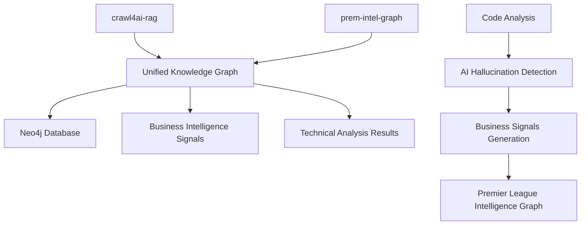

# Unified Knowledge Graph Integration

This document describes the integration between the `crawl4ai-rag` component and the `prem-intel-graph` Premier League Intelligence Graph, creating a unified knowledge graph that combines technical code analysis with business intelligence.

## Overview

The unified knowledge graph connects:
- **Code Repository Analysis**: Technical analysis of code repositories, classes, methods, and functions
- **Premier League Intelligence**: Business data about clubs, agencies, stakeholders, and signals
- **AI Hallucination Detection**: Technical validation of AI-generated code
- **Business Intelligence Signals**: Automated generation of business insights from technical analysis

## Architecture



## Key Components

### 1. Unified Schema (Neo4j)

The unified schema extends the Premier League Intelligence Graph to include code repository entities:

**Business Intelligence Nodes:**
- `Club`: Premier League clubs (Arsenal, Chelsea FC, etc.)
- `Agency`: Digital agencies (Yellow Panther, Lagardère Sports, etc.)  
- `Stakeholder`: Key people at clubs
- `Role`: Job roles and domains
- `Signal`: Business intelligence signals
- `SignalType`: Categories of signals

**Code Repository Nodes:**
- `Repository`: Code repositories
- `File`: Source code files
- `Class`: Code classes
- `Method`: Class methods
- `Function`: Standalone functions

**Key Relationships:**
- `Agency -[:owns]-> Repository`: Agencies own repositories
- `Repository -[:triggers]-> Signal`: Repositories trigger business signals
- `Club -[:emits]-> Signal`: Clubs emit business signals
- `Signal -[:type]-> SignalType`: Signals have types

### 2. Enhanced Signal Types

New signal types for code analysis:
- **Code Analysis**: General code structure analysis
- **Technical Debt**: Code quality concerns
- **AI Hallucination**: AI-generated code issues  
- **Tech Investment**: AI/ML capabilities detected

### 3. Unified Knowledge Graph Class

The `UnifiedKnowledgeGraph` class provides:
- Integration of technical and business analysis
- Signal generation from code analysis
- Business intelligence queries
- Cross-domain recommendations

## Configuration

### Environment Variables

Create a `shared-config.env` file:

```bash
# Neo4j Configuration
NEO4J_URI=bolt://localhost:7687
NEO4J_USER=neo4j
NEO4J_PASSWORD=pantherpassword
NEO4J_DATABASE=neo4j

# Enable knowledge graph functionality
USE_KNOWLEDGE_GRAPH=true

# OpenAI for analysis (optional)
OPENAI_API_KEY=your_openai_api_key_here
```

### Docker Deployment

Use the unified `docker-compose.yml` in `prem-intel-graph/`:

```bash
cd prem-intel-graph
docker-compose up -d
```

This starts:
- Neo4j database with unified schema
- crawl4ai-rag service on port 8001
- prem-intel-api service on port 8002

## Usage

### 1. Initialize Schema

The unified schema is automatically applied when services start. Manual initialization:

```bash
# From prem-intel-graph directory
docker exec -it panther-neo4j cypher-shell -u neo4j -p pantherpassword < neo4j/schema.cypher
```

### 2. Analyze Code with Business Context

Use the new MCP tool `analyze_with_business_intelligence`:

```python
# Example: Analyze a script with club context
result = await analyze_with_business_intelligence(
    script_path="/path/to/script.py",
    club_context="Manchester City",
    repository="panther_chat"
)
```

This will:
- Analyze the script for AI hallucinations
- Generate business intelligence signals
- Link findings to the specified club
- Create recommendations for stakeholders

### 3. Query Business Intelligence

Use the `query_business_intelligence` tool:

```python
# Get technical overview for a club
overview = await query_business_intelligence(
    query_type="club_technical_overview",
    club_name="Arsenal"
)

# Get recent hallucination alerts
alerts = await query_business_intelligence(
    query_type="hallucination_alerts"
)

# Find technical opportunities
opportunities = await query_business_intelligence(
    query_type="technical_opportunities"
)
```

### 4. Parse Repositories with Business Context

Parse GitHub repositories and link them to agencies:

```python
# Parse a repository (automatically links to Yellow Panther if configured)
result = await parse_github_repository(
    repo_url="https://github.com/yellowpanther/panther_chat"
)
```

## Signal Generation

The system automatically generates business intelligence signals from technical analysis:

### AI Hallucination Signals

When AI hallucinations are detected:
```json
{
  "signal_type": "AI Hallucination",
  "signal_headline": "AI hallucinations detected in script.py",
  "signal_summary": "Found 3 potential hallucinations with 65% confidence",
  "club": "Manchester City",
  "repository": "panther_chat",
  "score": 6.5,
  "hallucinations_count": 3,
  "confidence_score": 0.65
}
```

### Technical Debt Signals

When code quality issues are found:
```json
{
  "signal_type": "Technical Debt", 
  "signal_headline": "Code quality concerns in script.py",
  "signal_summary": "Script shows 60% confidence in validation",
  "club": "Arsenal",
  "score": 6.0,
  "confidence_score": 0.60
}
```

### Tech Investment Signals

When AI/ML capabilities are detected:
```json
{
  "signal_type": "Tech Investment",
  "signal_headline": "AI/ML capabilities detected in repository",
  "signal_summary": "Repository contains 15 AI-related files",
  "club": "Liverpool FC", 
  "score": 8.5
}
```

## Business Intelligence Queries

### Club Technical Overview

Get a comprehensive technical overview for a club:

```cypher
MATCH (c:Club {name: $club_name})
OPTIONAL MATCH (c)-[:partneredWith]->(a:Agency)-[:owns]->(r:Repository)
OPTIONAL MATCH (r)<-[:BELONGS_TO]-(f:File)
OPTIONAL MATCH (c)-[:emits]->(s:Signal)
WHERE s.intelType IN ['Code Analysis', 'AI Hallucination', 'Technical Debt']
RETURN c, collect(DISTINCT a) as agencies, 
       collect(DISTINCT r) as repositories,
       count(DISTINCT f) as total_files,
       collect(s) as technical_signals
```

### Hallucination Alerts

Find recent AI hallucination alerts:

```cypher
MATCH (s:Signal)
WHERE s.intelType = 'AI Hallucination' 
  AND s.date > date() - duration('P7D')
OPTIONAL MATCH (c:Club)-[:emits]->(s)
OPTIONAL MATCH (r:Repository)-[:triggers]->(s)
RETURN s, c, r
ORDER BY s.score DESC
LIMIT 10
```

### Technical Opportunities

Find clubs with high technical activity but no Yellow Panther partnership:

```cypher
MATCH (c:Club)-[:emits]->(s:Signal)
WHERE s.intelType IN ['Tech Investment', 'Code Analysis']
  AND s.score > 8.0
  AND NOT (c)-[:partneredWith]->(:Agency {name: 'Yellow Panther'})
OPTIONAL MATCH (c)-[:employs]->(st:Stakeholder)
RETURN c, collect(s) as signals, collect(st) as stakeholders
ORDER BY size(signals) DESC
```

## Integration Benefits

### For Technical Teams
- **Code Quality Monitoring**: Track AI hallucinations across projects
- **Repository Intelligence**: Understand codebase structure and relationships
- **Technical Debt Tracking**: Monitor code quality trends

### For Business Teams  
- **Opportunity Identification**: Find clubs with technical needs
- **Stakeholder Mapping**: Connect technical issues to decision makers
- **Competitive Intelligence**: Track technical capabilities across clubs

### For Sales Teams
- **Warm Lead Generation**: Technical signals indicate engagement opportunities
- **Context-Rich Outreach**: Business context for technical findings
- **Partnership Tracking**: Monitor existing relationships and gaps

## Sample Workflow

1. **Repository Analysis**: Parse a club's repository for code structure
2. **Script Validation**: Analyze specific scripts for AI hallucinations  
3. **Signal Generation**: Automatically create business intelligence signals
4. **Business Context**: Link technical findings to club stakeholders
5. **Opportunity Identification**: Query for sales and engagement opportunities
6. **Stakeholder Outreach**: Use signals to inform relationship building

## Monitoring and Alerts

The system can be configured to trigger alerts for:
- High-impact hallucination signals (score > 8.0)
- New stakeholder appointments at target clubs
- Technical debt accumulation patterns
- Clubs showing increased AI/ML investment signals

These alerts can integrate with Microsoft Teams, Slack, or CRM systems for proactive engagement.

## Future Enhancements

- **Real-time Signal Streaming**: Live updates as code changes
- **Predictive Analytics**: ML models for opportunity scoring
- **Automated Reporting**: Weekly intelligence summaries
- **Integration APIs**: Connect to sales and CRM tools
- **Visual Dashboard**: Neo4j Bloom interface for exploration

## Troubleshooting

### Common Issues

1. **Neo4j Connection Failed**: Check credentials in shared-config.env
2. **Schema Not Applied**: Restart services or manually run schema.cypher
3. **Signals Not Generated**: Ensure USE_KNOWLEDGE_GRAPH=true
4. **Missing Business Context**: Verify club names match schema exactly

### Logs and Debugging

Enable debug logging:
```bash
LOG_LEVEL=DEBUG docker-compose up
```

Check Neo4j browser at http://localhost:7474 to inspect the graph structure.

### Performance Optimization

- Index frequently queried properties
- Use connection pooling for high-volume analysis
- Cache repository analysis results
- Batch signal ingestion for efficiency

This unified integration transforms technical code analysis into actionable business intelligence, creating a powerful platform for identifying opportunities and building relationships in the Premier League ecosystem. 