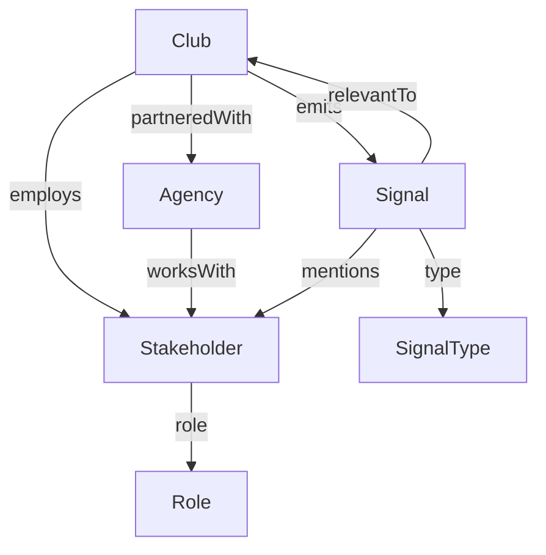

# 🧠 Premier League Intelligence Graph

## Overview

The Premier League Intelligence Graph is a real-time, Neo4j-powered knowledge graph designed to help Yellow Panther identify and target high-value opportunities across clubs, agencies, and decision-makers.

It serves as a living, queryable map of the Premier League's digital ecosystem — capturing relationships, signals, and influence pathways between clubs, stakeholders, and their agency partners.

---

## 🎯 Goals

- **Surface commercial & digital opportunities** using live signals (e.g. hiring, tech investments)
- **Map stakeholder influence** within and around Premier League clubs
- **Enable warm outreach** through graph-based relationship mapping
- **Track key trends** in fan engagement, sponsorship, digital transformation, and innovation

---

## 🧩 Graph Schema



### Node Types

| Node          | Properties                                                    |
| ------------- | ------------------------------------------------------------- |
| `Club`        | `name`, `tier`, `location`, `digitalMaturity`                 |
| `Agency`      | `name`, `specialty`, `pastWork`                               |
| `Stakeholder` | `name`, `title`, `linkedinUrl`, `influenceScore`              |
| `Role`        | `title`, `domain`                                             |
| `Signal`      | `headline`, `summary`, `source`, `date`, `score`, `intelType` |
| `SignalType`  | `name` (e.g. "Hiring", "Fan Innovation")                      |

### Relationship Types

| Relationship     | Description          |
| ---------------- | -------------------- |
| `:partneredWith` | Club ↔ Agency        |
| `:employs`       | Club ↔ Stakeholder   |
| `:worksWith`     | Agency ↔ Stakeholder |
| `:emits`         | Club ↔ Signal        |
| `:mentions`      | Signal ↔ Stakeholder |
| `:relevantTo`    | Signal ↔ Club        |
| `:role`          | Stakeholder ↔ Role   |

---

## 📥 Data Ingestion

The graph is continuously updated from:

* **News Crawlers** (via crawl4ai + RAG): match clubs, stakeholders, and generate scored signals
* **Job Boards / LinkedIn**: identify stakeholders, titles, hiring trends
* **Agency Intelligence**: manually or semi-automatically link known partnerships and case studies
* **GPT Enrichment**: score signals, infer roles, detect relationship links

Example `SignalGraphItem` for ingestion:

```json
{
  "club": "Chelsea FC",
  "agency": "Lagardère Sports",
  "stakeholders": ["Tom Glick"],
  "signal_type": "Hiring",
  "signal_headline": "Chelsea FC seeks Head of CRM",
  "signal_summary": "New job posting suggests focus on fan engagement strategy.",
  "source_url": "https://careers.chelseafc.com/crm-head",
  "date": "2025-06-28"
}
```

---

## 🔎 Sample Queries (Cypher)

### 1. Clubs without digital agency but investing in fan engagement

```cypher
MATCH (c:Club)-[:emits]->(s:Signal)-[:type]->(:SignalType {name: "Fan Innovation"})
WHERE NOT (c)-[:partneredWith]->(:Agency)
RETURN c.name, s.headline, s.date
```

### 2. Top innovation-focused stakeholders at Arsenal

```cypher
MATCH (p:Stakeholder)-[:employs]->(c:Club {name: "Arsenal"})
MATCH (p)<-[:mentions]-(s:Signal)
WHERE s.intelType IN ["Tech Investment", "Fan Innovation"]
RETURN p.name, p.title, COUNT(s) AS signalCount
ORDER BY signalCount DESC LIMIT 3
```

### 3. New signals for clubs Yellow Panther has not engaged with

```cypher
MATCH (c:Club)-[:emits]->(s:Signal)
WHERE NOT (c)-[:partneredWith]->(:Agency {name: "Yellow Panther"})
RETURN c.name, s.headline, s.date
ORDER BY s.date DESC
```

---

## 📊 Dashboards Powered by the Graph

* **Club Intelligence Panels**: Summarize signals, stakeholders, agencies per club
* **Stakeholder Maps**: Navigate org charts and influence webs
* **Opportunity Feed**: Sorted signal stream, ranked by GPT score and fit
* **Agency-Club Networks**: Visual maps of partnerships, broken by sector

---

## 🔔 Alerting & Outreach

Trigger microsoft teams alerts for:

* High-impact signals scored by GPT
* Stakeholder role changes (e.g., new CMO at Man United)
* Agency-club disconnections or new appointments
* Clubs entering new innovation cycles (multiple fan engagement signals in 30 days)

These events can be used to trigger:

* CRM updates
* Sales pipeline entries
* GPT-generated outreach draft

---

## 🔄 Roadmap

* [ ] 🚀 Seed Top 10 Clubs with Agencies + Stakeholders
* [ ] 🔁 Automate Weekly Signal Ingestion via crawl4ai
* [ ] 🧠 Integrate GPT Signal Scoring + Alert Rules
* [ ] 🎛️ Connect to Terminal UI (Next-Forge + Vercel AI SDK)
* [ ] 📈 Add dashboards for scouting, reporting, and outreach planning

---

## 📁 Folder Structure

```
prem-intel-graph/
├── data/
│   └── seed_clubs.csv
│   └── agency_links.json
├── pipelines/
│   └── ingest_signals_n8n.json
│   └── enrich_gpt_flow.yaml
├── neo4j/
│   └── schema.cypher
│   └── queries/
├── alerts/
│   └── gpt_signal_alerts.md
├── frontend/
│   └── dashboards/
│       └── club_intel.tsx
│       └── stakeholder_map.tsx
└── README.md (this file)
```

---

## ✅ Contacts

* **Graph Lead**: *[Your Name]*
* **Yellow Panther Ops Contact**: *[TBD]*
* **Slack Channel**: `#prem-intel`
* **Notion Workspace**: [Link here]

--- 