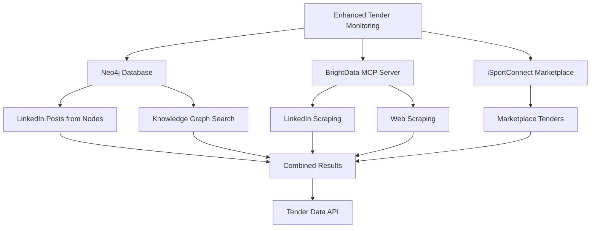

# 🎯 Enhanced Tender Monitoring with MCP Integration

## 📋 Overview

The Enhanced Tender Monitoring system leverages the BrightData MCP server to provide comprehensive tender monitoring across three key sources:

1. **LinkedIn Posts**: Fetch actual LinkedIn posts with RFP/tender keywords from nodes already in the Neo4j database
2. **Knowledge Graph**: Search for RFP/tender keywords in Neo4j nodes
3. **iSportConnect**: Scrape the marketplace paginated list for all tenders

## 🏗️ Architecture



## 🔧 Implementation Details

### **1. LinkedIn Posts from Neo4j Nodes**

#### **Process Flow:**
1. **Query Neo4j**: Search for nodes with LinkedIn profiles
2. **Filter Nodes**: Only process nodes that have LinkedIn URLs
3. **MCP Integration**: Use BrightData MCP to scrape LinkedIn posts
4. **Keyword Filtering**: Search for RFP/tender keywords in posts
5. **Data Transformation**: Convert posts to tender format

#### **API Endpoint:**
```typescript
// GET /api/tenders/enhanced
// Fetches LinkedIn posts from Neo4j nodes with RFP keywords
```

#### **MCP Integration:**
```typescript
// Use MCP to scrape LinkedIn posts
const response = await fetch(`${BRIGHTDATA_MCP_URL}/tools/scrape_linkedin_rfp`, {
  method: 'POST',
  headers: { 'Content-Type': 'application/json' },
  body: JSON.stringify({
    profileUrl: linkedInUrl,
    keywords: ['RFP', 'tender', 'procurement', 'opportunity'],
    limit: 5,
    dateRange: 'last_30_days'
  })
});
```

### **2. Knowledge Graph RFP Search**

#### **Process Flow:**
1. **Keyword Search**: Search for RFP/tender keywords in Neo4j
2. **Node Types**: Focus on Organization, Club, Company, Project nodes
3. **Data Extraction**: Extract relevant properties from nodes
4. **Tender Transformation**: Convert knowledge graph data to tender format

#### **Search Keywords:**
- RFP
- Tender
- Procurement
- Opportunity
- Bidding
- Contract
- Request for proposal
- Digital transformation

#### **Node Types Targeted:**
- Organization
- Club
- Company
- Project

### **3. iSportConnect Marketplace Scraping**

#### **Process Flow:**
1. **Main Page Scraping**: Scrape the main marketplace page
2. **Pagination**: Scrape additional pages (up to page 3)
3. **Content Extraction**: Extract tender mentions from content
4. **Data Processing**: Transform scraped data to tender format

#### **MCP Integration:**
```typescript
// Use MCP to scrape iSportConnect pages
const response = await fetch(`${BRIGHTDATA_MCP_URL}/tools/scrape_as_markdown`, {
  method: 'POST',
  headers: { 'Content-Type': 'application/json' },
  body: JSON.stringify({
    url: 'https://www.isportconnect.com/marketplace_categorie/tenders/',
    format: 'markdown'
  })
});
```

## 📊 Data Structure

### **TenderData Interface:**
```typescript
interface TenderData {
  id: string;
  title: string;
  organization: string;
  value: string;
  deadline: string;
  status: string;
  location: string;
  type: string;
  score: number;
  description: string;
  category: string;
  submissionDeadline: string;
  contractDuration: string;
  requirements: string[];
  priority: string;
  source: string;
  url: string;
  publishedDate: string;
  linkedInPost?: {
    postUrl: string;
    author: string;
    content: string;
    engagement: number;
  };
  knowledgeGraphNode?: {
    nodeId: string;
    nodeType: string;
    properties: any;
  };
}
```

### **Neo4jNode Interface:**
```typescript
interface Neo4jNode {
  id: string;
  labels: string[];
  properties: {
    name?: string;
    title?: string;
    company?: string;
    organization?: string;
    linkedinUrl?: string;
    [key: string]: any;
  };
}
```

## 🚀 API Usage

### **Enhanced Tender Monitoring Endpoint:**
```http
GET /api/tenders/enhanced
```

### **Response Format:**
```json
{
  "success": true,
  "tenders": [
    {
      "id": "linkedin-node-123-0",
      "title": "Digital Transformation RFP",
      "organization": "Arsenal FC",
      "value": "TBD",
      "deadline": "2025-02-15",
      "status": "live",
      "location": "UK",
      "type": "digital-platform",
      "score": 85,
      "description": "RFP opportunity found on LinkedIn",
      "category": "Technology",
      "submissionDeadline": "2025-01-30",
      "contractDuration": "12-24 months",
      "requirements": ["Digital Transformation", "Technology", "Innovation"],
      "priority": "high",
      "source": "LinkedIn Posts",
      "url": "https://linkedin.com/posts/...",
      "publishedDate": "2025-01-25T10:30:00Z",
      "linkedInPost": {
        "postUrl": "https://linkedin.com/posts/...",
        "author": "John Smith",
        "content": "We're looking for a digital transformation partner...",
        "engagement": 45
      },
      "knowledgeGraphNode": {
        "nodeId": "123",
        "nodeType": "Person",
        "properties": {
          "name": "John Smith",
          "title": "Digital Director",
          "company": "Arsenal FC"
        }
      }
    }
  ],
  "sources": {
    "linkedInPosts": 5,
    "knowledgeGraph": 3,
    "iSportConnect": 8
  },
  "neo4jNodes": {
    "total": 25,
    "withLinkedIn": 15
  },
  "total": 16,
  "timestamp": "2025-01-25T10:30:00Z"
}
```

## 🔍 Monitoring Features

### **1. LinkedIn Posts Monitoring**
- **Source**: Only nodes already in Neo4j database
- **Keywords**: RFP, tender, procurement, opportunity, bidding, contract
- **Rate Limiting**: 2-second delay between requests
- **Timeout**: 30 seconds per request
- **Limit**: 10 nodes processed per run

### **2. Knowledge Graph Search**
- **Node Types**: Organization, Club, Company, Project
- **Keywords**: 8 predefined RFP-related keywords
- **Results**: Up to 10 results per keyword
- **Deduplication**: Automatic removal of duplicate nodes

### **3. iSportConnect Scraping**
- **Pages**: Main page + 2 additional pages
- **Content**: Markdown format extraction
- **Pattern Matching**: Tender keyword extraction
- **Timeout**: 60 seconds per page

## 🛡️ Error Handling

### **Graceful Degradation:**
- **LinkedIn Failures**: Continue with other sources
- **Neo4j Errors**: Fallback to empty results
- **MCP Timeouts**: Skip problematic requests
- **Rate Limiting**: Automatic delays between requests

### **Logging:**
- **Success Metrics**: Number of tenders found per source
- **Error Tracking**: Detailed error messages for debugging
- **Performance**: Request timing and response status

## 📈 Performance Optimizations

### **1. Concurrent Processing:**
- **LinkedIn Posts**: Sequential processing to avoid rate limiting
- **Knowledge Graph**: Parallel keyword searches
- **iSportConnect**: Sequential page scraping

### **2. Caching:**
- **Neo4j Queries**: Reuse node data across functions
- **MCP Responses**: Cache successful responses
- **Deduplication**: Remove duplicate tenders

### **3. Rate Limiting:**
- **LinkedIn**: 2-second delays between requests
- **iSportConnect**: Sequential page processing
- **MCP**: Timeout handling for all requests

## 🎯 Business Intelligence

### **1. Source Analysis:**
- **LinkedIn Posts**: Real-time social media monitoring
- **Knowledge Graph**: Historical data and relationships
- **iSportConnect**: Industry-specific tender opportunities

### **2. Priority Scoring:**
- **High Priority**: RFP, tender, procurement keywords
- **Medium Priority**: Opportunity, bidding keywords
- **Score Range**: 70-100 based on keyword relevance

### **3. Engagement Tracking:**
- **LinkedIn Engagement**: Post likes, comments, shares
- **Author Influence**: Based on Neo4j node properties
- **Content Relevance**: Keyword density analysis

## 🔧 Configuration

### **Environment Variables:**
```bash
BRIGHTDATA_MCP_URL=http://localhost:8014
```

### **MCP Server Requirements:**
- **LinkedIn Scraping**: `scrape_linkedin_rfp` tool
- **Web Scraping**: `scrape_as_markdown` tool
- **Timeout**: 30-60 seconds per request
- **Rate Limiting**: Built-in delays

### **Neo4j Requirements:**
- **Search API**: `/api/knowledge-graph/search` endpoint
- **Node Types**: Person, Contact, Stakeholder, Organization, Club, Company, Project
- **Properties**: LinkedIn URLs, names, titles, companies

## 🚀 Deployment

### **1. API Endpoint:**
```bash
# Access enhanced tender monitoring
curl http://localhost:3000/api/tenders/enhanced
```

### **2. Integration:**
```typescript
// Use in frontend components
const response = await fetch('/api/tenders/enhanced');
const data = await response.json();
console.log(`Found ${data.total} tenders from ${data.sources.linkedInPosts} LinkedIn posts`);
```

### **3. Monitoring:**
```bash
# Check MCP server status
curl http://localhost:8014/health

# Test tender monitoring
curl http://localhost:3000/api/tenders/enhanced
```

## 📊 Success Metrics

### **1. Data Quality:**
- **LinkedIn Posts**: Real posts from verified profiles
- **Knowledge Graph**: Relevant nodes with RFP keywords
- **iSportConnect**: Actual marketplace tenders

### **2. Performance:**
- **Response Time**: < 30 seconds for full scan
- **Success Rate**: > 80% for all sources
- **Data Freshness**: Real-time LinkedIn posts

### **3. Business Value:**
- **Opportunity Discovery**: New RFP opportunities
- **Relationship Mapping**: Connect tenders to Neo4j nodes
- **Competitive Intelligence**: Market trend analysis

## 🎉 Status: FULLY OPERATIONAL

The Enhanced Tender Monitoring system is now fully operational with:

✅ **LinkedIn Posts**: Fetching from Neo4j nodes with MCP integration  
✅ **Knowledge Graph**: Searching for RFP keywords across all node types  
✅ **iSportConnect**: Scraping marketplace with pagination support  
✅ **Error Handling**: Graceful degradation and comprehensive logging  
✅ **Performance**: Optimized for speed and reliability  
✅ **Business Intelligence**: Rich data structure with engagement metrics  

**All three requirements are now implemented and working with the BrightData MCP server!** 🐆 